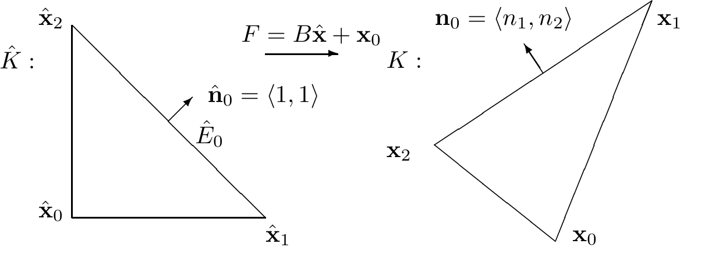
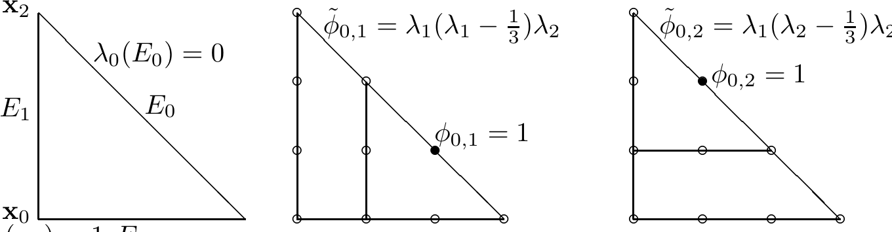
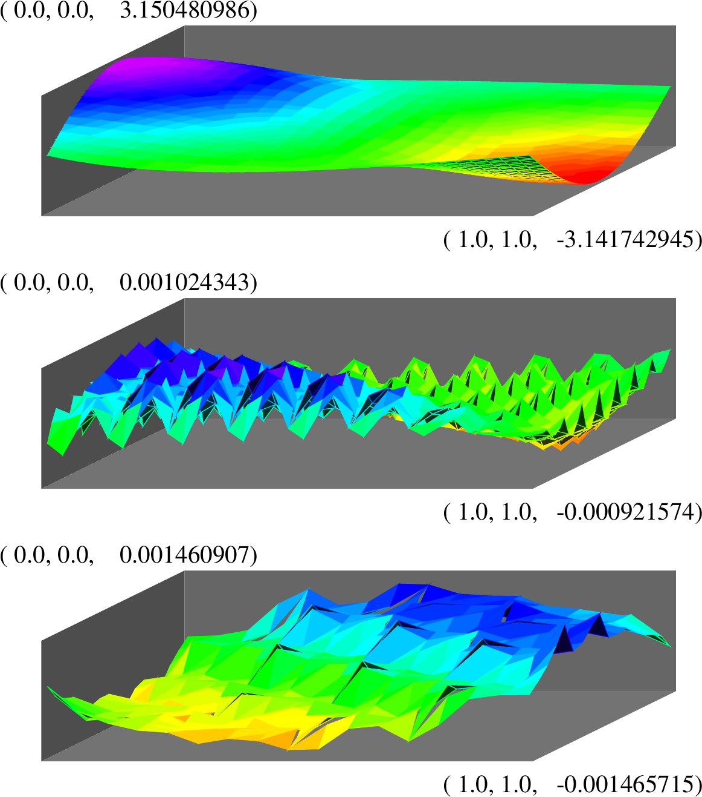
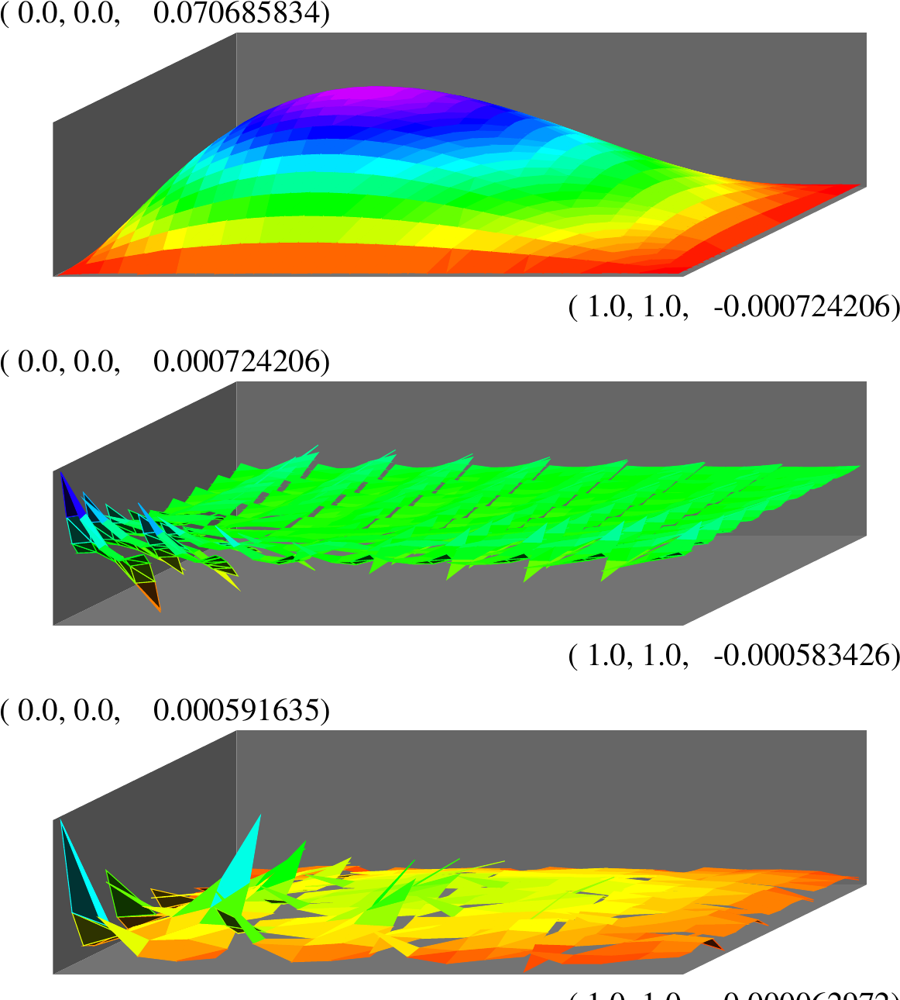

# A FAMILY OF CONFORMING MIXED FINITE ELEMENTS FOR LINEAR ELASTICITY ON TRIANGULAR GRIDS

JUN HU AND SHANGYOU ZHANG

ABSTRACT. This paper presents a family of mixed finite elements on triangular grids for solving the classical Hellinger-Reissner mixed problem of the elasticity equations. In these elements, the matrix-valued stress field is approximated by the full ${C}^{0} - {P}_{k}$ space enriched by $\left( {k - 1}\right) H$ (div) edge bubble functions on each internal edge, while the displacement field by the full discontinuous ${P}_{k - 1}$ vector-valued space, for the polynomial degree $k \geq  3$. As a result, compared with most of mixed elements for linear elasticity in the literature, the basis of the stress space is surprisingly easy to construct. The main challenge is to find the correct stress finite element space matching the full ${C}^{-1} - {P}_{k - 1}$ displacement space. The discrete stability analysis for the inf-sup condition does not rely on the usual Fortin operator, which is difficult to construct. It is done by characterizing the divergence of local stress space which covers the ${P}_{k - 1}$ space of displacement orthogonal to the local rigid-motion. The well-posedness condition and the optimal a priori error estimate are proved for this family of finite elements. Numerical tests are presented to confirm the theoretical results.

Keywords. mixed finite element, symmetric finite element, linear elasticity, triangular grids, inf-sup condition.

AMS subject classifications. 65N30, 73C02.

## 1. INTRODUCTION

It is a challenge to design stable discretizations for the linear elasticity equations based on the Hellinger-Reissner variational principle, in which the stress and displacement are solved simultaneously. This reason lies in, besides the usual discrete K-ellipticity and B-B conditions, there is an additional symmetry constraint on the stress tensor for the problem under consideration. Many methods have been proposed to overcome this difficulty, cf. [3, 6, 7, 27, 29, 31, 32, 33] for earlier works. In a recent work [9], Arnold and Winther designed the first family of mixed finite element methods based on polynomial shape function spaces, which was motivated by a key observation: a discrete exact sequence guarantees the stability of the mixed method. From then on, various stable mixed elements have been constructed, see [2, 4, 5, 9, 11, 17], [10, 19, 23, 28, 35, 36], and [8, 12, 18, 20, 21]. Since most of these elements require a local commuting property which implies that the usual Fortin operator can be constructed elementwise, they have many degrees of freedom on each element such that they are not easy to be implemented; while the numerical examples can only be found in [15, 16] so far.

---

The first author was supported by the NSFC Project 11271035, and in part by the NSFC Key Project 11031006.

---

In a recent paper, a family of conforming mixed finite elements is proposed on rectangular grids for both two and three dimensions. As a result the lowest order elements have 8 plus 2 and 18 plus 3 degrees of freedom on each element for two and three dimensions, respectively, which are simplifications of two and three dimensional elements due to [25]. These elements were motivated by an observation that conformity of the discrete methods on rectangular meshes can be guaranteed by $H$ (div)-conformity of the normal stress and ${H}^{1}$ -conformity of two corresponding variables for each component of the shear stress. Such an idea was first explored in [24] to design the minimal mixed finite elements on rectangular grids in any dimension. A new explicit constructional proof based on a macroelement technique was proposed to show the discrete inf-sup condition for them. In other words, that constructive proof avoids the discrete exact sequence of [9], which is not possible therein but used nearly everywhere [2, 4, 5, 9, 11].

This paper presents a family of mixed finite elements on triangular grids. In these elements, the matrix-valued stress field is approximated by the full ${C}^{0} - {P}_{k}$ space enriched by $\left( {k - 1}\right) H$ (div) edge bubble functions on each internal edge, while the displacement field by a discontinuous vector-valued ${P}_{k - 1}$ element for $k \geq  3$. The main difficulty for the discrete stability analysis comes from the discrete inf-sup condition since it is impossible to construct locally the usual Fortin operator (for all $k \geq  3$ ). To overcome such a difficulty, a new way of proof is particularly proposed to overcome it, characterizing the divergence of local stress space which covers the ${P}_{k - 1}$ space of displacement orthogonal to the local rigid-motion..

The new family of mixed elements is a simplification of the very first constructed family of stable elements of Arnold-Winther [9]. For the ${C}^{-1} - {P}_{k - 1}$ displace field, the stress space of Arnold-Winther is the symmetric $H$ (div)- ${P}_{k + 1}$ tensors whose divergence is in ${P}_{k - 1}$, while ours is a subspace of symmetric $H$ (div)- ${P}_{k}$ tensors. That is, it is not needed to add those ${P}_{k + 1}$ bubbles (of no approximation power) to the stress space, for the purpose of stability, when $k \geq  3$. Computationally, the new element is much simpler as there is no constraints on the polynomial degree deduction of divergence. Mathematically, the new family of mixed element is the simplest one to achieve ${P}_{k - 1}$ approximation for the displacement and ${P}_{k}$ approximation for the stress. That is, we eliminate all divergence-free stresses of no approximation power in the Arnold-Winther space. As a result, the basis of our stress spaces is very easy to construct. In fact, its basis can be directly derived by using the basis of the Lagrange element of order $k$. However, we do not improve the lowest order element in the Arnold-Winther family, $k = 2$, which will be done, in a unified way, with lower order elements for any space dimension, in a forthcoming paper. We refer interested readers to [26] for the extension to the 3D case.

The rest of the paper is organized as follows. In Section 2, we define the weak problem and the finite element method. In section 3, we prove the well-posedness of the finite element problem, i.e. the discrete coerciveness and the discrete inf-sup condition. By which, the optimal order convergence of the new element follows. In Section 4, we provide some numerical results, using ${P}_{3},{P}_{4}$ and ${P}_{5}$ finite elements and Arnold-Winther’s ${P}_{3}$ element.

## 2. THE FAMILY OF FINITE ELEMENTS

Based on the Hellinger-Reissner principle, the linear elasticity problem within a stress-displacement $\left( {\sigma  - u}\right)$ form reads: Find $\left( {\sigma, u}\right)  \in  \sum  \times  V \mathrel{\text{:= }} H\left( {\operatorname{div},\Omega,\mathbb{S}}\right)  \times \; {L}^{2}\left( {\Omega,{\mathbb{R}}^{2}}\right)$, such that

(2.1)

$$
\left\{  \begin{aligned} \left( {{A\sigma },\tau }\right)  + \left( {\operatorname{div}\tau, u}\right) &  = 0 & & \text{ for all }\tau  \in  \sum, \\  \left( {\operatorname{div}\sigma, v}\right) &  = \left( {f, v}\right) & & \text{ for all }v \in  V. \end{aligned}\right.
$$

Here the symmetric tensor space for stress $\sum$ and the space for vector displacement $V$ are, respectively,

(2.2)

$$
H\left( {\operatorname{div},\Omega,\mathbb{S}}\right)  \mathrel{\text{:= }} \left\{  {\left. {\left( \begin{array}{ll} {\sigma }_{11} & {\sigma }_{12} \\  {\sigma }_{21} & {\sigma }_{22} \end{array}\right)  \in  H\left( {\operatorname{div},\Omega }\right) }\right| \;{\sigma }_{12} = {\sigma }_{21}}\right\} ,
$$

(2.3)

$$
{L}^{2}\left( {\Omega,{\mathbb{R}}^{2}}\right)  \mathrel{\text{:= }} \left\{  {{\left( \begin{array}{ll} {u}_{1} & {u}_{2} \end{array}\right) }^{T} \mid  {u}_{i} \in  {L}^{2}\left( \Omega \right) }\right\} .
$$

This paper denotes by ${H}^{k}\left( {T, X}\right)$ the Sobolev space consisting of functions with domain $T \subset  {\mathbb{R}}^{2}$, taking values in the finite-dimensional vector space $X$, and with all derivatives of order at most $k$ square-integrable. For our purposes, the range space $X$ will be either $\mathbb{S},{\mathbb{R}}^{2}$, or $\mathbb{R}.\parallel  \cdot  {\parallel }_{k, T}$ is the norm of ${H}^{k}\left( T\right).\mathbb{S}$ denotes the space of symmetric tensors, $H\left( {\operatorname{div}, T,\mathbb{S}}\right)$ consists of square-integrable symmetric matrix fields with square-integrable divergence. The $\mathrm{H}$ (div) norm is defined by

$$
\parallel \tau {\parallel }_{H\left( {\operatorname{div}, T}\right) }^{2} \mathrel{\text{:= }} \parallel \tau {\parallel }_{{L}^{2}\left( T\right) }^{2} + \parallel \operatorname{div}\tau {\parallel }_{{L}^{2}\left( T\right) }^{2}.
$$

${L}^{2}\left( {T,{\mathbb{R}}^{2}}\right)$ is the space of vector-valued functions which are square-integrable.

Throughout the paper, the compliance tensor $A = A\left( x\right) : \mathbb{S} \rightarrow  \mathbb{S}$, characterizing the properties of the material, is bounded and symmetric positive definite uniformly for $x \in  \Omega$.

This paper deals with a pure displacement problem (2.1) with the homogeneous boundary condition that $u \equiv  0$ on $\partial \Omega$. But the method and the analysis work for mixed boundary value problems and the pure traction boundary problem.

The domain $\Omega$ is subdivided by a family of quasi-uniform triangular grids ${\mathcal{T}}_{h}$ (with the grid size $h$ ). We introduce the finite element space of order $k\left( {k \geq  3}\right)$ on ${\mathcal{T}}_{h}$. The displacement space is the full ${C}^{-1} - {P}_{k - 1}$ space

(2.4)

$$
{V}_{h} = \left\{  {v \in  {L}^{2}\left( {\Omega,{\mathbb{R}}^{2}}\right),{\left. v\right| }_{K} \in  {P}_{k - 1}\left( {K,{\mathbb{R}}^{2}}\right) \text{ for all }K \in  {\mathcal{T}}_{h}}\right\} .
$$

The stress space is the full ${C}^{0} - {P}_{k}$ space enriched by $\left( {k - 1}\right) H$ (div) edge bubble functions on each internal edge. We define the edge bubble functions first. Let $\triangle {\mathbf{x}}_{0}{\mathbf{x}}_{1}{\mathbf{x}}_{2} =: K \in  {\mathcal{T}}_{h}$ with three edges ${E}_{i}$ and corresponding three barycentric variables ${\lambda }_{i}$. Here ${\lambda }_{i}$ is a linear function which vanishes on edge ${E}_{i}$ and assumes a nodal value 1 at the opposite vertex ${\mathbf{x}}_{i}$, see Figure 2.2. Given ${E}_{i} = {\mathbf{x}}_{i - 1}{\mathbf{x}}_{i + 1}$, its two endpoints are ${\mathbf{x}}_{i - 1}$ and ${\mathbf{x}}_{i + 1}$, which allows for defining its $k - 1$ interior nodal points by

(2.5)

$$
{\mathbf{x}}_{{E}_{i}, j} = \frac{j}{k}{\mathbf{x}}_{i - 1} + \frac{k - j}{k}{\mathbf{x}}_{i + 1}, j = 1,\cdots, k - 1.
$$

We also define $\frac{\left( {k - 1}\right) \left( {k - 2}\right) }{2}$ nodal points inside $K$ by

(2.6)

$$
{\mathbf{x}}_{K, l, m} = \frac{l}{k}{\mathbf{x}}_{0} + \frac{m}{k}{\mathbf{x}}_{1} + \frac{k - l - m}{k}{\mathbf{x}}_{2},1 \leq  l, m\text{ and }l + m \leq  k - 1.
$$

Then the nodes for the Lagrange element of order $k$ is

$$
{X}_{K} = \left\{  {{\mathbf{x}}_{i}, i = 0,1,2}\right\}   \cup  \left\{  {{\mathbf{x}}_{{E}_{i}, j}, i = 0,1,2, j = 1,\cdots, k - 1}\right\}
$$

$$
\cup  \left\{  {{\mathbf{x}}_{K, l, m},1 \leq  l, m\text{ and }l + m \leq  k - 1}\right\} .
$$

Given node ${\mathbf{x}}_{{E}_{i}, j}$ on edge ${E}_{i}, j = 1,\cdots, k - 1$, let ${\phi }_{{E}_{i}, j} \in  {P}_{k}\left( {K,\mathbb{R}}\right)$ be its associated nodal basis function of the Lagrange element of order $k$ such that

(2.7)

$$
{\phi }_{{E}_{i}, j}\left( {\mathbf{x}}_{{E}_{i}, j}\right)  = 1\text{ and }{\phi }_{{E}_{i}, j}\left( {\mathbf{x}}^{\prime }\right)  = 0\text{ for any }{\mathbf{x}}^{\prime } \in  {X}_{K}\text{ other than }{\mathbf{x}}_{{E}_{i}, j}\text{. }
$$

Let ${\mathbf{n}}_{i} = \left\langle  {{n}_{i,1},{n}_{i,2}}\right\rangle$ and ${\mathbf{n}}_{i}^{ \bot  } = \left\langle  {-{n}_{i,2},{n}_{i,1}}\right\rangle$ be normal and tangent vectors on edge ${E}_{i}$, respectively, see Figure 2.1. We define a matrix of rank one by

(2.8)

$$
{\mathbb{T}}_{{E}_{i}} = {\mathbf{n}}_{i}^{ \bot  }{\mathbf{n}}_{i}^{ \bot  }{}^{T}.
$$

With these $\left( {k - 1}\right)$ edge bubble functions ${\phi }_{{E}_{i}, j}$ on each edge and the matrix ${\mathbb{T}}_{{E}_{i}}$ of rank one, we can define exactly $\left( {k - 1}\right)$ stress functions ${\tau }_{{\mathbb{E}}_{i}, j}$ by

(2.9)

$$
{\tau }_{{E}_{i}, j} = {\phi }_{{E}_{i}, j}{\mathbb{T}}_{{E}_{i}},\; j = 1,2,\ldots, k - 1, i = 0,1,2.
$$

By the definition, we have

(2.10)

$$
{\left. {\tau }_{{E}_{i}, j} \cdot  {\mathbf{n}}_{l}\right| }_{{E}_{l}} = 0, i, l = 0,1,2, j = 1,\cdots, k - 1,
$$

which implies that they are $H$ (div) bubble functions on element $K$. We define

(2.11)

$$
{\sum }_{\partial K, b} = \operatorname{span}\left\{  {{\tau }_{{E}_{i}, j}, i = 0,1,2, j = 1,\cdots, k - 1}\right\} .
$$

Figure 2.1. A reference triangle and a general triangle with an edge normal vector.

Figure 2.2. The barycentric variables ${\lambda }_{i}$ (linear functions) on $K = {\mathbf{x}}_{0}{\mathbf{x}}_{1}{\mathbf{x}}_{2}$, and two edge bubble functions of ${P}_{3}$ on edge ${E}_{0}$, where ${\phi }_{0,1} = {\widetilde{\phi }}_{0,1}/{\widetilde{\phi }}_{0,1}\left( {{\lambda }_{1} = \frac{2}{3},{\lambda }_{2} = \frac{1}{3}}\right)$.

The finite element space of order $k\left( {k \geq  3}\right)$ for the stress approximation is

(2.12)

$$
{\sum }_{h} = \left\{  {\sigma  \in  H\left( {\operatorname{div},\Omega,\mathbb{S}}\right),\sigma  = {\sigma }_{c} + {\sigma }_{b},{\sigma }_{c} \in  {H}^{1}\left( {\Omega,\mathbb{S}}\right),}\right.
$$

$$
\left. {{\left. {\sigma }_{c}\right| }_{K} \in  {P}_{k}\left( {K,\mathbb{S}}\right),{\left. {\sigma }_{b}\right| }_{K} \in  {\sum }_{\partial K, b},\forall K \in  {\mathcal{T}}_{h}}\right\} ,
$$

which is a $H$ (div) bubble enrichment of the ${H}^{1}$ space

(2.13)

$$
{\widetilde{\sum }}_{h} = \left\{  {\sigma  \in  H\left( {\operatorname{div},\Omega,\mathbb{S}}\right),\sigma  \in  {H}^{1}\left( {\Omega,\mathbb{S}}\right),{\left. \sigma \right| }_{K} \in  {P}_{k}\left( {K,\mathbb{S}}\right) \forall K \in  {\mathcal{T}}_{h}}\right\} .
$$

To define a basis of ${\sum }_{h}$, we need the orthogonal complement matrices ${\mathbb{T}}_{E, j}^{ \bot  } \in  \mathbb{S}$, $j = 1,2$, of matrix ${\mathbb{T}}_{E}$ for any edge $E$ of ${\mathcal{T}}_{h}$, which are defined by

(2.14)

$$
{\mathbb{T}}_{E, j}^{ \bot  }: {\mathbb{T}}_{E} = 0,{\mathbb{T}}_{E, j}^{ \bot  }: {\mathbb{T}}_{E, j}^{ \bot  } = 1\text{, and }{\mathbb{T}}_{E,1}^{ \bot  }: {\mathbb{T}}_{E,2}^{ \bot  } = 0\text{, }
$$

where the inner product $A: B = {a}_{11}{b}_{11} + {a}_{12}{b}_{12} + {a}_{21}{b}_{21} + {a}_{22}{b}_{22}$ for two matrices $A = {\left\{  {a}_{ij}\right\}  }_{i, j = 1}^{2}$ and $B = {\left\{  {b}_{ij}\right\}  }_{i, j = 1}^{2}$. The canonical basis of $\mathbb{S}$ reads

(2.15)

$$
{\mathbb{T}}_{1} = \left( \begin{array}{ll} 1 & 0 \\  0 & 0 \end{array}\right),{\mathbb{T}}_{2} = \left( \begin{array}{ll} 0 & 1 \\  1 & 0 \end{array}\right) \text{, and }{\mathbb{T}}_{3} = \left( \begin{array}{ll} 0 & 0 \\  0 & 1 \end{array}\right).
$$

Let ${\mathcal{X}}_{\mathbb{E}}$ denote all interior nodes, defined in (2.5), of all the edges, ${\mathcal{X}}_{\mathbb{K}}$ denote all interior nodes, defined in (2.6), of all the elements, and ${\mathcal{X}}_{\mathbb{V}}$ denote all the vertices of ${\mathcal{T}}_{h}$. Define the Lagrange element space of order $k$ by

$$
{\mathbb{P}}_{h} \mathrel{\text{:= }} {H}^{1}\left( {\Omega,\mathbb{R}}\right)  \cap  \left\{  {v \in  {L}^{2}\left( \Omega \right),{\left. v\right| }_{K} \in  {P}_{k}\left( {K,\mathbb{R}}\right),\forall K \in  {\mathcal{T}}_{h}}\right\} .
$$

Given node $\mathbf{x} \in  {\mathcal{X}}_{\mathbb{V}} \cup  {\mathcal{X}}_{\mathbb{E}} \cup  {\mathcal{X}}_{\mathbb{K}}$, let ${\phi }_{\mathbf{x}} \in  {\mathbb{P}}_{h}$ be its associated nodal basis function, which is similarly defined as ${\phi }_{{E}_{i}, j}$ in (2.7). The basis functions of ${\sum }_{h}$ can be classified into four classes:

(1) Vertex-based basis functions: given vertex $\mathbf{x} \in  {\mathcal{X}}_{\mathbb{V}}$, its three associated basis functions of ${\sum }_{h}$ read

$$
{\tau }_{V,\mathbf{x}, i} = {\phi }_{\mathbf{x}}{\mathbb{T}}_{i}, i = 1,2,3.
$$

(2) Volume-based basis functions: given node $\mathbf{x} \in  {\mathcal{X}}_{\mathbb{K}}$ inside $K$, its three associated basis functions of ${\sum }_{h}$ read

$$
{\tau }_{K,\mathbf{x}, i} = {\phi }_{\mathbf{x}}{\mathbb{T}}_{i}, i = 1,2,3.
$$

(3) Edge-based basis functions with nonzero fluxes: given node $\mathbf{x} \in  {\mathcal{X}}_{\mathbb{E}}$ on edge $E$, its two associated basis functions with nonzero fluxes of ${\sum }_{h}$ read

$$
{\tau }_{E,\mathbf{x}, i}^{\left( nb\right) } = {\phi }_{\mathbf{x}}{\mathbb{T}}_{E, i}^{ \bot  }, i = 1,2.
$$

(4) Edge-based bubble functions: given node $\mathbf{x} \in  {\mathcal{X}}_{\mathbb{E}}$ on edge $E$ which is shared by elements ${K}_{1}$ and ${K}_{2}$, its bubble functions in ${\sum }_{h}$ read

$$
{\tau }_{E,\mathbf{x}, i}^{\left( b\right) } = {\left. {\phi }_{\mathbf{x}}\right| }_{{K}_{i}}{\mathbb{T}}_{E}, i = 1,2.
$$

It is straightforward to see that these functions defined in the above four terms form a basis of ${\sum }_{h}$, which are very easy to construct.

The mixed finite element approximation of Problem (1.1) reads: Find $\left( {{\sigma }_{h},{u}_{h}}\right)  \in \; {\sum }_{h} \times  {V}_{h}$ such that

(2.16)

$$
\left\{  \begin{aligned} \left( {A{\sigma }_{h},\tau }\right)  + \left( {\operatorname{div}\tau,{u}_{h}}\right) &  = 0 & & \text{ for all }\tau  \in  {\sum }_{h}, \\  \left( {\operatorname{div}{\sigma }_{h}, v}\right) &  = \left( {f, v}\right) & & \text{ for all }v \in  {V}_{h}. \end{aligned}\right.
$$

It follows from the definition of ${V}_{h}\left( {P}_{k - 1}\right.$ polynomials) and ${\sum }_{h}\left( {P}_{k}\right.$ polynomials $)$ that

$$
\operatorname{div}{\sum }_{h} \subset  {V}_{h}
$$

This, in turn, leads to a strong divergence-free space:

(2.17)

$$
{Z}_{h} \mathrel{\text{:= }} \left\{  {{\tau }_{h} \in  {\sum }_{h} \mid  \left( {\operatorname{div}{\tau }_{h}, v}\right)  = 0\;\text{ for all }v \in  {V}_{h}}\right\}
$$

$$
= \left\{  {{\tau }_{h} \in  {\sum }_{h} \mid  \operatorname{div}{\tau }_{h} = 0\text{ pointwise }}\right\} .
$$

## 3. STABILITY AND CONVERGENCE

The convergence of the finite element solutions follows the stability and the standard approximation property. So we consider first the well-posedness of the discrete problem (2.16). By the standard theory, we only need to prove the following two conditions, based on their counterpart at the continuous level.

(1) K-ellipticity. There exists a constant $C > 0$, independent of the meshsize $h$ such that

(3.1)

$$
\left( {{A\tau },\tau }\right)  \geq  C\parallel \tau {\parallel }_{H\left( \operatorname{div}\right) }^{2}\text{ for all }\tau  \in  {Z}_{h},
$$

where ${Z}_{h}$ is the divergence-free space defined in (2.17).

(2) Discrete B-B condition. There exists a positive constant $C > 0$ independent of the meshsize $h$, such that

(3.2)

$$
\mathop{\inf }\limits_{{0 \neq  v \in  {V}_{h}}}\mathop{\sup }\limits_{{0 \neq  \tau  \in  {\sum }_{h}}}\frac{\left( \operatorname{div}\tau, v\right) }{\parallel \tau {\parallel }_{H\left( \operatorname{div}\right) }\parallel v{\parallel }_{{L}^{2}\left( \Omega \right) }} \geq  C.
$$

It follows from div ${\sum }_{h} \subset  {V}_{h}$ that $\operatorname{div}\tau  = 0$ for any $\tau  \in  {Z}_{h}$. This implies the above K-ellipticity condition (3.1).

It remains to show the discrete B-B condition (3.2), in the following two lemmas.

Lemma 3.1. For any ${v}_{h} \in  {V}_{h}$, there is a ${\tau }_{h} \in  {\widetilde{\sum }}_{h}$ such that, for any polynomial $p \in  {P}_{k - 2}\left( {K,{\mathbb{R}}^{2}}\right),$

(3.3)

$$
{\int }_{K}\left( {\operatorname{div}{\tau }_{h} - {v}_{h}}\right)  \cdot  {pd}\mathbf{x} = 0\;\text{ and }\;{\begin{Vmatrix}{\tau }_{h}\end{Vmatrix}}_{H\left( \operatorname{div}\right) } \leq  C{\begin{Vmatrix}{v}_{h}\end{Vmatrix}}_{{L}^{2}\left( \Omega \right) }.
$$

Proof. Let ${v}_{h} \in  {V}_{h}$. By the stability of the continuous formulation, cf. [9], there is a $\tau  \in  \sum  \cap  {H}^{1}\left( {\Omega,\mathbb{S}}\right)$ such that,

$$
\operatorname{div}\tau  = {v}_{h}\;\text{ and }\;\parallel \tau {\parallel }_{{H}^{1}\left( \Omega \right) } \leq  C{\begin{Vmatrix}{v}_{h}\end{Vmatrix}}_{{L}^{2}\left( \Omega \right) }.
$$

As $\tau  \in  {H}^{1}\left( {\Omega,\mathbb{S}}\right)$, we modify the Scott-Zhang [30] interpolation operator slightly to define a flux preserving interpolation.

$$
{I}_{h}: \sum  \cap  {H}^{1}\left( {\Omega,\mathbb{S}}\right)  \rightarrow  {\sum }_{h} \cap  {H}^{1}\left( {\Omega,\mathbb{S}}\right)  = {\widetilde{\sum }}_{h}
$$

$$
\tau  = \left( \begin{array}{ll} {\tau }_{11} & {\tau }_{12} \\  {\tau }_{12} & {\tau }_{22} \end{array}\right)  \mapsto  {\tau }_{h} = \left( \begin{array}{ll} {\tau }_{{11}, h} & {\tau }_{{12}, h} \\  {\tau }_{{12}, h} & {\tau }_{{22}, h} \end{array}\right)  = {I}_{h}\tau
$$

Here the interpolation is done inside a subspace, the continuous finite element subspace ${\sum }_{h} \cap  {H}^{1}\left( {\Omega,\mathbb{S}}\right).{I}_{h}\tau$ is defined by its values at the Lagrange nodes.

At a vertex node ${\mathbf{x}}_{i},{I}_{h}\tau \left( {\mathbf{x}}_{i}\right)$ is defined as the nodal value of $\tau$ at the vertex if $\tau$ is continuous, but in general, ${I}_{h}\tau \left( {\mathbf{x}}_{i}\right)$ is defined as an average value on an edge at the vertex, as in [30]. After defining the nodal values at vertices of triangles, the

nodal values of ${\tau }_{h}$ at the nodes inside each edge are defined by the ${L}^{2}$ -orthogonal projection on the edge:

(3.4)

$$
\forall p \in  {P}_{k - 2}\left( {E,\mathbb{R}}\right),\left\{  \begin{array}{l} {\int }_{E}{\tau }_{h,{11}}{pds} = {\int }_{E}{\tau }_{11}{pds}, \\  {\int }_{E}{\tau }_{h,{12}}{pds} = {\int }_{E}{\tau }_{12}{pds}, \\  {\int }_{E}{\tau }_{h,{22}}{pds} = {\int }_{E}{\tau }_{22}{pds}, \end{array}\right.
$$

where $E$ is an edge in the triangulation ${\mathcal{T}}_{h}$. At the Lagrange nodes inside triangles, ${I}_{h}\tau$ is defined by the ${L}^{2}$ -orthogonal projection on the triangle:

(3.5)

$$
{\int }_{K}{\tau }_{{ij}, h}{pd}\mathbf{x} = {\int }_{K}{\tau }_{ij}{pd}\mathbf{x}\;\forall p \in  {P}_{k - 3}\left( {K,\mathbb{R}}\right),
$$

where $K$ is an element of ${\mathcal{T}}_{h}$. It follows by the stability of the Scott-Zhang operator that

$$
{\begin{Vmatrix}{I}_{h}\tau \end{Vmatrix}}_{H\left( \operatorname{div}\right) } \leq  C\parallel \tau {\parallel }_{{H}^{1}\left( \Omega \right) } \leq  C{\begin{Vmatrix}{v}_{h}\end{Vmatrix}}_{{L}^{2}\left( \Omega \right) }.
$$

By (3.4) and (3.5), we get the a partial-divergence matching property of ${I}_{h}$: for any $p \in  {P}_{k - 2}\left( {K,{\mathbb{R}}^{2}}\right)$,

$$
{\int }_{K}\left( {\operatorname{div}{\tau }_{h} - {v}_{h}}\right)  \cdot  {pd}\mathbf{x} = {\int }_{\partial K}{\tau }_{h}\mathbf{n} \cdot  {pds} - {\int }_{K}{\tau }_{h}: \nabla {pd}\mathbf{x} - {\int }_{K}{v}_{h} \cdot  {pd}\mathbf{x}
$$

$$
= {\int }_{\partial K}\tau \mathbf{n} \cdot  {pds} - {\int }_{K}\tau : \nabla {pd}\mathbf{x} - {\int }_{K}{v}_{h} \cdot  {pd}\mathbf{x}
$$

$$
= {\int }_{K}\left( {\operatorname{div}\tau  - {v}_{h}}\right)  \cdot  {pd}\mathbf{x} = 0.
$$

Lemma 3.2. For any ${v}_{h} \in  {V}_{h}$, if

(3.6)

$$
{\int }_{K}{v}_{h} \cdot  {pd}\mathbf{x} = 0\;\text{ for all }p \in  {P}_{k - 2}\left( {K,{\mathbb{R}}^{2}}\right),
$$

there is a ${\tau }_{h} \in  {\sum }_{h}$ such that

(3.7)

$$
\operatorname{div}{\tau }_{h} = {v}_{h}\;\text{ and }\;{\begin{Vmatrix}{\tau }_{h}\end{Vmatrix}}_{H\left( \operatorname{div}\right) } \leq  C{\begin{Vmatrix}{v}_{h}\end{Vmatrix}}_{{L}^{2}\left( \Omega \right) }.
$$

Proof. We first define the local spaces of bubble stress functions. Let ${\mathbf{x}}_{0},{\mathbf{x}}_{1}$ and ${\mathbf{x}}_{2}$ be the three vertices of a triangle $K$. The referencing mapping is then, cf. Figure 2.1

$$
\mathbf{x} = {F}_{K}\left( \widehat{\mathbf{x}}\right)  = {\mathbf{x}}_{0} + \left( \begin{array}{ll} {\mathbf{x}}_{1} - {\mathbf{x}}_{0} & {\mathbf{x}}_{2} - {\mathbf{x}}_{0} \end{array}\right) \widehat{\mathbf{x}}.
$$

Then

(3.8)

$$
\widehat{\mathbf{x}} = \left( \begin{matrix} {\mathbf{n}}_{1}^{T} \\  {\mathbf{n}}_{2}^{T} \end{matrix}\right) \left( {\mathbf{x} - {\mathbf{x}}_{0}}\right),
$$

where

$$
\left( \begin{array}{l} {\mathbf{n}}_{1}^{T} \\  {\mathbf{n}}_{2}^{T} \end{array}\right)  = {\left( \begin{array}{ll} {\mathbf{x}}_{1} - {\mathbf{x}}_{0} & {\mathbf{x}}_{2} - {\mathbf{x}}_{0} \end{array}\right) }^{-1}.
$$

Due to the inverse matrix relation, these two vectors ${\mathbf{n}}_{1},{\mathbf{n}}_{2}$ are orthogonal to edges ${\mathbf{x}}_{0}{\overrightarrow{\mathbf{x}}}_{2}$ and ${\mathbf{x}}_{0}{\overrightarrow{\mathbf{x}}}_{1}$, respectively. By (3.8), they are coefficients of the barycentric variables:

$$
{\lambda }_{1} = {\mathbf{n}}_{1} \cdot  \left( {\mathbf{x} - {\mathbf{x}}_{0}}\right)
$$

$$
{\lambda }_{2} = {\mathbf{n}}_{2} \cdot  \left( {\mathbf{x} - {\mathbf{x}}_{0}}\right),
$$

$$
{\lambda }_{0} = 1 - {\lambda }_{1} - {\lambda }_{2}
$$

With them, we define the $H\left( {\operatorname{div}, K,\mathbb{S}}\right)$ bubble functions

(3.9)

$$
{\sum }_{K, b} = \operatorname{span}\left\{  {{\lambda }_{2}{\lambda }_{0}{p}_{1}{\mathbf{n}}_{1}^{ \bot  }{\mathbf{n}}_{1}^{ \bot  }{}^{T},{\lambda }_{0}{\lambda }_{1}{p}_{2}{\mathbf{n}}_{2}^{ \bot  }{\mathbf{n}}_{2}^{ \bot  }{}^{T},{\lambda }_{1}{\lambda }_{2}{p}_{0}{\mathbf{n}}_{0}^{ \bot  }{\mathbf{n}}_{0}^{ \bot  }{}^{T}}\right\} ,
$$

where ${p}_{1},{p}_{2}$ and ${p}_{0} \in  {P}_{k - 2}\left( {K,\mathbb{R}}\right)$, and

$$
{\mathbf{n}}_{1}^{ \bot  } = \left( \begin{matrix}  - {n}_{12} \\  {n}_{11} \end{matrix}\right),\;\text{ if }{\mathbf{n}}_{1} = \left( \begin{matrix} {n}_{11} \\  {n}_{12} \end{matrix}\right),
$$

$$
{\mathbf{n}}_{0} =  - {\mathbf{n}}_{1} - {\mathbf{n}}_{2}
$$

Note that ${\tau }_{h} \cdot  {\mathbf{n}}_{j} = \mathbf{0}$ on the three edges $\left( {{\lambda }_{j} = 0}\right)$, for all ${\tau }_{h} \in  {\sum }_{K, b}$. Thus, the match of div ${\tau }_{h} = {v}_{h}$ is done locally on $K$, independently of the matching on next element.

We begin to prove the lemma. Let ${v}_{h} \in  {V}_{h}$ satisfying (3.6). We show there is a local $\tau  \in  {\sum }_{K, b}$ such that $\operatorname{div}\tau  = {v}_{h}$, on each element $K$. As ${v}_{h}$ satisfies (3.6), ${\left. {v}_{h}\right| }_{K} \in  {V}_{K, \bot  }$ where ${V}_{K, \bot  }$ is the rigid-motion free space

$$
{V}_{K, \bot  } = \left\{  {{v}_{h} \in  {P}_{k - 1}\left( {K,{\mathbb{R}}^{2}}\right),{\int }_{K}{v}_{h} \cdot  \left( \begin{array}{l} a - {by} \\  c + {bx} \end{array}\right) d\mathbf{x} = \mathbf{0},\forall a, b, c \in  \mathbb{R}}\right\} .
$$

We prove div ${\sum }_{K, b} = {V}_{K, \bot  }$ next. By definition, $\operatorname{div}{\sum }_{K, b} \subset  {V}_{K, \bot  }$. If $\operatorname{div}{\sum }_{K, b} \neq \; {V}_{K, \bot  }$, there is a ${v}_{h} \in  {V}_{K, \bot  }$ orthogonal to div ${\sum }_{K, b}$, i.e.,

$$
{\int }_{K}\operatorname{div}\tau  \cdot  {v}_{h}d\mathbf{x} =  - {\int }_{K}\tau : \epsilon \left( {v}_{h}\right) d\mathbf{x} = 0\;\forall \tau  \in  {\sum }_{K, b},
$$

where $\epsilon \left( {v}_{h}\right)$ is the symmetric gradient, $\left( {\nabla {v}_{h} + {\nabla }^{T}{v}_{h}}\right) /2$. We show next ${v}_{h} = 0$.

Let $\left\{  {{\mathbb{M}}_{i}, i = 0,1,2}\right\}$ be the dual basis, of

$$
{\mathbb{T}}_{i} = {\mathbf{n}}_{i}^{ \bot  }{\mathbf{n}}_{i}^{ \bot  }{}^{T},\; i = 1,2,0,
$$

i.e.

$$
{\mathbb{M}}_{j}: {\mathbb{T}}_{i} = {\delta }_{ij}
$$

As noted above, $\left\{  {\mathbf{n}}_{i}\right\}$ are three normal vectors of element $K$. In Lemma 3.3 below, we shall prove that the three matrices ${\mathbb{T}}_{i}, i = 0,1,2$, are linearly independent. Hence the above equation has a unique solution ${\mathbb{M}}_{j}$. Therefore we have a unique expansion, as $\epsilon \left( {v}_{h}\right)  \in  {P}_{k - 2}\left( {K,\mathbb{S}}\right)$,

$$
\epsilon \left( {v}_{h}\right)  = {q}_{1}{\mathbb{M}}_{1} + {q}_{2}{\mathbb{M}}_{2} + {q}_{0}{\mathbb{M}}_{0},\;\text{ for some }{q}_{1},{q}_{2},{q}_{0} \in  {P}_{k - 2}\left( {K,\mathbb{R}}\right).
$$

Selecting ${\tau }_{1} = {\lambda }_{2}{\lambda }_{0}{q}_{1}{\mathbf{n}}_{1}^{ \bot  }{\mathbf{n}}_{1}^{ \bot  }{}^{T} \in  {\sum }_{K, b}$, we have

$$
0 = {\int }_{K}{\tau }_{1}: \epsilon \left( {v}_{h}\right) d\mathbf{x} = {\int }_{K}{\lambda }_{2}{\lambda }_{0}{q}_{1}^{2}\left( \mathbf{x}\right) d\mathbf{x}.
$$

As ${\lambda }_{2}{\lambda }_{0} > 0$ on $K$, we conclude that ${q}_{1} = 0$. Similarly, ${q}_{2}$ and ${q}_{0}$ are zero. Since ${v}_{h} = 0$ is not a rigid motion, this shows that ${v}_{h} = 0$.

As we assume $k \geq  3$, the condition (3.6) that ${v}_{h}$ is orthogonal to ${P}_{k - 2}\left( {K,{\mathbb{R}}^{2}}\right)$ implies that ${v}_{h} \in  {V}_{h, \bot  } = \operatorname{div}{\sum }_{K, b}$. The selection of ${\tau }_{h}$, locally on element $K$, is made by

$$
{\begin{Vmatrix}{\tau }_{h}\end{Vmatrix}}_{{L}^{2}\left( \Omega \right) } = \min \left\{  {\parallel \tau {\parallel }_{{L}^{2}\left( \Omega \right) },\operatorname{div}\tau  = {v}_{h},\tau  \in  {\sum }_{K, b}}\right\} .
$$

The boundedness of div operator in (3.7) follows the scaling argument with affine mappings. Thus (3.7) holds.

Lemma 3.3. Let ${\mathbf{v}}_{1} \in  {\mathbb{R}}^{2}$ and ${\mathbf{v}}_{2} \in  {\mathbb{R}}^{2}$, and ${\mathbf{v}}_{0} = {\mathbf{v}}_{1} + {\mathbf{v}}_{2}$. Suppose that ${\mathbf{v}}_{1}$ and ${\mathbf{v}}_{2}$ are linearly independent. Then three matrices ${\mathbf{v}}_{1}{\mathbf{v}}_{1}^{T},{\mathbf{v}}_{2}{\mathbf{v}}_{2}^{T}$, and ${\mathbf{v}}_{0}{\mathbf{v}}_{0}^{T}$ are linearly independent.

Proof. Let ${\mathbf{v}}_{1} = {\left( {a}_{1},{a}_{2}\right) }^{T}$ and ${\mathbf{v}}_{2} = {\left( {b}_{1},{b}_{2}\right) }^{T}$, which leads to ${\mathbf{v}}_{0} = {\left( {a}_{1} + {b}_{1},{a}_{2} + {b}_{2}\right) }^{T}$. Hence

$$
{\mathbf{v}}_{1}{\mathbf{v}}_{1}^{T} = \left( \begin{matrix} {a}_{1}^{2} & {a}_{1}{a}_{2} \\  {a}_{1}{a}_{2} & {a}_{2}^{2} \end{matrix}\right),{\mathbf{v}}_{2}{\mathbf{v}}_{2}^{T} = \left( \begin{matrix} {b}_{1}^{2} & {b}_{1}{b}_{2} \\  {b}_{1}{b}_{2} & {b}_{2}^{2} \end{matrix}\right)
$$

and

$$
{\mathbf{v}}_{0}{\mathbf{v}}_{0}^{T} = \left( \begin{matrix} {\left( {a}_{1} + {b}_{1}\right) }^{2} & \left( {{a}_{1} + {b}_{1}}\right) \left( {{a}_{2} + {b}_{2}}\right) \\  \left( {{a}_{1} + {b}_{1}}\right) \left( {{a}_{2} + {b}_{2}}\right) & {\left( {a}_{2} + {b}_{2}\right) }^{2} \end{matrix}\right)
$$

To prove the desired result, it suffices to show that the rank of the matrix

$$
\left( \begin{matrix} {a}_{1}^{2} & {b}_{1}^{2} & {\left( {a}_{1} + {b}_{1}\right) }^{2} \\  {a}_{2}^{2} & {b}_{2}^{2} & {\left( {a}_{2} + {b}_{2}\right) }^{2} \\  {a}_{1}{a}_{2} & {b}_{1}{b}_{2} & \left( {{a}_{1} + {b}_{1}}\right) \left( {{a}_{2} + {b}_{2}}\right)  \end{matrix}\right),
$$

is three. A direct calculation finds that the determinant of the above matrix is ${\left( {a}_{1}{b}_{2} - {a}_{2}{b}_{1}\right) }^{3}$. Since ${\mathbf{v}}_{1}$ and ${\mathbf{v}}_{2}$ are linearly independent, we have

$$
{a}_{1}{b}_{2} - {a}_{2}{b}_{1} \neq  0
$$

which completes the proof.

Remark 3.1. The lemma 3.2 can be proved differently, by counting the dimension of vector spaces. Due to the linearly independent vectors (in matrix form),

$$
\dim {\sum }_{K, b} = 3\dim {P}_{k - 2} = \frac{3}{2}{k}^{2} - \frac{3}{2}k.
$$

If we can show that the div-free bubbles of ${\sum }_{K, b}$ must be the bubble Airy functions, namely,

(3.10)

$$
\operatorname{div}{\tau }_{h} = 0 \Rightarrow  {\tau }_{h} = \left( \begin{matrix} \frac{{\partial }^{2}{w}_{h}}{\partial {y}^{2}} &  - \frac{{\partial }^{2}{w}_{h}}{\partial x\partial y} \\   - \frac{{\partial }^{2}{w}_{h}}{\partial x\partial y} & \frac{{\partial }^{2}{w}_{h}}{\partial {x}^{2}} \end{matrix}\right)
$$

where ${w}_{h} = {w}_{K}{b}_{K}^{2}$ for some ${w}_{K} \in  {P}_{k - 4}\left( {K,\mathbb{R}}\right)$, where ${b}_{K} = {\lambda }_{0}{\lambda }_{1}{\lambda }_{2}$ is the element ${P}_{3}$ bubble, then we would get

$$
\dim \operatorname{div}{\sum }_{K, b} = \dim {\sum }_{K, b} - \dim {P}_{k - 4}
$$

$$
= {k}^{2} + k - 3 = 2\dim {P}_{k - 1} - 3 = \dim {V}_{K, \bot  }\text{. }
$$

As $\operatorname{div}{\sum }_{K, b} \subset  {V}_{K, \bot  }$, the dimension counting will prove $\operatorname{div}{\sum }_{K, b} = {V}_{K, \bot  }$.

We are going to prove (3.10). Since ${w}_{h}$ can be selected up to a linear function, we start to take ${w}_{h}$ such that it vanishes at three vertices of element $K$. Since ${\tau }_{h} \in  {\sum }_{K, b}$, it follows that

$$
\frac{\partial }{\partial {\mathbf{n}}_{i}^{ \bot  }}\frac{\partial {w}_{h}}{\partial x}{\left| {}_{{E}_{i}} = \frac{\partial }{\partial {\mathbf{n}}_{i}^{ \bot  }}\frac{\partial {w}_{h}}{\partial y}\right| }_{{E}_{i}} = 0, i = 0,1,2.
$$

This implies that

(3.11)

$$
{\left. \frac{{\partial }^{2}{w}_{h}}{\partial {\left( {\mathbf{n}}_{i}^{ \bot  }\right) }^{2}}\right| }_{{E}_{i}} = {\left. \frac{{\partial }^{2}{w}_{h}}{\partial {\mathbf{n}}_{i}^{ \bot  }\partial {\mathbf{n}}_{i}}\right| }_{{E}_{i}} = 0, i = 0,1,2.
$$

Hence $\frac{\partial {w}_{h}}{\partial {\mathbf{n}}_{i}^{ \bot  }}$ is a constant on ${E}_{i}$. Since ${w}_{h}$ vanishes on three vertices of $K$, this indicates that ${w}_{h}$ vanishes on ${E}_{i}$, which implies that $\frac{\partial {w}_{h}}{\partial {\mathbf{n}}_{i}^{ \bot  }} = 0$ on ${E}_{i}$. Consequently, $\nabla {w}_{h}$ vanishes on three vertices of $K$. By (3.11), $\frac{\partial {w}_{h}}{\partial {\mathbf{n}}_{i}}$ is a constant on ${E}_{i}$. This implies that $\frac{\partial {w}_{h}}{\partial {\mathbf{n}}_{i}} = 0$ on ${E}_{i}$, which completes the proof of (3.10).

We are in the position to show the well-posedness of the discrete problem.

Lemma 3.4. For the discrete problem (2.16), the K-ellipticity (3.1) and the discrete B-B condition (3.2) hold uniformly. Consequently, the discrete mixed problem (2.16) has a unique solution $\left( {{\sigma }_{h},{u}_{h}}\right)  \in  {\sum }_{h} \times  {V}_{h}$.

Proof. The K-ellipticity immediately follows from the fact that div ${\sum }_{h} \subset  {V}_{h}$. Therefore we only need to prove the discrete B-B condition (3.2). For any ${v}_{h} \in  {V}_{h}$, it follows from Lemma 3.1 that there exists a ${\tau }_{1} \in  {\sum }_{h}$ such that, for any polynomial $p \in  {P}_{k - 2}\left( {K,{\mathbb{R}}^{2}}\right),$

(3.12)

$$
{\int }_{K}\left( {\operatorname{div}{\tau }_{1} - {v}_{h}}\right)  \cdot  {pd}\mathbf{x} = 0\;\text{ and }\;{\begin{Vmatrix}{\tau }_{1}\end{Vmatrix}}_{H\left( \operatorname{div}\right) } \leq  C{\begin{Vmatrix}{v}_{h}\end{Vmatrix}}_{{L}^{2}\left( \Omega \right) }.
$$

Then it follows from Lemma 3.2 that there is a ${\tau }_{2} \in  {\sum }_{h}$ such that

(3.13)

$$
\operatorname{div}{\tau }_{2} = {v}_{h} - \operatorname{div}{\tau }_{1}\;\text{ and }\;{\begin{Vmatrix}{\tau }_{2}\end{Vmatrix}}_{H\left( \operatorname{div}\right) } \leq  C{\begin{Vmatrix}\operatorname{div}{\tau }_{1} - {v}_{h}\end{Vmatrix}}_{{L}^{2}\left( \Omega \right) },
$$

Let $\tau  = {\tau }_{1} + {\tau }_{2}$. This implies that

(3.14)

$$
\operatorname{div}\tau  = {v}_{h}\text{ and }\parallel \tau {\parallel }_{H\left( \operatorname{div}\right) } \leq  C{\begin{Vmatrix}{v}_{h}\end{Vmatrix}}_{{L}^{2}\left( \Omega \right) },
$$

this proves the discrete B-B condition (3.2).

Theorem 3.1. Let $\left( {\sigma, u}\right)  \in  \sum  \times  V$ be the exact solution of problem 2.1 and $\left( {{\tau }_{h},{u}_{h}}\right)  \in  {\sum }_{h} \times  {V}_{h}$ the finite element solution of (2.16). Then, for $k \geq  3$,

(3.15)

$$
{\begin{Vmatrix}\sigma  - {\sigma }_{h}\end{Vmatrix}}_{H\left( \operatorname{div}\right) } + {\begin{Vmatrix}u - {u}_{h}\end{Vmatrix}}_{{L}^{2}\left( \Omega \right) } \leq  C{h}^{k}\left( {\parallel \sigma {\parallel }_{{H}^{k + 1}\left( \Omega \right) } + \parallel u{\parallel }_{{H}^{k}\left( \Omega \right) }}\right).
$$

Proof. The stability of the elements and the standard theory of mixed finite element methods [13, 14] give the following quasi-optimal error estimate immediately

(3.16)

$$
{\begin{Vmatrix}\sigma  - {\sigma }_{h}\end{Vmatrix}}_{H\left( \operatorname{div}\right) } + {\begin{Vmatrix}u - {u}_{h}\end{Vmatrix}}_{{L}^{2}\left( \Omega \right) } \leq  C\mathop{\inf }\limits_{{{\tau }_{h} \in  {\sum }_{h},{v}_{h} \in  {V}_{h}}}\left( {{\begin{Vmatrix}\sigma  - {\tau }_{h}\end{Vmatrix}}_{H\left( \operatorname{div}\right) } + {\begin{Vmatrix}u - {v}_{h}\end{Vmatrix}}_{{L}^{2}\left( \Omega \right) }}\right).
$$

Let ${P}_{h}$ denote the local ${L}^{2}$ projection operator, or triangle-wise interpolation operator, from $V$ to ${V}_{h}$, satisfying the error estimate

(3.17)

$$
{\begin{Vmatrix}v - {P}_{h}v\end{Vmatrix}}_{{L}^{2}\left( \Omega \right) } \leq  C{h}^{k}\parallel v{\parallel }_{{H}^{k}\left( \Omega \right) }\text{ for any }v \in  {H}^{k}\left( {\Omega,{\mathbb{R}}^{2}}\right).
$$

Choosing ${\tau }_{h} = {I}_{h}\sigma  \in  {\sum }_{h}$ where ${I}_{h}$ is defined in (3.4) and (3.5), we have [30], as ${I}_{h}$ preserves symmetric ${P}_{k}$ functions locally,

(3.18)

$$
{\begin{Vmatrix}\sigma  - {\tau }_{h}\end{Vmatrix}}_{{L}^{2}\left( \Omega \right) } + h{\left| \sigma  - {\tau }_{h}\right| }_{\text{ div }} \leq  C{h}^{k + 1}\parallel \sigma {\parallel }_{{H}^{k + 1}\left( \Omega \right) }.
$$

Let ${v}_{h} = {P}_{h}v$ and ${\tau }_{h} = {I}_{h}\sigma$ in (3.16), by (3.17) and (3.18), we obtain (3.15).

Remark 3.2. To prove an optimal error estimate for the stress in the ${L}^{2}$ norm, we can follow the idea from [31] to use a mesh dependent norm technique. In particular, this will lead to

$$
{\begin{Vmatrix}\sigma  - {\sigma }_{h}\end{Vmatrix}}_{{L}^{2}\left( \Omega \right) } \leq  C{h}^{k + 1}{\left| \sigma \right| }_{{H}^{k + 1}\left( \Omega \right) }.
$$

Remark 3.3. The extension to nearly incompressible or incompressible elastic materials is possible. In the homogeneous isotropic case the compliance tensor is given by

$$
{A\tau } = \frac{1}{2\mu }\left( {\tau  - \frac{\lambda }{{2\mu } + {n\lambda }}\operatorname{tr}\left( \tau \right) \delta }\right),\; n = 2,
$$

where $\delta  = \left( \begin{array}{ll} 1 & 0 \\  0 & 1 \end{array}\right)$, and $\mu  > 0,\lambda  > 0$ are the Lamé constants. For our mixed method, as for most methods based on the Hellinger-Reissner principle, one can prove that the error estimates hold uniformly in $\lambda$. In the analysis above we use the fact that

$$
\alpha \parallel \tau {\parallel }_{0} \leq  \left( {{A\tau },\tau }\right)
$$

for some positive constant $\alpha$. This estimate degenerates $\alpha  \rightarrow  0$ when $\lambda  \rightarrow   + \infty$. However the estimate remains true with $\alpha  > 0$ depending only on $\Omega$ and $\mu$ if we restrict $\tau$ to functions for which $\operatorname{div}\tau  = 0$ and ${\int }_{\Omega }\operatorname{tr}\left( \tau \right) d\mathbf{x} = 0$, see [14], also [7,34] for more details.

## 4. NUMERICAL TESTS

We compute a 2D pure displacement problem on the unit square $\Omega  = {\left\lbrack  0,1\right\rbrack  }^{2}$ with a homogeneous boundary condition that $u \equiv  0$ on $\partial \Omega$. In the computation, we let $\mu  = 1/2$ and $\lambda  = 1$, and the exact solution be

(4.1)

$$
u = \left( \begin{matrix} {e}^{x - y}x\left( {1 - x}\right) y\left( {1 - y}\right) \\  \sin \left( {\pi x}\right) \sin \left( {\pi y}\right)  \end{matrix}\right).
$$

The true stress function $\sigma$ and the load function $f$ are defined by the equations in (2.1), for the given solution $u$.

In the computation, the level one grid consists of two right triangles, obtained by cutting the unit square with a north-east line. Each grid is refined into a half-sized grid uniformly, to get a higher level grid. In all the computation, the discrete systems of equations are solved by Matlab backslash solver.

TABLE 4.1. The errors, ${\epsilon }_{h} = \sigma  - {\sigma }_{h}$, and the order of convergence, by the ${P}_{3}$ element, for (4.1).

<table><tr><td></td><td>${\begin{Vmatrix}u - {u}_{h}\end{Vmatrix}}_{0}$</td><td>${h}^{n}$</td><td>${\begin{Vmatrix}{\epsilon }_{h}\end{Vmatrix}}_{0}$</td><td>${h}^{n}$</td><td>${\begin{Vmatrix}\operatorname{div}{\epsilon }_{h}\end{Vmatrix}}_{0}$</td><td>${h}^{n}$</td><td>$\dim {V}_{h}$</td><td>$\dim {\sum }_{h}$</td></tr><tr><td>1</td><td>0.118116</td><td>0.00</td><td>0.89740816</td><td>0.00</td><td>4.917949</td><td>0.00</td><td>24</td><td>50</td></tr><tr><td>2</td><td>0.024156</td><td>2.29</td><td>0.14324287</td><td>2.65</td><td>0.981834</td><td>2.32</td><td>96</td><td>163</td></tr><tr><td>3</td><td>0.002462</td><td>3.29</td><td>0.01069158</td><td>3.74</td><td>0.132268</td><td>2.89</td><td>384</td><td>587</td></tr><tr><td>4</td><td>0.000285</td><td>3.11</td><td>0.00069804</td><td>3.94</td><td>0.016842</td><td>2.97</td><td>1536</td><td>2227</td></tr><tr><td>5</td><td>0.000035</td><td>3.03</td><td>0.00004416</td><td>3.98</td><td>0.002115</td><td>2.99</td><td>6144</td><td>8675</td></tr></table>

First, we use the ${P}_{3}$ finite element, $k = 3$ in (2.4) and (2.12), i.e., the ${P}_{3}$ stress element and ${P}_{2}$ displacement element. In Table 4.1, the errors and the convergence order in various norms are listed for the true solution (4.1). An order 3 convergence is observed for both displacement and stress, see Table 4.1, as shown in the theorem. For better observing this property, we plot the finite element solution ${\left( {\sigma }_{h}\right) }_{11}$ and its error, on level 4 grid, in Figure 4.1. We also plot the finite element solution ${\left( {u}_{h}\right) }_{1}$ and its error, on level 4 grid, in Figure 4.2. It is apparent that there is at least one superconvergent point on each triangle, for the ${P}_{3}$ solutions, but not for the ${P}_{4}$ solutions.

Figure 4.1. The solution of ${\left( {\sigma }_{h}\right) }_{11}$ and the error by ${P}_{3}$ finite element on level 4. The error (bottom) for ${\left( {\sigma }_{h}\right) }_{11}$ by ${P}_{4}$ finite element on level 3.

In the second computation, we use the ${P}_{4}$ finite element, i.e., $k = 4$ in (2.4) and (2.12). The data are listed in Table 4.2. This time, the order of convergence is exactly as proved in the theorem, order 4 in all norms. It can be seen from Figure 4.2 that ${P}_{4}$ solutions have no zero point (superconvergent point) for $u$ on each element.

In the third computation, we use the ${P}_{5}$ finite element, i.e., $k = 5$ in (2.4) and (2.12). The data are listed in Table 4.3. The order of convergence in $H$ (div) norm is as proved in the theorem, order 5. Again, like the ${P}_{3}$ and ${P}_{4}$ elements, the ${P}_{5}$ element has a sixth order convergence in ${L}^{2}$ for the stress.

In the last computation, we use the ${P}_{3}$ Arnold-Winther element [9] where the stress space is the ${P}_{3}$ polynomials whose divergence is ${P}_{1}$. The total degrees of freedom for the stress for the new ${P}_{3}$ element are $3\left| \mathbb{V}\right|  + 4\left| \mathbb{E}\right|  + 9\left| \mathbb{K}\right|$, where $\left| \mathbb{V}\right|,\left| \mathbb{E}\right|$, and $\left| \mathbb{K}\right|$ are the numbers of vertices, edges and elements of ${\mathcal{T}}_{h}$, respectively, while those for the Arnold-Winther element are $3\left| \mathbb{V}\right|  + 4\left| \mathbb{E}\right|  + 3\left| \mathbb{K}\right|$. Since the nine bubble functions on each element can be easily condensed, these two elements almost have the same complexity for solving. Nevertheless, the new element has one order higher convergence than the Arnold-Winther element, see the data in Tables 4.1 and 4.4

TABLE 4.2. The errors, ${\epsilon }_{h} = \sigma  - {\sigma }_{h}$, and the order of convergence, by the ${P}_{4}$ element \(k = 4\text{ in (2.4) and (2.12)},\) for (4.1).

<table><tr><td></td><td>${\begin{Vmatrix}u - {u}_{h}\end{Vmatrix}}_{0}$</td><td>${h}^{n}$</td><td>${\begin{Vmatrix}{\epsilon }_{h}\end{Vmatrix}}_{0}$</td><td>${h}^{n}$</td><td>${\begin{Vmatrix}\operatorname{div}{\epsilon }_{h}\end{Vmatrix}}_{0}$</td><td>${h}^{n}$</td><td>$\dim {V}_{h}$</td><td>$\dim {\sum }_{h}$</td></tr><tr><td>1</td><td>0.04847978</td><td>0.0</td><td>0.162921</td><td>0.0</td><td>1.454469</td><td>0.0</td><td>40</td><td>78</td></tr><tr><td>2</td><td>0.00288821</td><td>4.1</td><td>0.005690</td><td>4.8</td><td>0.085544</td><td>4.1</td><td>160</td><td>267</td></tr><tr><td>3</td><td>0.00019094</td><td>3.9</td><td>0.000199</td><td>4.8</td><td>0.005586</td><td>3.9</td><td>640</td><td>987</td></tr><tr><td>4</td><td>0.00001211</td><td>4.0</td><td>0.000007</td><td>4.9</td><td>0.000353</td><td>4.0</td><td>2560</td><td>3795</td></tr></table>

Figure 4.2. The solution of ${\left( {u}_{h}\right) }_{1}$ and the error by ${P}_{3}$ finite element on level 4. The error (bottom) for ${\left( {u}_{h}\right) }_{1}$ by ${P}_{4}$ finite element on level 3.

TABLE 4.3. The errors, ${\epsilon }_{h} = \sigma  - {\sigma }_{h}$, and the order of convergence, by the ${P}_{5}$ element \(k = 5\text{ in (2.4) and (2.12)},\) for (4.1).

<table><tr><td></td><td>${\begin{Vmatrix}u - {u}_{h}\end{Vmatrix}}_{0}$</td><td>${h}^{n}$</td><td>${\begin{Vmatrix}{\epsilon }_{h}\end{Vmatrix}}_{0}$</td><td>${h}^{n}$</td><td>${\begin{Vmatrix}\operatorname{div}{\epsilon }_{h}\end{Vmatrix}}_{0}$</td><td>${h}^{n}$</td><td>$\dim {V}_{h}$</td><td>$\dim {\sum }_{h}$</td></tr><tr><td>1</td><td>0.0053888</td><td>0.0</td><td>0.022720</td><td>0.0</td><td>0.243435</td><td>0.0</td><td>60</td><td>112</td></tr><tr><td>2</td><td>0.0005013</td><td>3.4</td><td>0.002159</td><td>3.4</td><td>0.019784</td><td>3.6</td><td>240</td><td>395</td></tr><tr><td>3</td><td>0.0000145</td><td>5.1</td><td>0.000040</td><td>5.7</td><td>0.000655</td><td>4.9</td><td>960</td><td>1483</td></tr><tr><td>4</td><td>0.0000004</td><td>5.0</td><td>0.000001</td><td>5.9</td><td>0.000021</td><td>5.0</td><td>3840</td><td>5747</td></tr></table>

TABLE 4.4. The errors, ${\epsilon }_{h} = \sigma  - {\sigma }_{h}$, and the order of convergence, by the ${P}_{3}$ Arnold-Winther element [9], for (4.1).

<table><tr><td></td><td>${\begin{Vmatrix}u - {u}_{h}\end{Vmatrix}}_{0}$</td><td>${h}^{n}$</td><td>${\begin{Vmatrix}{\epsilon }_{h}\end{Vmatrix}}_{0}$</td><td>${h}^{n}$</td><td>${\begin{Vmatrix}\operatorname{div}{\epsilon }_{h}\end{Vmatrix}}_{0}$</td><td>${h}^{n}$</td><td>$\dim {V}_{h}$</td><td>$\dim {\sum }_{h}$</td></tr><tr><td>1</td><td>0.27384</td><td>0.0</td><td>1.21549</td><td>0.0</td><td>6.97007</td><td>0.0</td><td>12</td><td>38</td></tr><tr><td>2</td><td>0.07429</td><td>1.9</td><td>0.16642</td><td>2.9</td><td>2.13781</td><td>1.7</td><td>48</td><td>115</td></tr><tr><td>3</td><td>0.01959</td><td>1.9</td><td>0.02180</td><td>2.9</td><td>0.57734</td><td>1.9</td><td>192</td><td>395</td></tr><tr><td>4</td><td>0.00497</td><td>2.0</td><td>0.00274</td><td>3.0</td><td>0.14709</td><td>2.0</td><td>768</td><td>1459</td></tr><tr><td>5</td><td>0.00125</td><td>2.0</td><td>0.00034</td><td>3.0</td><td>0.03694</td><td>2.0</td><td>3072</td><td>5603</td></tr></table>

## References

[1] R. A. Adams, Sobolev Spaces, New York: Academic Press, 1975.

[2] S. Adams and B. Cockburn, A mixed finite element method for elasticity in three dimensions, J. Sci. Comput. 25 (2005), no. 3, 515-521.

[3] M. Amara and J. M. Thomas, Equilibrium finite elements for the linear elastic problem, Numer. Math. 33 (1979), 367-383.

[4] D. N. Arnold and G. Awanou, Rectangular mixed finite elements for elasticity, Math. Models Methods Appl. Sci. 15 (2005), 1417-1429.

[5] D. Arnold, G. Awanou and R. Winther, Finite elements for symmetric tensors in three dimensions, Math. Comp. 77 (2008), no. 263, 1229-1251.

[6] D. N. Arnold, F. Brezzi and J. Douglas, Jr., PEERS: A new mixed finite element for plane elasticity, Jpn. J. Appl. Math. 1 (1984), 347-367.

[7] D. N. Arnold, J. Douglas Jr., and C. P. Gupta, A family of higher order mixed finite element methods for plane elasticity, Numer. Math. 45 (1984), 1-22.

[8] D.N. Arnold, R. Falk and R. Winther, Mixed finite element methods for linear elasticity with weakly imposed symmetry, Math. Comp. 76 (2007), no. 260, 1699-1723.

[9] D. N. Arnold and R. Winther, Mixed finite element for elasticity, Numer. Math. 92 (2002), 401-419.

[10] D. N. Arnold and R. Winther, Nonconforming mixed elements for elasticity, Math. Models. Methods Appl. Sci. 13 (2003), 295-307.

[11] G. Awanou, Two remarks on rectangular mixed finite elements for elasticity, J. Sci. Comput. 50 (2012), 91-102.

[12] D. Boffi, F. Brezzi and M. Fortin, Reduced symmetry elements in linear elasticity, Commun. Pure Appl. Anal. 8 (2009), no. 1, 95-121.

[13] F. Brezzi, On the existence, uniqueness and approximation of saddle-point problems arising from Lagrangian multipliers, Rev. Francaise Automat. Informat. Recherche Operationnelle Ser. Rouge, 8(R-2) (1974), 129-151.

[14] F. Brezzi and M. Fortin, Mixed and hybrid finite element methods, Springer, 1991.

[15] C. Carstensen, M. Eigel, J. Gedicke, Computational competition of symmetric mixed FEM in linear elasticity, Comput. Methods Appl. Mech. Engrg. 200 (2011), 2903-2915.

[16] C. Carstensen, D. Günther, J. Reininghaus, J. Thiele, The Arnold-Winther mixed FEM in linear elasticity. Part I: Implementation and numerical verification, Comput. Methods Appl. Mech. Engrg. 197 (2008), 3014-3023.

[17] S. C. Chen and Y. N. Wang, Conforming rectangular mixed finite elements for elasticity, J. Sci. Comput. 47 (2011), no. 1, 93-108.

[18] B. Cockburn, J. Gopalakrishnan and J. Guzmán, A new elasticity element made for enforcing weak stress symmetry, Math. Comp. 79 (2010), no. 271, 1331-1349.

[19] J. Gopalakrishnan and J. Guzmán, Symmetric nonconforming mixed finite elements for linear elasticity, SIAM J. Numer. Anal. 49 (2011), no. 4, 1504-1520.

[20] J. Gopalakrishnan and J. Guzmán, A second elasticity element using the matrix bubble, IMA J. Numer. Anal. 32 (2012), no. 1, 352-372.

[21] J. Guzmán, A unified analysis of several mixed methods for elasticity with weak stress symmetry, J. Sci. Comput. 44 (2010), no. 2, 156-169.

[22] J. Hu, A new family of efficient rectangular conforming mixed finite elements for linear elasticity in the symmetric formulation, arXiv: 1311.4718[math. NA].

[23] J. Hu and Z. C. Shi, Lower order rectangular nonconforming mixed elements for plane elasticity, SIAM J. Numer. Anal. 46 (2007), 88-102.

[24] J. Hu, H. Y. Man and S. Zhang, The minimal mixed finite element method for the symmetric stress field on rectangular grids in any space dimension, arXiv:1304.5428 math. NA] (2013).

[25] J. Hu, H. Y. Man and S. Zhang, A simple conforming mixed finite element for linear elasticity on rectangular grids in any space dimension, J. Sci. Comput. 58(2014), 367-379.

[26] J. Hu and S. Zhang, A family of conforming mixed finite elements for linear elasticity on tetrahedral grids, arXiv:1407.4190 [math. NA].

[27] C. Johnson and B. Mercier, Some equilibrium finite element methods for two-dimensional elasticity problems, Numer. Math. 30 (1978), 103-116.

[28] H.-Y. Man, J. Hu and Z.-C. Shi, Lower order rectangular nonconforming mixed finite element for the three-dimensional elasticity problem, Math. Models Methods Appl. Sci. 19 (2009), no. 1, 51-65.

[29] M. Morley, A family of mixed finite elements for linear elasticity, Numer. Math. 55 (1989), no. 6, 633-666.

[30] L. R. Scott and S. Zhang, Finite-element interpolation of non-smooth functions satisfying boundary conditions, Math. Comp. 54 (1990), 483-493.

[31] R. Stenberg, On the construction of optimal mixed finite element methods for the linear elasticity problem, Numer. Math. 48 (1986), 447-462.

[32] R. Stenberg, Two low-order mixed methods for the elasticity problem, In: J. R. Whiteman (ed.): The Mathematics of Finite Elements and Applications, VI. London: Academic Press, 1988, 271-280.

[33] R. Stenberg, A family of mixed finite elements for the elasticity problem, Numer. Math. 53 (1988), no. 5, 513-538.

[34] X. P. Xie and J. C. Xu, New mixed finite elements for plane elasticity and Stokes equations, Sci. China Math.,54(2011), 1499-1519.

[35] S. Y. Yi, Nonconforming mixed finite element methods for linear elasticity using rectangular elements in two and three dimensions, CALCOLO 42 (2005), 115-133.

[36] S. Y. Yi, A New nonconforming mixed finite element method for linear elasticity, Math. Models. Methods Appl. Sci. 16 (2006), 979-999.

LMAM AND SCHOOL OF MATHEMATICAL SCIENCES, PEKING UNIVERSITY, BEIJING 100871, P. R. CHINA. HUJUN@MATH.PKU.EDU.CN

DEPARTMENT OF MATHEMATICAL SCIENCES, UNIVERSITY OF DELAWARE, NEWARK, DE 19716, USA. szhang@udel.edu
