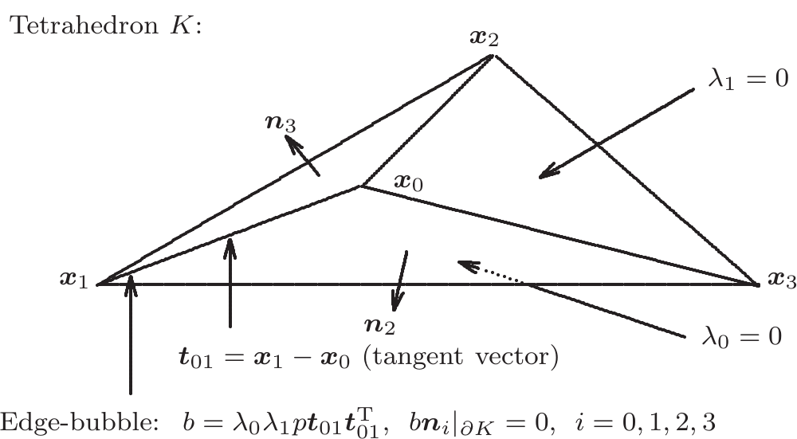
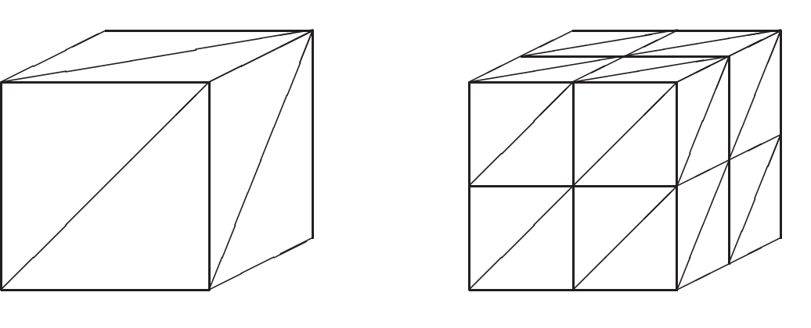

# A family of symmetric mixed finite elements for linear elasticity on tetrahedral grids

HU Jun ${}^{1, * }$ & ZHANG ShangYou ${}^{2}$

${}^{1}$ LMAM and School of Mathematical Sciences, Peking University, Beijing 100871, China; ${}^{2}$ Department of Mathematical Sciences, University of Delaware, Newark, DE 19716, USA Email: hujun@math.pku.edu.cn, szhang@udel.edu

*Corresponding author

Received July 15, 2014; accepted November 13, 2014; published online December 5, 2014

Abstract A family of stable mixed finite elements for the linear elasticity on tetrahedral grids are constructed, where the stress is approximated by symmetric $H$ (div)- ${P}_{k}$ polynomial tensors and the displacement is approximated by ${C}^{-1} - {P}_{k - 1}$ polynomial vectors, for all $k \geq  4$. The main ingredients for the analysis are a new basis of the space of symmetric matrices, an intrinsic $H$ (div) bubble function space on each element, and a new technique for establishing the discrete inf-sup condition. In particular, they enable us to prove that the divergence space of the $H$ (div) bubble function space is identical to the orthogonal complement space of the rigid motion space with respect to the vector-valued ${P}_{k - 1}$ polynomial space on each tetrahedron. The optimal error estimate is proved, verified by numerical examples.

Keywords mixed finite element, symmetric finite element, linear elasticity, conforming finite element, tetrahedral grid, inf-sup condition

MSC(2010) 65N30, 73C02

Citation: Hu J, Zhang S Y. A family of symmetric mixed finite elements for linear elasticity on tetrahedral grids. Sci China Math, 2015, 58: 297-307, doi: 10.1007/s11425-014-4953-5

## 1 Introduction

In the Hellinger-Reissner mixed formulation of the linear elasticity equations, the stress is sought in $H\left( {\operatorname{div},\Omega,\mathbb{S}}\right)$ and the displacement in ${L}^{2}\left( {\Omega,{\mathbb{R}}^{3}}\right)$. It is a challenge to design stable mixed finite element spaces mainly due to the symmetric constraint of the stress tensor. To overcome this difficulty, earliest works adopted composite element techniques or weakly symmetric methods $\left\lbrack  {3,6,7,{25},{27},{29} - {31}}\right\rbrack$. In [9], Arnold and Winther designed the first family of mixed finite element methods in 2D, based on polynomial shape function spaces. From then on, various stable mixed elements have been constructed, see $\left\lbrack  {2,4,5,8 - {12},{17} - {24},{26},{32},{33}}\right\rbrack$.

As the displacement function is in ${L}^{2}\left( {\Omega,{\mathbb{R}}^{3}}\right)$, a natural discretization is the piecewise ${P}_{k - 1}$ polynomial without interelement continuity. It is a long-standing and challenging problem if the stress tensor can be discretized by an appropriate ${P}_{k}$ finite element subspace of $H\left( {\operatorname{div},\Omega,\mathbb{S}}\right)$. Adams and Cockburn constructed such a mixed finite element in [2] where the discrete stress space is the space of $H\left( {\operatorname{div},\Omega,\mathbb{S}}\right)$ - ${P}_{k + 2}$ tensors whose divergence is a ${P}_{k - 1}$ polynomial on each tetrahedron, for $k = 2$. The method was modified and extended to a family of elements, $k \geq  2$, by Arnold et al. [5]. In this paper, we solve this open problem by constructing a suitable $H\left( {\operatorname{div},\Omega,\mathbb{S}}\right)  - {P}_{k}$, instead of the above ${P}_{k + 2}$, finite element space for the stress discretization, for $k \geq  4$. In these elements, the symmetric stress tensor is approximated by the full ${C}^{0} - {P}_{k}$ space enriched by some so-called $H$ (div) bubble functions locally on each tetrahedron. A new way of proof is developed to establish the stability of the mixed elements, by characterizing the divergence of local stress space. The space of divergence of the local $H$ (div) bubble stress space is exactly the subspace of the ${P}_{k - 1}$ polynomial space orthogonal to the local rigid-motion. The optimal order error estimate is proved, verified by numerical tests of ${P}_{4}$ and ${P}_{5}$ mixed elements. Note that the ${P}_{k}$ mixed element here has the same numbers of degrees of freedom at vertices, on edges, and faces, as that $k - 2$ order mixed element in [5], while the new element promises a $k$ order convergence in the energy norm.

The rest of the paper is organized as follows. In Section 2, we define the weak problem and the finite element method. In Section 3, we prove the well-posedness of the finite element problem, i.e., the discrete coerciveness and the discrete inf-sup condition, by which, the optimal order convergence of the new element follows. In Section 4, we provide some numerical results, using ${P}_{4}$ and ${P}_{5}$ finite elements.

## 2 The family of finite elements

Based on the Hellinger-Reissner principle, the linear elasticity problem within a stress-displacement $\left( {\sigma  - u}\right)$ form reads: Find $\left( {\sigma, u}\right)  \in  \Sigma  \times  V \mathrel{\text{:= }} H\left( {\operatorname{div},\Omega,\mathbb{S} = \text{ symmetric }{\mathbb{R}}^{3 \times  3}}\right)  \times  {L}^{2}\left( {\Omega,{\mathbb{R}}^{3}}\right)$, such that

$$
\left\{  \begin{array}{ll} \left( {{A\sigma },\tau }\right)  + \left( {\operatorname{div}\tau, u}\right)  = 0, & \text{ for all }\tau  \in  \Sigma, \\  \left( {\operatorname{div}\sigma, v}\right)  = \left( {f, v}\right), & \text{ for all }v \in  V. \end{array}\right. \tag{2.1}
$$

Here the symmetric tensor space for the stress $\Sigma$ and the space for the vector displacement $V$ are, respectively,

$$
H\left( {\operatorname{div},\Omega,\mathbb{S}}\right)  \mathrel{\text{:= }} \left\{  {\sigma  = \left( \begin{array}{lll} {\sigma }_{11} & {\sigma }_{12} & {\sigma }_{13} \\  {\sigma }_{21} & {\sigma }_{22} & {\sigma }_{23} \\  {\sigma }_{31} & {\sigma }_{32} & {\sigma }_{33} \end{array}\right)  \in  H\left( {\operatorname{div},\Omega }\right),{\sigma }^{\mathrm{T}} = \sigma }\right\} , \tag{2.2}
$$

$$
{L}^{2}\left( {\Omega,{\mathbb{R}}^{3}}\right)  \mathrel{\text{:= }} \left\{  {{\left( \begin{array}{lll} {u}_{1} & {u}_{2} & {u}_{3} \end{array}\right) }^{\mathrm{T}},{u}_{i} \in  {L}^{2}\left( \Omega \right), i = 1,2,3}\right\} . \tag{2.3}
$$

This paper denotes by ${H}^{k}\left( {T, X}\right)$ the Sobolev space consisting of functions with domain $T \subset  {\mathbb{R}}^{3}$, taking values in the finite-dimensional vector space $X$, and with all derivatives of order at most $k$ square-integrable. For our purposes, the range space $X$ will be either $\mathbb{S},{\mathbb{R}}^{3}$, or $\mathbb{R}.\parallel  \cdot  {\parallel }_{k, T}$ is the norm of ${H}^{k}\left( T\right)$. $\mathbb{S}$ denotes the space of symmetric tensors, $H\left( {\operatorname{div}, T,\mathbb{S}}\right)$ consists of square-integrable symmetric matrix fields with square-integrable divergence. The $H\left( \mathrm{{div}}\right)$ norm is defined by

$$
\parallel \tau {\parallel }_{H\left( {\operatorname{div}, T}\right) }^{2} \mathrel{\text{:= }} \parallel \tau {\parallel }_{{L}^{2}\left( T\right) }^{2} + \parallel \operatorname{div}\tau {\parallel }_{{L}^{2}\left( T\right) }^{2}.
$$

${L}^{2}\left( {T,{\mathbb{R}}^{3}}\right)$ is the space of vector-valued functions which are square-integrable. Here, the compliance tensor $A = A\left( x\right) : \mathbb{S} \rightarrow  \mathbb{S}$, characterizing the properties of the material, is bounded and symmetric positive definite uniformly for $x \in  \Omega$.

This paper deals with a pure displacement problem (2.1) with the homogeneous boundary condition that $u \equiv  0$ on $\partial \Omega$. But the method and the analysis work for mixed boundary value problems and the pure traction boundary problem.

The domain $\Omega$ is subdivided by a family of quasi-uniform tetrahedral grids ${\mathcal{T}}_{h}$ (with the grid size $h$ ). We introduce the finite element space of order $k\left( {k \geq  4}\right)$ on ${\mathcal{T}}_{h}$. The displacement space is the full ${C}^{-1} - {P}_{k - 1}$ space

$$
{V}_{h} = \left\{  {v \in  {L}^{2}\left( {\Omega,{\mathbb{R}}^{3}}\right),{\left. v\right| }_{K} \in  {P}_{k - 1}\left( {K,{\mathbb{R}}^{3}}\right) \text{ for all }K \in  {\mathcal{T}}_{h}}\right\} . \tag{2.4}
$$

Since the discrete stress space ${\Sigma }_{h}$ is an $H$ (div) bubble enrichment of the ${H}^{1}$ space

$$
{\widetilde{\Sigma }}_{h} = \left\{  {\sigma  \in  {H}^{1}\left( {\Omega,\mathbb{S}}\right),{\left. \sigma \right| }_{K} \in  {P}_{k}\left( {K,\mathbb{S}}\right) \text{ for all }K \in  {\mathcal{T}}_{h}}\right\} , \tag{2.5}
$$

we first define the $H$ (div) bubble function space on each element. To this end, let ${\mathbf{x}}_{0},{\mathbf{x}}_{1},{\mathbf{x}}_{2}$ and ${\mathbf{x}}_{3}$ be the four vertices of a tetrahedron $K$, cf. Figure 2.1.

Figure 2.1 An edge-bubble function $b = {\lambda }_{0}{\lambda }_{1}p{\mathbf{t}}_{01}{\mathbf{t}}_{01}^{\mathrm{T}}, p \in  {P}_{k - 2}\left( {K,\mathbb{R}}\right)$ on an edge ${\mathbf{x}}_{0}{\mathbf{x}}_{1}$ of tetrahedron $K$

The referencing mapping is then

$$
\mathbf{x} = {F}_{K}\left( \widehat{\mathbf{x}}\right)  = {\mathbf{x}}_{0} + \left( \begin{array}{lll} {\mathbf{x}}_{1} - {\mathbf{x}}_{0} & {\mathbf{x}}_{2} - {\mathbf{x}}_{0} & {\mathbf{x}}_{3} - {\mathbf{x}}_{0} \end{array}\right) \widehat{\mathbf{x}},
$$

mapping the reference tetrahedron

$$
\widehat{K} = \left\{  {0 \leq  {\widehat{x}}_{1},{\widehat{x}}_{2},{\widehat{x}}_{3},1 - {\widehat{x}}_{1} - {\widehat{x}}_{2} - {\widehat{x}}_{3} \leq  1}\right\}
$$

to $K$. Then the inverse mapping is

$$
\widehat{\mathbf{x}} = \left( \begin{matrix} {\mathbf{n}}_{1}^{\mathrm{T}} \\  {\mathbf{n}}_{2}^{\mathrm{T}} \\  {\mathbf{n}}_{3}^{\mathrm{T}} \end{matrix}\right) \left( {\mathbf{x} - {\mathbf{x}}_{0}}\right), \tag{2.6}
$$

where

$$
\left( \begin{array}{l} {\mathbf{n}}_{1}^{\mathrm{T}} \\  {\mathbf{n}}_{2}^{\mathrm{T}} \\  {\mathbf{n}}_{3}^{\mathrm{T}} \end{array}\right)  = {\left( \begin{array}{lll} {\mathbf{x}}_{1} - {\mathbf{x}}_{0} & {\mathbf{x}}_{2} - {\mathbf{x}}_{0} & {\mathbf{x}}_{3} - {\mathbf{x}}_{0} \end{array}\right) }^{-1}. \tag{2.7}
$$

By (2.6), these normal vectors are coefficients of the barycentric variables:

$$
{\lambda }_{1} = {\mathbf{n}}_{1} \cdot  \left( {\mathbf{x} - {\mathbf{x}}_{0}}\right),\;{\lambda }_{2} = {\mathbf{n}}_{2} \cdot  \left( {\mathbf{x} - {\mathbf{x}}_{0}}\right),
$$

$$
{\lambda }_{3} = {\mathbf{n}}_{3} \cdot  \left( {\mathbf{x} - {\mathbf{x}}_{0}}\right),\;{\lambda }_{0} = 1 - {\lambda }_{1} - {\lambda }_{2} - {\lambda }_{3}.
$$

On each face triangle, say ${\mathbf{x}}_{0}{\mathbf{x}}_{2}{\mathbf{x}}_{3}$, all three edges (the tangent vectors), ${\mathbf{x}}_{0}{\mathbf{x}}_{2},{\mathbf{x}}_{0}{\mathbf{x}}_{3}$ and ${\mathbf{x}}_{2}{\mathbf{x}}_{3}$, are orthogonal to the face normal vector ${\mathbf{n}}_{1}$. For convenience, we introduce the tangent vectors and their tensors:

$$
{\mathbf{t}}_{01} = {\mathbf{x}}_{1} - {\mathbf{x}}_{0},\;{T}_{01} = {\mathbf{t}}_{01}{\mathbf{t}}_{01}^{\mathrm{T}},
$$

$$
{\mathbf{t}}_{02} = {\mathbf{x}}_{2} - {\mathbf{x}}_{0},\;{T}_{02} = {\mathbf{t}}_{02}{\mathbf{t}}_{02}^{\mathrm{T}},
$$

$$
{\mathbf{t}}_{03} = {\mathbf{x}}_{3} - {\mathbf{x}}_{0},\;{T}_{03} = {\mathbf{t}}_{03}{\mathbf{t}}_{03}^{\mathrm{T}}, \tag{2.8}
$$

$$
{\mathbf{t}}_{12} = {\mathbf{x}}_{2} - {\mathbf{x}}_{1},\;{T}_{12} = {\mathbf{t}}_{12}{\mathbf{t}}_{12}^{\mathrm{T}},
$$

$$
{\mathbf{t}}_{23} = {\mathbf{x}}_{3} - {\mathbf{x}}_{2},\;{T}_{23} = {\mathbf{t}}_{23}{\mathbf{t}}_{23}^{\mathrm{T}},
$$

$$
{\mathbf{t}}_{13} = {\mathbf{x}}_{3} - {\mathbf{x}}_{1},\;{T}_{13} = {\mathbf{t}}_{13}{\mathbf{t}}_{13}^{\mathrm{T}}.
$$

With them, we define a $H\left( {\operatorname{div}, K,\mathbb{S}}\right)$ bubble function space

$$
{\Sigma }_{K, b} = \mathop{\sum }\limits_{{0 \leq  i < j \leq  3}}{\lambda }_{i}{\lambda }_{j}{P}_{k - 2}\left( {K,\mathbb{R}}\right) {T}_{ij}. \tag{2.9}
$$

Note that each bubble function, say, a function $\tau$ in ${\lambda }_{0}{\lambda }_{1}{T}_{01}{P}_{k - 2}\left( {K,\mathbb{R}}\right)$, vanishes on two face triangles $\left( {{\lambda }_{0} = 0,{\lambda }_{1} = 0}\right)$ and $\tau {\mathbf{n}}_{2} = \mathbf{0},\tau {\mathbf{n}}_{3} = \mathbf{0}$ on the other two face triangles. Then the discrete stress space of order $k\left( {k \geq  4}\right)$ is defined as

$$
{\Sigma }_{h} = \left\{  {\sigma  \in  H\left( {\operatorname{div},\Omega,\mathbb{S}}\right),\sigma  = {\sigma }_{c} + {\sigma }_{b},{\sigma }_{c} \in  {\widetilde{\Sigma }}_{h},{\left. {\sigma }_{b}\right| }_{K} \in  {\Sigma }_{K, b},\forall K \in  {\mathcal{T}}_{h}}\right\} . \tag{2.10}
$$

Next, we define a basis for ${\Sigma }_{h}$. Given element $K$, let ${\mathbf{x}}_{i}$ and ${F}_{i}, i = 0,1,2,3$, be its vertices and faces, respectively. Given edge ${E}_{i, j} = {\mathbf{x}}_{i}{\mathbf{x}}_{j},0 \leq  i < j \leq  3$, define its $k - 1$ interior nodal points

$$
{\mathbf{x}}_{{E}_{i, j}, l} = \frac{l}{k}{\mathbf{x}}_{i} + \left( {1 - \frac{l}{k}}\right) {\mathbf{x}}_{j},\;1 \leq  l \leq  k - 1. \tag{2.11}
$$

Given ${F}_{i}$ with three vertices ${\mathbf{x}}_{0}^{\left( i\right) },{\mathbf{x}}_{1}^{\left( i\right) }$ and ${\mathbf{x}}_{2}^{\left( i\right) }$, define its $\frac{\left( {k - 1}\right) \left( {k - 2}\right) }{2}$ interior nodal points

$$
{\mathbf{x}}_{{F}_{i}, j, l} = \frac{j}{k}{\mathbf{x}}_{0}^{\left( i\right) } + \frac{l}{k}{\mathbf{x}}_{1}^{\left( i\right) } + \frac{k - l - j}{k}{\mathbf{x}}_{2}^{\left( i\right) },\;1 \leq  j, l\text{ and }j + l \leq  k - 1. \tag{2.12}
$$

We define $\frac{\left( {k - 1}\right) \left( {k - 2}\right) \left( {k - 3}\right) }{6}$ interior nodal points

$$
{\mathbf{x}}_{K, i, j, l} = \frac{i}{k}{\mathbf{x}}_{0} + \frac{j}{k}{\mathbf{x}}_{1} + \frac{l}{k}{\mathbf{x}}_{2} + \frac{k - i - j - l}{k}{\mathbf{x}}_{3}, \tag{2.13}
$$

$1 \leq  i, j, l$ and $i + j + l \leq  k - 1$ of element $K$. Then the nodes for the Lagrange element of order $k$ are

$$
{\mathbb{X}}_{K} = \left\{  {{\mathbf{x}}_{i}, i = 0,\ldots,3}\right\}   \cup  \left\{  {{\mathbf{x}}_{{E}_{i, j}, l},0 \leq  i < j \leq  3, l = 1,\ldots, k - 1}\right\}
$$

$$
\cup  \left\{  {{\mathbf{x}}_{{F}_{i}, j, l}, i = 0,\ldots,3,1 \leq  j, l\text{ and }j + l \leq  k - 1}\right\}
$$

$$
\cup  \left\{  {{\mathbf{x}}_{K, i, j, l},1 \leq  i, j, l\text{ and }i + j + l \leq  k - 1}\right\}  \text{. }
$$

Let ${\mathcal{X}}_{\mathbb{E}}$ denote all interior nodes, defined in (2.11), of all the edges, ${\mathcal{X}}_{\mathbb{F}}$ denote all interior nodes, defined in (2.12), of all the faces, ${\mathcal{X}}_{\mathbb{K}}$ denote all interior nodes, defined in (2.13), of all the elements, and ${\mathcal{X}}_{\mathbb{V}}$ denote all the vertices of ${\mathcal{T}}_{h}$. Define the Lagrange element space of order $k$ by

$$
{\mathbb{P}}_{h} \mathrel{\text{:= }} {H}^{1}\left( {\Omega,\mathbb{R}}\right)  \cap  \left\{  {v \in  {L}^{2}\left( \Omega \right),{\left. v\right| }_{K} \in  {P}_{k}\left( {K,\mathbb{R}}\right),\forall K \in  {\mathcal{T}}_{h}}\right\} .
$$

Given a node $\mathbf{x} \in  {\mathcal{X}}_{\mathbb{V}} \cup  {\mathcal{X}}_{\mathbb{E}} \cup  {\mathcal{X}}_{\mathbb{F}} \cup  {\mathcal{X}}_{\mathbb{K}}$, let ${\varphi }_{\mathbf{x}} \in  {\mathbb{P}}_{h}$ be its associated nodal basis function, which is defined as

$$
{\varphi }_{\mathbf{x}}\left( \mathbf{x}\right)  = 1\text{ and }{\varphi }_{\mathbf{x}}\left( {\mathbf{x}}^{\prime }\right)  = 0\text{ for any }{\mathbf{x}}^{\prime } \in  {\mathcal{X}}_{\mathbb{V}} \cup  {\mathcal{X}}_{\mathbb{E}} \cup  {\mathcal{X}}_{\mathbb{F}} \cup  {\mathcal{X}}_{\mathbb{K}}\text{ other than }\mathbf{x}\text{. }
$$

Given edge $E$, let ${T}_{E}$ be a matrix of rank one defined similarly to that in (2.8). We need the orthogonal complement matrices ${T}_{E, j}^{ \bot  } \in  \mathbb{S}, j = 1,\ldots,5$, of matrix ${T}_{E}$, which are defined by

$$
{T}_{E, j}^{ \bot  }: {T}_{E} = 0,\;{T}_{E, j}^{ \bot  }: {T}_{E, j}^{ \bot  } = 1,\;\text{ and }\;{T}_{E, i}^{ \bot  }: {T}_{E, j}^{ \bot  } = 0\;\text{ for }i \neq  j, \tag{2.14}
$$

where the inner product $A: B = \mathop{\sum }\limits_{{i, j = 1}}^{3}{a}_{ij}{b}_{ij}$ for two matrices $A = {\left\{  {a}_{ij}\right\}  }_{i, j = 1}^{3}$ and $B = {\left\{  {b}_{ij}\right\}  }_{i, j = 1}^{3}$.

Given face $F$, let ${\mathbf{t}}_{F, j}, j = 1,2,3$, be unit tangential vectors of its three edges, which allow for defining

$$
{T}_{F, j} = {\mathbf{t}}_{F, j}{\mathbf{t}}_{F, j}^{\mathrm{T}},\; j = 1,2,3. \tag{2.15}
$$

Define their orthogonal complement matrices ${T}_{F, m}^{ \bot  }, m = 1,2,3$, such that

$$
{T}_{F, j}: {T}_{F, m}^{ \bot  } = 0,\;\text{ and }\;{T}_{F, j}^{ \bot  }: {T}_{F, m}^{ \bot  } = {\delta }_{j, m},\; j, m = 1,2,3. \tag{2.16}
$$

A canonical basis of $\mathbb{S}$ reads

(2.17)

$$
{\mathbb{T}}_{1} = \left( \begin{array}{lll} 1 & 0 & 0 \\  0 & 0 & 0 \\  0 & 0 & 0 \end{array}\right),\;{\mathbb{T}}_{2} = \left( \begin{array}{lll} 0 & 1 & 0 \\  1 & 0 & 0 \\  0 & 0 & 0 \end{array}\right),\;\text{ and }\;{\mathbb{T}}_{3} = \left( \begin{array}{lll} 0 & 0 & 1 \\  0 & 0 & 0 \\  1 & 0 & 0 \end{array}\right),
$$

$$
{\mathbb{T}}_{4} = \left( \begin{array}{lll} 0 & 0 & 0 \\  0 & 1 & 0 \\  0 & 0 & 0 \end{array}\right),\;{\mathbb{T}}_{5} = \left( \begin{array}{lll} 0 & 0 & 0 \\  0 & 0 & 1 \\  0 & 1 & 0 \end{array}\right),\;\text{ and }\;{\mathbb{T}}_{6} = \left( \begin{array}{lll} 0 & 0 & 0 \\  0 & 0 & 0 \\  0 & 0 & 1 \end{array}\right).
$$

With these preparations, the basis functions of ${\Sigma }_{h}$ can be classified into six classes:

(1) Vertex-based basis functions: given node $\mathbf{x} \in  {\mathcal{X}}_{\mathbb{V}}$, its six associated basis functions of ${\Sigma }_{h}$ read

$$
{\tau }_{\mathbf{x}, i} = {\varphi }_{\mathbf{x}}{\mathbb{T}}_{i},\; i = 1,\ldots,6.
$$

(2) Edge-based basis functions with nonzero flux: given node $\mathbf{x} \in  {\mathcal{X}}_{\mathbb{E}}$ on edge $E$, its five associated basis functions with nonzero flux of ${\Sigma }_{h}$ read

$$
{\tau }_{E,\mathbf{x}, i}^{\left( nb\right) } = {\varphi }_{\mathbf{x}}{T}_{E, i}^{ \bot  },\; i = 1,\ldots,5.
$$

(3) Edge-based basis functions with zero flux: given node $\mathbf{x} \in  {\mathcal{X}}_{\mathbb{E}}$ on edge $E$, letting ${K}_{1},\ldots,{K}_{{\ell }_{E}}$ be elements which share the common edge $E$, its associated basis functions with zero flux of ${\Sigma }_{h}$ read

$$
{\tau }_{E,{K}_{i},\mathbf{x}}^{\left( b\right) } = {\left. {\varphi }_{\mathbf{x}}\right| }_{{K}_{i}}{T}_{E},\; i = 1,\ldots,{\ell }_{E}.
$$

(4) Face-based basis functions with nonzero flux: given node $\mathbf{x} \in  {\mathcal{X}}_{\mathbb{F}}$ on face $F$, its three associated basis functions with nonzero flux of ${\Sigma }_{h}$ read

$$
{\tau }_{F,\mathbf{x}, i}^{\left( nb\right) } = {\varphi }_{\mathbf{x}}{T}_{F, i}^{ \bot  },\; i = 1,2,3.
$$

(5) Face-based basis functions with zero flux: given node $\mathbf{x} \in  {\mathcal{X}}_{\mathbb{F}}$ on face $F$, letting ${K}_{1}$ and ${K}_{2}$ be two elements which share the common face $F$, its associated basis functions with zero flux of ${\Sigma }_{h}$ read

$$
{\tau }_{F,{K}_{i},\mathbf{x}, j}^{\left( b\right) } = {\left. {\varphi }_{\mathbf{x}}\right| }_{{K}_{i}}{T}_{F, j},\; i = 1,2,\; j = 1,2,3.
$$

(6) Volume-based basis functions: given node $\mathbf{x} \in  {\mathcal{X}}_{\mathbb{K}}$ inside $K$, its six associated basis functions of ${\Sigma }_{h}$ read

$$
{\tau }_{K,\mathbf{x}, i} = {\varphi }_{\mathbf{x}}{\mathbb{T}}_{i},\; i = 1,\ldots,6.
$$

To characterize the bubble space ${\Sigma }_{K, b}$, we need the following lemma.

Lemma 2.1. The six symmetric tensors ${T}_{ij}$ in (2.8) are linearly independent, and form a basis of $\mathbb{S}$.

Proof. Each tensor ${T}_{ij} = {\mathbf{t}}_{ij}{\mathbf{t}}_{ij}^{\mathrm{T}}$ is a positive semi-definite matrix, on a tetrahedron $K$. We would show that the constants ${c}_{ij}$ are all equal to zero in

$$
T = {c}_{01}{T}_{01} + {c}_{02}{T}_{02} + {c}_{03}{T}_{03} + {c}_{12}{T}_{12} + {c}_{23}{T}_{23} + {c}_{13}{T}_{13} = 0.
$$

First, we compute the bilinear form (cf. Figure 2.1), by (2.7),

$$
{\mathbf{n}}_{1}^{\mathrm{T}}T{\mathbf{n}}_{1} = {c}_{01}1 \cdot  1 + {c}_{02}0 + {c}_{03}0 + {c}_{12}\left( {-1}\right) \left( {-1}\right)  + {c}_{23}0 + {c}_{13}\left( {-1}\right) \left( {-1}\right)  = 0.
$$

Here, by (2.7) and (2.8),

$$
{\mathbf{t}}_{01}^{\mathrm{T}}{\mathbf{n}}_{1} = 1,
$$

$$
{\mathbf{t}}_{12}^{\mathrm{T}}{\mathbf{n}}_{1} = \left( {{\mathbf{t}}_{02}^{\mathrm{T}} - {\mathbf{t}}_{01}^{\mathrm{T}}}\right) {\mathbf{n}}_{1} = 0 - 1,
$$

$$
{\mathbf{t}}_{13}^{\mathrm{T}}{\mathbf{n}}_{1} = \left( {{\mathbf{t}}_{03}^{\mathrm{T}} - {\mathbf{t}}_{01}^{\mathrm{T}}}\right) {\mathbf{n}}_{1} = 0 - 1.
$$

Symmetrically, by evaluating ${\mathbf{n}}_{i}^{\mathrm{T}}T{\mathbf{n}}_{i}$ for $i = 0,1,2,3$, where ${\mathbf{n}}_{0} =  - {\mathbf{n}}_{1} - {\mathbf{n}}_{2} - {\mathbf{n}}_{3}$, we have

$$
\left\{  \begin{array}{l} {c}_{01} + {c}_{02} + {c}_{03} = 0 \\  {c}_{01} + {c}_{12} + {c}_{13} = 0 \\  {c}_{02} + {c}_{12} + {c}_{23} = 0 \\  {c}_{03} + {c}_{13} + {c}_{23} = 0 \end{array}\right. \tag{2.18}
$$

Note that ${\mathbf{n}}_{0} \neq  \mathbf{0}$ as $K$ is a non-singular tetrahedron. Next, we introduce three (non-unit) vectors ${\mathbf{s}}_{i}$ orthogonal to the three pairs of skew edges, $\overline{{\mathbf{x}}_{0}{\mathbf{x}}_{1}}$ and $\overline{{\mathbf{x}}_{2}{\mathbf{x}}_{3}},\overline{{\mathbf{x}}_{0}{\mathbf{x}}_{2}}$ and $\overline{{\mathbf{x}}_{1}{\mathbf{x}}_{3}},\overline{{\mathbf{x}}_{0}{\mathbf{x}}_{3}}$ and $\overline{{\mathbf{x}}_{1}{\mathbf{x}}_{2}}$, respectively (cf. Figure 2.1), i.e.,

$$
{\mathbf{s}}_{1} = \frac{{\mathbf{t}}_{01} \times  {\mathbf{t}}_{23}}{6\left| K\right| }
$$

because $\left| K\right|  \neq  0$ and consequently $\left| {{t}_{01} \times  {t}_{23}}\right|  \neq  0$. Thus ${s}_{1} \cdot  {t}_{01} = 0,{s}_{1} \cdot  {t}_{02} =  - 1,{s}_{1} \cdot  {t}_{03} =  - 1$, ${\mathbf{s}}_{1} \cdot  {\mathbf{t}}_{12} =  - 1,{\mathbf{s}}_{1} \cdot  {\mathbf{t}}_{13} =  - 1$, and ${\mathbf{s}}_{1} \cdot  {\mathbf{t}}_{23} = 0$. By evaluating ${\mathbf{s}}_{i}^{\mathrm{T}}T{\mathbf{s}}_{i}$, it follows that

$$
\left\{  \begin{array}{l} {c}_{02} + {c}_{03} + {c}_{12} + {c}_{13} = 0, \\  {c}_{01} + {c}_{03} + {c}_{12} + {c}_{23} = 0, \\  {c}_{01} + {c}_{02} + {c}_{13} + {c}_{23} = 0. \end{array}\right. \tag{2.19}
$$

By the first two equations in (2.18) and the first equation in (2.19), we get $2{c}_{01} = 0$. Symmetrically, we find all ${c}_{ij} = 0$. Thus $\left\{  {T}_{ij}\right\}$ is a linearly independent set of tensors. As $\dim \mathbb{S} = 6,\left\{  {T}_{ij}\right\}$ is a basis.

It follows from the definition of ${V}_{h}\left( {P}_{k - 1}\right.$ polynomials) and ${\Sigma }_{h}\left( {P}_{k}\right.$ polynomials $)$ that div ${\Sigma }_{h} \subset  {V}_{h}$. This, in turn, leads to a strong divergence-free space:

$$
{Z}_{h} \mathrel{\text{:= }} \left\{  {{\tau }_{h} \in  {\Sigma }_{h} \mid  \left( {\operatorname{div}{\tau }_{h}, v}\right)  = 0\text{ for all }v \in  {V}_{h}}\right\}   = \left\{  {{\tau }_{h} \in  {\Sigma }_{h} \mid  \operatorname{div}{\tau }_{h} = 0\text{ pointwise }}\right\} . \tag{2.20}
$$

The mixed finite element approximation of Problem (1.1) reads: Find $\left( {{\sigma }_{h},{u}_{h}}\right)  \in  {\Sigma }_{h} \times  {V}_{h}$ such that

$$
\left\{  \begin{array}{ll} \left( {A{\sigma }_{h},\tau }\right)  + \left( {\operatorname{div}\tau,{u}_{h}}\right)  = 0, & \text{ for all }\tau  \in  {\Sigma }_{h}, \\  \left( {\operatorname{div}{\sigma }_{h}, v}\right)  = \left( {f, v}\right), & \text{ for all }v \in  {V}_{h}. \end{array}\right. \tag{2.21}
$$

## 3 Stability and convergence

The convergence of the finite element solutions follows the stability and the standard approximation property. So we consider first the well-posedness of the discrete problem (2.21). By the standard theory, we only need to prove the following two conditions, based on their counterpart at the continuous level.

(1) K-ellipticity. There exists a constant $C > 0$, independent of the meshsize $h$ such that

$$
\left( {{A\tau },\tau }\right)  \geq  C\parallel \tau {\parallel }_{H\left( \operatorname{div}\right) }^{2}\text{ for all }\tau  \in  {Z}_{h}, \tag{3.1}
$$

where ${Z}_{h}$ is the divergence-free space defined in (2.20).

(2) Discrete B-B condition. There exists a positive constant $C > 0$ independent of the meshsize $h$, such that

$$
\mathop{\inf }\limits_{{0 \neq  v \in  {V}_{h}}}\mathop{\sup }\limits_{{0 \neq  \tau  \in  {\Sigma }_{h}}}\frac{\left( \operatorname{div}\tau, v\right) }{\parallel \tau {\parallel }_{H\left( \operatorname{div}\right) }\parallel v{\parallel }_{{L}^{2}\left( \Omega \right) }} \geq  C. \tag{3.2}
$$

It follows from div ${\Sigma }_{h} \subset  {V}_{h}$ that $\operatorname{div}\tau  = 0$ for any $\tau  \in  {Z}_{h}$. This implies the above K-ellipticity condition (3.1). It remains to show the discrete B-B condition (3.2), in the following two lemmas.

Lemma 3.1. For any ${v}_{h} \in  {V}_{h}$, there is a ${\tau }_{h} \in  {\widetilde{\Sigma }}_{h} \subset  {\Sigma }_{h}$ such that, for any polynomial $p \in  {P}_{k - 3}\left( {K,{\mathbb{R}}^{3}}\right)$, $K \in  {\mathcal{T}}_{h}$

$$
{\int }_{K}\left( {\operatorname{div}{\tau }_{h} - {v}_{h}}\right)  \cdot  {pd}\mathbf{x} = 0\;\text{ and }\;{\begin{Vmatrix}{\tau }_{h}\end{Vmatrix}}_{H\left( \operatorname{div}\right) } \leq  C{\begin{Vmatrix}{v}_{h}\end{Vmatrix}}_{{L}^{2}\left( \Omega \right) }. \tag{3.3}
$$

Proof. Let ${v}_{h} \in  {V}_{h}$. By the stability of the continuous formulation, there is a $\tau  \in  {H}^{1}\left( {\Omega,\mathbb{S}}\right)$ such that,

$$
\operatorname{div}\tau  = {v}_{h}\;\text{ and }\;\parallel \tau {\parallel }_{{H}^{1}\left( \Omega \right) } \leq  C{\begin{Vmatrix}{v}_{h}\end{Vmatrix}}_{{L}^{2}\left( \Omega \right) }.
$$

As $\tau  \in  {H}^{1}\left( {\Omega,\mathbb{S}}\right)$, we modify the Scott-Zhang [28] interpolation operator slightly to define a flux preserving interpolation,

$$
{I}_{h}: {H}^{1}\left( {\Omega,\mathbb{S}}\right)  \rightarrow  {\Sigma }_{h} \cap  {H}^{1}\left( {\Omega,\mathbb{S}}\right)  = {\widetilde{\Sigma }}_{h}
$$

$$
\tau  \mapsto  {\tau }_{h} \mathrel{\text{:= }} {I}_{h}\tau
$$

Here the interpolation is done inside a subspace, the continuous finite element subspace ${\Sigma }_{h} \cap  {H}^{1}\left( {\Omega,\mathbb{S}}\right)$. ${I}_{h}\tau$ is defined by its values at the Lagrange nodes.

At a vertex node or a node inside an edge, ${\mathbf{x}}_{i},{I}_{h}\tau \left( {\mathbf{x}}_{i}\right)$ is defined as the nodal value of $\tau$ at the point if $\tau$ is continuous, but in general, ${I}_{h}\tau \left( {\mathbf{x}}_{i}\right)$ is defined as an average value on a face triangle, on whose edge the node is, as in [28]. After defining the nodal values at edges of tetrahedra, the nodal values of ${\tau }_{h}$ at the nodes inside each face triangle $F$ of a tetrahedron are defined by the ${L}^{2}$ -orthogonal projection on the triangle $F$:

$$
{\int }_{F}{\tau }_{h,{ij}}{pdS} = {\int }_{F}{\tau }_{ij}{pdS},\;\forall p \in  {P}_{k - 3}\left( {F,\mathbb{R}}\right),\; i, j = 1,2,3, \tag{3.4}
$$

where ${\tau }_{h,{ij}}$ and ${\tau }_{ij}$ are the $\left( {i, j}\right)$ -th components of ${\tau }_{h}$ and $\tau$, respectively, and $F$ is a face triangle of a tetrahedron in the tetrahedral triangulation ${\mathcal{T}}_{h}$. The number of equations in (3.4) is the same as the number of internal degrees of freedom of ${P}_{k}$ polynomials, $\dim {P}_{k - 3}$. At the Lagrange nodes inside a tetrahedron, ${I}_{h}\tau \left( {\mathbf{x}}_{i}\right)$ is defined by the ${L}^{2}$ -orthogonal projection on the tetrahedron, satisfying

$$
{\int }_{K}{\tau }_{h,{ij}}{pd}\mathbf{x} = {\int }_{K}{\tau }_{ij}{pd}\mathbf{x},\;\forall p \in  {P}_{k - 4}\left( {K,\mathbb{R}}\right), \tag{3.5}
$$

where $K$ is an element of ${\mathcal{T}}_{h}$. It follows by the stability of the Scott-Zhang operator that

$$
{\begin{Vmatrix}{I}_{h}\tau \end{Vmatrix}}_{{H}^{1}\left( \Omega \right) } \leq  C\parallel \tau {\parallel }_{{H}^{1}\left( \Omega \right) } \leq  C{\begin{Vmatrix}{v}_{h}\end{Vmatrix}}_{{L}^{2}\left( \Omega \right) }.
$$

In particular,

$$
{\begin{Vmatrix}{I}_{h}\tau \end{Vmatrix}}_{H\left( \operatorname{div}\right) } \leq  {\begin{Vmatrix}{I}_{h}\tau \end{Vmatrix}}_{{H}^{1}\left( \Omega \right) } \leq  C{\begin{Vmatrix}{v}_{h}\end{Vmatrix}}_{{L}^{2}\left( \Omega \right) }.
$$

By (3.4) and (3.5), we get a partial-divergence matching property of ${I}_{h}$: for any $p \in  {P}_{k - 3}\left( {K,{\mathbb{R}}^{3}}\right)$, as the symmetric gradient $\epsilon \left( p\right)  \in  {P}_{k - 4}\left( {K,\mathbb{S}}\right)$,

$$
{\int }_{K}\left( {\operatorname{div}{\tau }_{h} - {v}_{h}}\right)  \cdot  {pd}\mathbf{x} = {\int }_{\partial K}\left( {{\tau }_{h}\mathbf{n}}\right)  \cdot  {pds} - {\int }_{K}{\tau }_{h}: \epsilon \left( p\right) d\mathbf{x} - {\int }_{K}{v}_{h} \cdot  {pd}\mathbf{x}
$$

$$
= {\int }_{\partial K}\left( {\tau \mathbf{n}}\right)  \cdot  {pds} - {\int }_{K}\tau : \epsilon \left( p\right) d\mathbf{x} - {\int }_{K}{v}_{h} \cdot  {pd}\mathbf{x}
$$

$$
= {\int }_{K}\left( {\operatorname{div}\tau  - {v}_{h}}\right)  \cdot  {pd}\mathbf{x} = 0.
$$

The proof is complete.

Given element $K$, let $R\left( K\right)$ be the space of 6-dimensional, local rigid motions:

$$
R\left( K\right)  = \left\{  {\left. \left( \begin{array}{l} {a}_{1} - {a}_{4}y - {a}_{5}z \\  {a}_{2} + {a}_{4}x - {a}_{6}z \\  {a}_{3} + {a}_{5}x + {a}_{6}y \end{array}\right) \right| \;{a}_{1},{a}_{2},{a}_{3},{a}_{4},{a}_{5},{a}_{6} \in  \mathbb{R}}\right\} . \tag{3.6}
$$

Let ${R}^{ \bot  }\left( K\right)$ be the orthogonal complement of $R\left( K\right)$ with respect to ${P}_{k - 1}\left( {K,{\mathbb{R}}^{3}}\right)$. We have the following key result.

Lemma 3.2. It holds that

$$
\operatorname{div}{\Sigma }_{K, b} = {R}^{ \bot  }\left( K\right). \tag{3.7}
$$

Proof. It is immediate that

$$
\operatorname{div}{\Sigma }_{K, b} \subset  {R}^{ \bot  }\left( K\right) \text{. }
$$

If div ${\Sigma }_{K, b} \neq  {R}^{ \bot  }\left( K\right)$, there is a nonzero ${v}_{h} \in  {R}^{ \bot  }\left( K\right)$ such that

$$
{\int }_{K}\operatorname{div}{\tau }_{h} \cdot  {v}_{h}d\mathbf{x} = 0,\;\forall {\tau }_{h} \in  {\Sigma }_{K, b}.
$$

By integration by parts, for ${\tau }_{h} \in  {\Sigma }_{K, b}$, we have

$$
{\int }_{K}\operatorname{div}{\tau }_{h} \cdot  {v}_{h}d\mathbf{x} =  - {\int }_{K}{\tau }_{h}: \epsilon \left( {v}_{h}\right) d\mathbf{x} = 0, \tag{3.8}
$$

where $\epsilon \left( {v}_{h}\right)$ is the symmetric gradient, $\left( {\nabla {v}_{h} + {\nabla }^{\mathrm{T}}{v}_{h}}\right) /2$.

Let $\left\{  {{M}_{ij}, i = 0,1,2, j = i + 1,\ldots,3}\right\}$ be the dual basis of the symmetric matrix space, of $\left\{  {T}_{ij}\right\}$, defined in (2.8), i.e.,

$$
{M}_{ij} = {M}_{ij}^{\mathrm{T}},\;{M}_{ij}: {T}_{{i}^{\prime }{j}^{\prime }} = {\delta }_{{ij},{i}^{\prime }{j}^{\prime }}. \tag{3.9}
$$

Under the dual basis, we have a unique expansion, as $\epsilon \left( {v}_{h}\right)  \in  {P}_{k - 2}\left( {K,\mathbb{S}}\right)$,

$$
\epsilon \left( {v}_{h}\right)  = {q}_{1}{M}_{01} + {q}_{2}{M}_{02} + {q}_{3}{M}_{03} + {q}_{4}{M}_{12} + {q}_{5}{M}_{23} + {q}_{6}{M}_{13}, \tag{3.10}
$$

for some ${q}_{i} \in  {P}_{k - 2}\left( {K,\mathbb{R}}\right)$. Selecting ${\tau }_{1} = {\lambda }_{0}{\lambda }_{1}{q}_{1}{T}_{01} \in  {\Sigma }_{K, b}$, we have, by (3.9),

$$
0 = {\int }_{K}{\tau }_{1}: \epsilon \left( {v}_{h}\right) d\mathbf{x} = {\int }_{K}{\lambda }_{0}{\lambda }_{1}{q}_{1}^{2}\left( \mathbf{x}\right) d\mathbf{x}.
$$

As ${\lambda }_{0}{\lambda }_{1} > 0$ on $K$, we conclude that ${q}_{1} \equiv  0$. Similarly, the other five ${q}_{i}$ in (3.10) are zero, which implies that ${v}_{h}$ is a rigid motion. On the other hand, ${v}_{h} \in  {R}^{ \bot  }\left( K\right)$ which indicates that it cannot be a nonzero local rigid motion. Thus, ${v}_{h} \equiv  0$ and $\operatorname{div}{\Sigma }_{K, b} = {R}^{ \bot  }\left( K\right)$.

Lemma 3.3. For any ${v}_{h} \in  {V}_{h}$, if

$$
{\int }_{K}{v}_{h} \cdot  {pd}\mathbf{x} = 0\;\text{ for all }p \in  {P}_{k - 3}\left( {K,{\mathbb{R}}^{3}}\right) \text{ and all }K \in  {\mathcal{T}}_{h}, \tag{3.11}
$$

then there is a ${\tau }_{h} \in  {\Sigma }_{h}$ such that

$$
\operatorname{div}{\tau }_{h} = {v}_{h}\;\text{ and }\;{\begin{Vmatrix}{\tau }_{h}\end{Vmatrix}}_{H\left( \operatorname{div}\right) } \leq  C{\begin{Vmatrix}{v}_{h}\end{Vmatrix}}_{{L}^{2}\left( \Omega \right) }. \tag{3.12}
$$

Proof. As we assume polynomial degree $k \geq  4$ in ${V}_{h}$,

$$
p \in  {P}_{k - 3}\left( {K,{\mathbb{R}}^{3}}\right)  \supset  {P}_{1}\left( {K,{\mathbb{R}}^{3}}\right)  \supset  R\left( K\right).
$$

So if ${v}_{h}$ satisfies (3.11), ${\left. {v}_{h}\right| }_{K} \in  {R}^{ \bot  }\left( K\right)$ for any element $K$. Then it follows from Lemma 3.2 that there exists a ${\tau }_{K} \in  {\Sigma }_{K, b}$ such that

$$
\operatorname{div}{\tau }_{K} = {\left. {v}_{h}\right| }_{K},\;{\begin{Vmatrix}{\tau }_{K}\end{Vmatrix}}_{{L}^{2}\left( K\right) } = \left\{  {\min \parallel \tau {\parallel }_{{L}^{2}\left( K\right) },\operatorname{div}\tau  = {\left. {v}_{h}\right| }_{K},\tau  \in  {\Sigma }_{K, b}}\right\} .
$$

Let ${\left. {\tau }_{h}\right| }_{K} = {\tau }_{K}$ for any $K \in  {\mathcal{T}}_{h}$. As the matching div ${\tau }_{h} = {v}_{h}$ is independently done on each element $K$, by affine mapping and scaling argument, (3.12) holds.

We are in the position to show the well-posedness of the discrete problem.

Lemma 3.4. For the discrete problem (2.21), the K-ellipticity (3.1) and the discrete B-B condition (3.2) hold uniformly. Consequently, the discrete mixed problem (2.21) has a unique solution $\left( {{\sigma }_{h},{u}_{h}}\right)  \in \; {\Sigma }_{h} \times  {V}_{h}$.

Proof. The K-ellipticity immediately follows from the fact that $\operatorname{div}{\Sigma }_{h} \subset  {V}_{h}$. To prove the discrete B-B condition (3.2), for any ${v}_{h} \in  {V}_{h}$, it follows from Lemma 3.1 that there exists a ${\tau }_{1} \in  {\Sigma }_{h}$ such that, for any polynomial $p \in  {P}_{k - 3}\left( {K,{\mathbb{R}}^{3}}\right)$,

$$
{\int }_{K}\left( {\operatorname{div}{\tau }_{1} - {v}_{h}}\right)  \cdot  {pd}\mathbf{x} = 0\;\text{ and }\;{\begin{Vmatrix}{\tau }_{1}\end{Vmatrix}}_{H\left( \operatorname{div}\right) } \leq  C{\begin{Vmatrix}{v}_{h}\end{Vmatrix}}_{{L}^{2}\left( \Omega \right) }. \tag{3.13}
$$

Then it follows from Lemma 3.3 that there is a ${\tau }_{2} \in  {\Sigma }_{h}$ such that

$$
\operatorname{div}{\tau }_{2} = {v}_{h} - \operatorname{div}{\tau }_{1}\;\text{ and }\;{\begin{Vmatrix}{\tau }_{2}\end{Vmatrix}}_{H\left( \operatorname{div}\right) } \leq  C{\begin{Vmatrix}\operatorname{div}{\tau }_{1} - {v}_{h}\end{Vmatrix}}_{{L}^{2}\left( \Omega \right) }. \tag{3.14}
$$

Let $\tau  = {\tau }_{1} + {\tau }_{2}$, which implies that

$$
\operatorname{div}\tau  = {v}_{h}\text{ and }\parallel \tau {\parallel }_{H\left( \operatorname{div}\right) } \leq  C{\begin{Vmatrix}{v}_{h}\end{Vmatrix}}_{{L}^{2}\left( \Omega \right) }. \tag{3.15}
$$

This proves the discrete B-B condition (3.2).

Theorem 3.5. Let $\left( {\sigma, u}\right)  \in  \Sigma  \times  V$ be the exact solution of problem (2.1) and $\left( {{\tau }_{h},{u}_{h}}\right)  \in  {\Sigma }_{h} \times  {V}_{h}$ the finite element solution of (2.21). Then, for $k \geq  4$,

$$
{\begin{Vmatrix}\sigma  - {\sigma }_{h}\end{Vmatrix}}_{H\left( \operatorname{div}\right) } + {\begin{Vmatrix}u - {u}_{h}\end{Vmatrix}}_{{L}^{2}\left( \Omega \right) } \leq  C{h}^{k}\left( {\parallel \sigma {\parallel }_{{H}^{k + 1}\left( \Omega \right) } + \parallel u{\parallel }_{{H}^{k}\left( \Omega \right) }}\right). \tag{3.16}
$$

Proof. The stability of the elements and the standard theory of mixed finite element methods [13,14] give the following quasioptimal error estimate immediately,

$$
{\begin{Vmatrix}\sigma  - {\sigma }_{h}\end{Vmatrix}}_{H\left( \operatorname{div}\right) } + {\begin{Vmatrix}u - {u}_{h}\end{Vmatrix}}_{{L}^{2}\left( \Omega \right) } \leq  C\mathop{\inf }\limits_{{{\tau }_{h} \in  {\Sigma }_{h},{v}_{h} \in  {V}_{h}}}\left( {{\begin{Vmatrix}\sigma  - {\tau }_{h}\end{Vmatrix}}_{H\left( \operatorname{div}\right) } + {\begin{Vmatrix}u - {v}_{h}\end{Vmatrix}}_{{L}^{2}\left( \Omega \right) }}\right). \tag{3.17}
$$

Let ${P}_{h}$ denote the local ${L}^{2}$ projection operator, or triangle-wise interpolation operator, from $V$ to ${V}_{h}$, satisfying the error estimate

$$
{\begin{Vmatrix}v - {P}_{h}v\end{Vmatrix}}_{{L}^{2}\left( \Omega \right) } \leq  C{h}^{k}\parallel v{\parallel }_{{H}^{k}\left( \Omega \right) }\;\text{ for any }v \in  {H}^{k}\left( {\Omega,{\mathbb{R}}^{3}}\right). \tag{3.18}
$$

Choosing ${\tau }_{h} = {I}_{h}\sigma  \in  {\Sigma }_{h}$, where ${I}_{h}$ is defined in (3.4) and (3.5), we have [28], as ${I}_{h}$ preserves symmetric ${P}_{k}$ functions locally,

$$
{\begin{Vmatrix}\sigma  - {\tau }_{h}\end{Vmatrix}}_{{L}^{2}\left( \Omega \right) } + h{\left| \sigma  - {\tau }_{h}\right| }_{H\left( \operatorname{div}\right) } \leq  C{h}^{k + 1}\parallel \sigma {\parallel }_{{H}^{k + 1}\left( \Omega \right) }. \tag{3.19}
$$

Let ${v}_{h} = {P}_{h}v$ and ${\tau }_{h} = {I}_{h}\sigma$ in (3.17), by (3.18) and (3.19), we obtain (3.16).

Remark 3.6. By using a mesh dependent norm technique, see for example [29], we can prove the following optimal error estimate,

$$
{\begin{Vmatrix}\sigma  - {\sigma }_{h}\end{Vmatrix}}_{{L}^{2}\left( \Omega \right) } \leq  C{h}^{k + 1}\parallel \sigma {\parallel }_{{H}^{k + 1}\left( \Omega \right) },
$$

provided that $\sigma  \in  {H}^{k + 1}\left( {\Omega,\mathbb{S}}\right)$.

## 4 Numerical tests

We compute one example in $3\mathrm{D}$, by ${P}_{4}$ and by ${P}_{5}$ mixed finite element methods. It is a pure displacement problem on the unit cube $\Omega  = {\left( 0,1\right) }^{3}$ with a homogeneous boundary condition that $u \equiv  0$ on $\partial \Omega$. In the computation, we let

$$
{A\sigma } = \frac{1}{2\mu }\left( {\sigma  - \frac{\lambda }{{2\mu } + {n\lambda }}\operatorname{tr}\left( \sigma \right) \delta }\right),\; n = 3,\;\text{ where }\delta  = \left( \begin{array}{lll} 1 & 0 & 0 \\  0 & 1 & 0 \\  0 & 0 & 1 \end{array}\right),
$$

and $\mu  = 1/2$ and $\lambda  = 1$ are the Lamé constants.

Let the exact solution on the unit square ${\left\lbrack  0,1\right\rbrack  }^{3}$ be

$$
u = \left( \begin{array}{l} {2}^{4} \\  {2}^{5} \\  {2}^{6} \end{array}\right) x\left( {1 - x}\right) y\left( {1 - y}\right) z\left( {1 - z}\right). \tag{4.1}
$$

Then, the true stress function $\sigma$ and the load function $f$ are defined by the equations in (2.1), for the given solution $u$.

In the computation, the level one grid is the given domain with a diagonal line shown in Figure 4.1. Each grid is refined into a half-sized grid uniformly, to get a higher level grid, shown in Figure 4.1. In all the computation, the discrete systems of equations are solved by Matlab backslash solver. In Table 4.1, the errors and the convergence order in various norms are listed for the true solution (4.1), by the ${P}_{4}$ mixed finite element in (2.10) and (2.4), with $k = 4$ there. The optimal order of convergence is achieved in Table 4.1, confirming Theorem 3.5.

Figure 4.1 The initial grid for (4.1), and its level 2 refinement

Table 4.1 The error and the order of convergence by the ${P}_{4}$ finite element, $k = 4$ in (2.4) and (2.10), for (4.1)

<table><tr><td></td><td>${\begin{Vmatrix}\sigma  - {\sigma }_{h}\end{Vmatrix}}_{{L}^{2}\left( \Omega \right) }$</td><td>${h}^{n}$</td><td>${\begin{Vmatrix}u - {u}_{h}\end{Vmatrix}}_{{L}^{2}\left( \Omega \right) }$</td><td>${h}^{n}$</td><td>${\begin{Vmatrix}\operatorname{div}\left( \sigma  - {\sigma }_{h}\right) \end{Vmatrix}}_{{L}^{2}\left( \Omega \right) }$</td><td>${h}^{n}$</td></tr><tr><td>1</td><td>0.19929801</td><td>0.0</td><td>0.06133241</td><td>0.0</td><td>1.47254873</td><td>0.0</td></tr><tr><td>2</td><td>0.00804695</td><td>4.6</td><td>0.00714869</td><td>3.1</td><td>0.09203430</td><td>4.0</td></tr><tr><td>3</td><td>0.00029057</td><td>4.8</td><td>0.00049143</td><td>3.9</td><td>0.00575214</td><td>4.0</td></tr></table>

Table 4.2 The error and the order of convergence by the ${P}_{5}$ finite element, $k = 5$ in (2.4) and (2.10), for (4.1)

<table><tr><td></td><td>${\begin{Vmatrix}{I}_{h}\sigma  - {\sigma }_{h}\end{Vmatrix}}_{{L}^{2}\left( \Omega \right) }$</td><td>${h}^{n}$</td><td>${\begin{Vmatrix}{I}_{h}u - {u}_{h}\end{Vmatrix}}_{{L}^{2}\left( \Omega \right) }$</td><td>${h}^{n}$</td><td>${\begin{Vmatrix}\operatorname{div}\left( {I}_{h}\sigma  - {\sigma }_{h}\right) \end{Vmatrix}}_{{L}^{2}\left( \Omega \right) }$</td><td>${h}^{n}$</td></tr><tr><td>1</td><td>0.00000002</td><td>0.0</td><td>0.01937914</td><td>0.0</td><td>0.00000011</td><td>0.0</td></tr><tr><td>2</td><td>0.00000002</td><td>0.0</td><td>0.00089726</td><td>4.4</td><td>0.00000031</td><td>0.0</td></tr></table>

In Table 4.2, the errors and the convergence order in various norms are listed for the true solution (4.1), by the ${P}_{5}$ mixed finite element in (2.10) and (2.4), with $k = 5$ there. Here the exact solution $\sigma$ is a polynomial tensor of degree 5. Thus, it is in the stress finite element space ${\Sigma }_{h}$ and the finite element solution ${\sigma }_{h}$ is exact. It is computed so, shown in the second column and the six column in Table 4.2. The optimal order of convergence is achieved for the displacement $u$ in Table 4.2 (up to the computer accuracy), confirming Theorem 3.5.

Acknowledgements This work was supported by National Natural Science Foundation of China (Grant Nos. 11271035, 91430213 and 11421101).

## References

1 Adams R A. Sobolev Spaces. New York: Academic Press, 1975

2 Adams S, Cockburn B. A mixed finite element method for elasticity in three dimensions. J Sci Comput, 2005, 25: 515-521

3 Amara M, Thomas J M. Equilibrium finite elements for the linear elastic problem. Numer Math, 1979, 33: 367-383

4 Arnold D N, Awanou G. Rectangular mixed finite elements for elasticity. Math Models Methods Appl Sci, 2005, 15: 1417-1429

5 Arnold D, Awanou G, Winther R. Finite elements for symmetric tensors in three dimensions. Math Comp, 2008, 77: 1229-1251

6 Arnold D N, Brezzi F, Douglas J Jr. PEERS: A new mixed finite element for plane elasticity. Jpn J Appl Math, 1984, 1: 347-367

7 Arnold D N, Douglas J Jr, Gupta C P. A family of higher order mixed finite element methods for plane elasticity. Numer Math, 1984, 45: 1-22

8 Arnold D N, Falk R, Winther R. Mixed finite element methods for linear elasticity with weakly imposed symmetry. Math Comp, 2007, 76: 1699-1723

9 Arnold D N, Winther R. Mixed finite element for elasticity. Numer Math, 2002, 92: 401-419

10 Arnold D N, Winther R. Nonconforming mixed elements for elasticity. Math Models Methods Appl Sci, 2003, 13: 295-307

11 Awanou G. Two remarks on rectangular mixed finite elements for elasticity. J Sci Comput, 2012, 50: 91-102

12 Boffi D, Brezzi F, Fortin M. Reduced symmetry elements in linear elasticity. Comm Pure Appl Anal, 2009, 8: 95-121

13 Brezzi F. On the existence, uniqueness and approximation of saddle-point problems arising from Lagrangian multipliers. Rev Francaise Automat Informat Recherche Operationnelle Ser Rouge, 1974, 8: 129-151

14 Brezzi F, Fortin M. Mixed and Hybrid Finite Element Methods. Berlin: Springer, 1991

15 Carstensen C, Eigel M, Gedicke J. Computational competition of symmetric mixed FEM in linear elasticity. Comput Methods Appl Mech Engrg, 2011, 200: 2903-2915

16 Carstensen C, Günther D, Reininghaus J, et al. The Arnold-Winther mixed FEM in linear elasticity, I: Implementation and numerical verification. Comput Methods Appl Mech Engrg, 2008, 197: 3014-3023

17 Chen S C, Wang Y N. Conforming rectangular mixed finite elements for elasticity. J Sci Comput, 2011, 47: 93-108

18 Cockburn B, Gopalakrishnan J, Guzmán J. A new elasticity element made for enforcing weak stress symmetry. Math Comp, 2010, 79: 1331-1349

19 Gopalakrishnan J, Guzmán J. Symmetric nonconforming mixed finite elements for linear elasticity. SIAM J Numer Anal, 2011, 49: 1504-1520

20 Gopalakrishnan J, Guzmán J. A second elasticity element using the matrix bubble. IMA J Numer Anal, 2012, 32: 352-372

21 Guzmán J. A unified analysis of several mixed methods for elasticity with weak stress symmetry. J Sci Comput, 2010, 44: 156-169

22 Hu J, Man H Y, Zhang S. The minimal mixed finite element method for the symmetric stress field on rectangular grids in any space dimension. ArXiv:1304.5428, 2013

23 Hu J, Man H Y, Zhang S. A simple conforming mixed finite element for linear elasticity on rectangular grids in any space dimension. J Sci Comput, 2014, 58: 367-379

24 Hu J, Shi Z C. Lower order rectangular nonconforming mixed elements for plane elasticity. SIAM J Numer Anal, 2007, 46: 88-102

25 Johnson C, Mercier B. Some equilibrium finite element methods for two-dimensional elasticity problems. Numer Math, 1978, 30: 103-116

26 Man H Y, Hu J, Shi Z C. Lower order rectangular nonconforming mixed finite element for the three-dimensional elasticity problem. Math Models Methods Appl Sci, 2009, 19: 51-65

27 Morley M. A family of mixed finite elements for linear elasticity. Numer Math, 1989, 55: 633-666

28 Scott L R, Zhang S. Finite-element interpolation of non-smooth functions satisfying boundary conditions. Math Comp, 1990, 54: 483-493

29 Stenberg R. On the construction of optimal mixed finite element methods for the linear elasticity problem. Numer Math, 1986, 48: 447-462

30 Stenberg R. Two low-order mixed methods for the elasticity problem. In: Whiteman J R, ed. The Mathematics of Finite Elements and Applications, VI. London: Academic Press, 1988, 271-280

31 Stenberg R. A family of mixed finite elements for the elasticity problem. Numer Math, 1988, 53: 513-538

32 Yi S Y. Nonconforming mixed finite element methods for linear elasticity using rectangular elements in two and three dimensions. CALCOLO, 2005, 42: 115-133

33 Yi S Y. A New nonconforming mixed finite element method for linear elasticity. Math Models Methods Appl Sci, 2006, 16: 979-999
