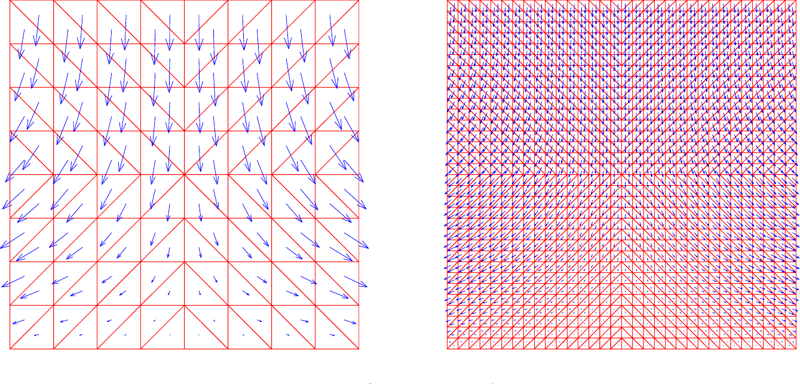

# FIRST-ORDER SYSTEM LEAST SQUARES FOR THE STRESS-DISPLACEMENT FORMULATION: LINEAR ELASTICITY*

ZHIQIANG CAI \( {}^{ \dagger  } \) AND GERHARD STARKE \( {}^{ \ddagger  } \)

Abstract. This paper develops a least-squares finite element method for linear elasticity in both two and three dimensions. The least-squares functional is based on the stress-displacement formulation with the symmetry condition of the stress tensor imposed in the first-order system. For the respective displacement and stress, using the Crouzeix-Raviart and Raviart-Thomas finite element spaces, our least-squares finite element method is shown to be optimal in the (broken) \( {H}^{1} \) and \( H \) (div) norms uniform in the incompressible limit.

Key words. least-squares finite element method, linear elasticity, incompressible limit

AMS subject classifications. 65M60, 65M15

## PII. S003614290139696X

1. Introduction. The practical need of the stress tensor has motivated extensive studies of mixed finite element methods in the stress-displacement formulation (see \( \left\lbrack  {1,4,2,3,5,{11},{14},{20}}\right\rbrack  ) \). Unlike mixed methods for second-order scalar elliptic boundary value problems, stress-displacement finite elements are extremely difficult to construct. This is due to the fact that the stress tensor is symmetric. A beautiful finite element space had not been constructed until recently by Arnold and Winther [5]. Their space is a natural extension of the Raviart-Thomas space of \( H \) (div). The minimum degree of freedom on each triangle of Arnold and Winther space for the symmetric stress tensor in two dimensions is 24, which is very expensive. Previous works impose the symmetry condition weakly via a Lagrange multiplier (see [1, 2, 20]). Like scalar elliptic problems, mixed methods lead to saddle-point problems, and mixed finite elements are subject to the inf-sup condition. Many solution methods which work well for symmetric positive definite problems cannot be applied directly. Although substantial progress in solution methods for saddle-point problems has been achieved, these problems may still be difficult and expensive to solve.

Finite element methods of least-squares type have been the object of many studies recently (see, e.g., the survey [7] and the monograph [18]). Least-squares finite element methods have also been applied to first-order system formulations of linear elasticity, for example, in [13], where displacement gradients are used as additional degrees of freedom. Recently, a displacement-stress-rotation least-squares formulation has been investigated in [19] (see also the references therein for some other least-squares approaches in the engineering literature). Our aim is to present a least-squares formulation that computes approximations for the stress and displacement only. These are the quantities of interest in many practical applications including coupling of elastic deformation with fluid flow models. The least-squares formulation presented in this paper also has some advantages for the extension to geometrically nonlinear elasticity computations, as will be considered in a companion paper.

---

*Received by the editors October 25, 2001; accepted for publication (in revised form) November 4, 2002; published electronically May 6, 2003. This work was sponsored in part by National Science Foundation grants ASC-9720257 and INT-9910010.

http://www.siam.org/journals/sinum/41-2/39696.html

\( {}^{ \dagger  } \) Department of Mathematics, Purdue University,1395 Mathematical Sciences Building, West Lafayette, IN 47907-1395 (zcai@math.purdue.edu). The research of this author was performed in part under the auspices of the U.S. Department of Energy by Lawrence Livermore National Laboratory under contract W-7405-Eng-48.

\( {}^{ \ddagger } \) Institut für Angewandte Mathematik, Universität Hannover, Welfengarten 1, 30167 Hannover, Germany (starke@ifam.uni-hannover.de). The research of this author was supported in part by the Deutscher Akademischer Austauschdienst (DAAD) through a bilateral travel grant.

---

The purpose of this paper is to develop a least-squares finite element method based on the stress-displacement formulation. To circumvent the numerical difficulty on the symmetry of the stress tensor, we impose such a symmetry condition in the first-order system and then apply the least-squares principle to this overdetermined, but consistent, system. The least-squares functional uses the \( {L}^{2} \) norm, and it is shown that the homogeneous functional is equivalent to the energy norm involving the Lamé constant for the displacement and the standard \( H \) (div) norm for the stress. This implies that our least-squares finite element method using the respective Crouzeix-Raviart and Raviart-Thomas spaces for the displacement and stress yields optimal error estimates uniformly in the incompressible limit. The algebraic system resulting in this discretization may be efficiently solved by multigrid methods, which will be considered in a forthcoming paper. Additionally, we consider an inverse norm least-squares functional and show that its homogeneous form is equivalent to the energy norm for the displacement and the \( {L}^{2} \) norm for the stress. This functional can be used to develop a discrete inverse norm least-squares method (see, e.g., [9]).

An outline of the paper is as follows. The linear elasticity system is introduced in section 2, along with some notations. Section 3 develops the least-squares functionals based on the extended first-order system of the stress and displacement and establishes their ellipticity and continuity. Section 4 discusses the finite element approximation. Finally, section 5 establishes an inequality in the stress tensor space, used in section 3, through a Helmholtz decomposition.

2. Linear elasticity and preliminaries. We consider an isotropic elastic material in the configuration space \( \Omega  \subset  {\Re }^{d}\left( {d = 2\text{ or 3 }}\right) \). Assume that \( \Omega \) is a bounded, open, connected domain with Lipschitz boundary \( \partial \Omega \). Let \( \mathbf{u} = {\left( {u}_{1},\ldots,{u}_{d}\right) }^{t} \) be the displacement and \( \mathbf{f} = {\left( {f}_{1},\ldots,{f}_{d}\right) }^{t} \) be the body force. The constituent law expresses a linear relation between the stress tensor \( \mathbf{\sigma }\left( \mathbf{u}\right)  = {\left( {\sigma }_{ij}\left( \mathbf{u}\right) \right) }_{d \times  d} \) and the linearized strain tensor \( \mathbf{\epsilon }\left( \mathbf{u}\right)  = {\left( {\epsilon }_{ij}\left( \mathbf{u}\right) \right) }_{d \times  d} \), with \( {\epsilon }_{ij}\left( \mathbf{u}\right)  = \frac{1}{2}\left( {{\partial }_{j}{u}_{i} + {\partial }_{i}{u}_{j}}\right) \):

(2.1)

\[{\sigma }_{ij}\left( \mathbf{u}\right)  = \lambda \operatorname{tr}\left( {\mathbf{\epsilon }\left( \mathbf{u}\right) }\right) {\delta }_{ij} + {2\mu }{\epsilon }_{ij}\left( \mathbf{u}\right),\]

where tr stands for the trace operator (i.e., \( \operatorname{tr}\left( {\mathbf{\epsilon }\left( \mathbf{u}\right) }\right)  = \mathop{\sum }\limits_{{j = 1}}^{d}{\epsilon }_{jj}\left( \mathbf{u}\right)  = \nabla  \cdot  \mathbf{u} \) ), \( {\delta }_{ij} \) is the Kronecker tensor, and the positive constants \( \lambda \) and \( \mu \) are the Lamé constants such that \( \mu  \in  \left\lbrack  {{\mu }_{1},{\mu }_{2}}\right\rbrack \) with \( 0 < {\mu }_{1} < {\mu }_{2} \) and \( \lambda  \in  \left( {0,\infty }\right) \). We have the equilibrium equation

(2.2)

\[\mathop{\sum }\limits_{{i = 1}}^{d}\frac{\partial {\sigma }_{ij}\left( \mathbf{u}\right) }{\partial {x}_{i}} + {f}_{j} = 0\;\text{ for }j = 1,\ldots, d.\]

Let \( {\Gamma }_{D} \) and \( {\Gamma }_{N} \) be a partition of the boundary of \( \Omega \) such that \( \partial \Omega  = {\overline{\Gamma }}_{D} \cup  {\overline{\Gamma }}_{N} \) and \( {\Gamma }_{D} \cap  {\Gamma }_{N} = \varnothing \). Let \( \mathbf{n} = {\left( {n}_{1},\ldots,{n}_{d}\right) }^{t} \) be the outward unit vector normal to the boundary. We impose the homogeneous displacement and traction boundary conditions

(2.3)

\[\left\{  \begin{matrix} \mathbf{u} = \mathbf{0}\text{ on }{\Gamma }_{D}, \\  \mathop{\sum }\limits_{{i = 1}}^{d}{\sigma }_{ij}\left( \mathbf{u}\right) {n}_{i} = 0\text{ on }{\Gamma }_{N}\;\text{ for }j = 1,\ldots, d. \end{matrix}\right.\]

For simplicity, we assume that \( {\Gamma }_{D} \) is not empty (i.e., mes \( \left( {\Gamma }_{D}\right)  =  0 \) ). For the pure traction problem \( \left( {{\Gamma }_{D} = \varnothing }\right) \), our approach may be easily extended to the space of infinitesimal rigid motions.

We use the standard notation and definition for the Sobolev spaces \( {H}^{s}\left( \Omega \right) \) for \( s \geq  0 \), the associated inner products are denoted by \( {\left( \cdot, \cdot  \right) }_{s,\Omega } \), and their norms by \( \parallel  \cdot  {\parallel }_{s,\Omega } \). (We will omit \( \Omega \) from the inner product and norm designation when there is no risk of confusion.) For \( s = 0,{H}^{s}\left( \Omega \right) \) coincides with \( {L}^{2}\left( \Omega \right) \). In this case, the norm and inner product will be denoted by \( \parallel  \cdot  \parallel \) and \( \left( {\cdot, \cdot  }\right) \), respectively. Let

\[{H}_{D}^{1}\left( \Omega \right)  = \left\{  {v \in  {H}^{1}\left( \Omega \right) : v = 0\text{ on }{\Gamma }_{D}}\right\}  \;\text{ and }\;{H}_{N}^{1}\left( \Omega \right)  = \left\{  {v \in  {H}^{1}\left( \Omega \right) : v = 0\text{ on }{\Gamma }_{N}}\right\} .\]

We use \( {H}_{D}^{-1}\left( \Omega \right) \) to denote the dual of \( {H}_{D}^{1}\left( \Omega \right) \) with the norm defined by

\[\parallel \phi {\parallel }_{-1, D} = \mathop{\sup }\limits_{{0 \neq  \psi  \in  {H}_{D}^{1}\left( \Omega \right) }}\frac{\left( \phi,\psi \right) }{\parallel \psi {\parallel }_{1}}\]

(see [6, section 6.2]). Let

\[H\left( {\operatorname{div};\Omega }\right)  = \left\{  {\mathbf{q} \in  {L}^{2}{\left( \Omega \right) }^{d}: \nabla  \cdot  \mathbf{q} \in  {L}^{2}\left( \Omega \right) }\right\}\]

and

\[H\left( {\mathbf{{curl}};\Omega }\right)  = \left\{  {\mathbf{q} \in  {L}^{2}{\left( \Omega \right) }^{d}: \nabla  \times  \mathbf{q} \in  {L}^{2}{\left( \Omega \right) }^{{2d} - 3}}\right\} ,\]

which are Hilbert spaces under the respective norms

\[\parallel \mathbf{q}{\parallel }_{H\left( {\operatorname{div};\Omega }\right) } = {\left( \parallel \mathbf{q}{\parallel }^{2} + \parallel \nabla  \cdot  \mathbf{q}{\parallel }^{2}\right) }^{\frac{1}{2}}\;\text{ and }\;\parallel \mathbf{q}{\parallel }_{H\left( {\operatorname{curl};\Omega }\right) } = {\left( \parallel \mathbf{q}{\parallel }^{2} + \parallel \nabla  \times  \mathbf{q}{\parallel }^{2}\right) }^{\frac{1}{2}}.\]

Define the subspaces

\[{H}_{N}\left( {\operatorname{div};\Omega }\right)  = \left\{  {\mathbf{q} \in  H\left( {\operatorname{div};\Omega }\right) : \mathbf{n} \cdot  \mathbf{q} = 0\text{ on }{\Gamma }_{N}}\right\}\]

and

\[{H}_{D}\left( {\mathbf{{curl}};\Omega }\right)  = \left\{  {\mathbf{q} \in  H\left( {\mathbf{{curl}};\Omega }\right) : \mathbf{n} \times  \mathbf{q} = \mathbf{0}\text{ on }{\Gamma }_{D}}\right\} .\]

Finally, define the product spaces

\[{H}_{D}^{-1}{\left( \Omega \right) }^{d} = \mathop{\prod }\limits_{{i = 1}}^{d}{H}_{D}^{-1}\left( \Omega \right),\;{H}_{N}{\left( \operatorname{div};\Omega \right) }^{d} = \mathop{\prod }\limits_{{i = 1}}^{d}{H}_{N}\left( {\operatorname{div};\Omega }\right),\]

\[\text{ and }{H}_{D}{\left( \operatorname{curl};\Omega \right) }^{d} = \mathop{\prod }\limits_{{i = 1}}^{d}{H}_{D}\left( {\operatorname{curl};\Omega }\right)\]

with standard product norms. We also use the notations

\[\mathbf{\sigma }: \mathbf{\tau } = \mathop{\sum }\limits_{{i, j = 1}}^{d}{\sigma }_{ij}{\tau }_{ij}\;\text{ and }\;\left| \mathbf{\tau }\right|  = \sqrt{\mathbf{\tau }: \mathbf{\tau }}.\]

The weak form of boundary value problem for the displacement in (2.2) and (2.3) has a unique solution \( \mathbf{u} \in  {H}_{D}^{1}{\left( \Omega \right) }^{d} \) for every \( \mathbf{f} \in  {H}_{D}^{-1}{\left( \Omega \right) }^{d} \). Moreover, the solution \( \mathbf{u} \) satisfies the following \( {H}^{1} \) regularity estimate:

(2.4)

\[\parallel \mathbf{u}{\parallel }_{1} + \lambda \parallel \nabla  \cdot  \mathbf{u}\parallel  \leq  C\parallel \mathbf{f}{\parallel }_{-1}.\]

If the domain \( \Omega \) is convex or its boundary is \( {C}^{1,1} \), then the \( {H}^{2} \) regularity estimate holds:

(2.5)

\[\parallel \mathbf{u}{\parallel }_{2} + \lambda \parallel \nabla  \cdot  \mathbf{u}{\parallel }_{1} \leq  C\parallel \mathbf{f}\parallel\]

for the pure displacement or pure traction problems (see, e.g.,[10]). We use \( C \) with or without subscripts to denote a generic positive constant, possibly different at different occurrences, which is independent of the Lamé constant \( \lambda \) and the mesh size \( h \) introduced in the subsequent section but may depend on the Lamé constant \( \mu \) and the domain \( \Omega \). We will frequently use the term uniform in reference to a relation to mean that it holds independent of \( \lambda \) and \( h \).

3. First-order system least squares. Let \( \mathcal{C} = \lambda \mathbf{b}\mathbf{b}^{t} + 2\mu I \) be a \( {d}^{2} \times  {d}^{2} \) matrix, where

\[\mathbf{b} = \left\{  \begin{array}{ll} {\left( 1,0,0,1\right) }^{t}, & d = 2, \\  {\left( 1,0,0,0,1,0,0,0,1\right) }^{t}, & d = 3. \end{array}\right.\]

It is easy to see that \( \mathcal{C} \) is symmetric and positive definite and that its inverse has the form of

\[{\mathcal{C}}^{-1} = \frac{1}{2\mu }\left( {I - \frac{\lambda }{{d\lambda } + {2\mu }}\mathbf{b}{\mathbf{b}}^{t}}\right).\]

It is convenient to view \( d \times  d \) -matrices as \( {d}^{2} \) -vectors, e.g., \( {\left( {\sigma }_{ij}\right) }_{d \times  d} \) as \( {\left( {\mathbf{\sigma }}_{1},\ldots,{\mathbf{\sigma }}_{d}\right) }^{t} \), where \( {\mathbf{\sigma }}_{j} = {\left( {\sigma }_{1j},\ldots,{\sigma }_{dj}\right) }^{t} \) is the \( j \) th column of \( {\left( {\sigma }_{ij}\right) }_{d \times  d} \) for \( j = 1,\ldots, d \). Thus,

\[\operatorname{tr}\mathbf{\sigma } = \operatorname{tr}{\left( {\sigma }_{ij}\right) }_{d \times  d} = \mathop{\sum }\limits_{{i = 1}}^{d}{\sigma }_{ii} = {\mathbf{b}}^{t}\left( \begin{matrix} {\mathbf{\sigma }}_{1} \\  \vdots \\  {\mathbf{\sigma }}_{d} \end{matrix}\right)  = {\mathbf{b}}^{t}\mathbf{\sigma }.\]

Now, the constituent law may be rewritten in terms of the matrix \( \mathcal{C} \):

(3.1)

\[\mathbf{\sigma }\left( \mathbf{u}\right)  = \mathcal{C}\mathbf{\epsilon }\left( \mathbf{u}\right).\]

By treating the stress tensor as independent variables, we then have the following first-order system:

(3.2)

\[\left\{  \begin{aligned} \mathbf{\sigma } - \mathcal{C}\mathbf{\epsilon }\left( \mathbf{u}\right) &  = \mathbf{0} & & \text{ in } & \Omega, \\  \nabla  \cdot  \mathbf{\sigma } + \mathbf{f} &  = \mathbf{0} & & \text{ in } & \Omega, \end{aligned}\right.\]

with boundary conditions

(3.3)

\[\mathbf{u} = \mathbf{0}\text{ on }{\Gamma }_{D}\text{ and }\mathbf{n} \cdot  \mathbf{\sigma } = \mathbf{0}\text{ on }{\Gamma }_{N}.\]

Here, the respective divergence and normal operators \( \nabla  \cdot \) and \( \mathbf{n} \cdot \) (and other operators encountered in the subsequent section) are extended componentwise:

\[\nabla  \cdot  \mathbf{\sigma } = \left( \begin{matrix} \nabla  \cdot  {\mathbf{\sigma }}_{1} \\  \vdots \\  \nabla  \cdot  {\mathbf{\sigma }}_{d} \end{matrix}\right) \;\text{ and }\;\mathbf{n} \cdot  \mathbf{\sigma } = \left( \begin{matrix} \mathbf{n} \cdot  {\mathbf{\sigma }}_{1} \\  \vdots \\  \mathbf{n} \cdot  {\mathbf{\sigma }}_{d} \end{matrix}\right).\]

Note that the stress tensor is symmetric; that is,

(3.4)

\[\mathbf{\sigma } = {\mathbf{\sigma }}^{t}\;\text{ in }\Omega.\]

(Here, \( {\mathbf{\sigma }}^{t} \) denotes the transpose of \( \mathbf{\sigma } \) as a \( d \times  d \) matrix.) One can impose such symmetry in the solution space as in [5]. By doing so, it complicates the construction and increases the dimension of the finite element space. The construction of a piecewise linear \( H \) (div)-conforming finite element space for the stress field would necessarily be of the form

\[{\left. \mathbf{\sigma }\right| }_{T} = \left( \begin{array}{ll} {\alpha }_{T} + {\gamma }_{T}{x}_{1} & {\beta }_{T} + {\gamma }_{T}{x}_{2} \\  {\rho }_{T} + {\delta }_{T}{x}_{1} & {\sigma }_{T} + {\delta }_{T}{x}_{2} \end{array}\right)\]

with \( {\alpha }_{T},{\beta }_{T},{\gamma }_{T},{\delta }_{T},{\rho }_{T},{\sigma }_{T} \in  \Re \). The symmetry condition would imply \( {\gamma }_{T} = {\delta }_{T} = 0 \), leaving us with nothing but constants and therefore with div \( \mathbf{\sigma } = \mathbf{0} \). This does certainly not lead to an acceptable approximation property in the \( H \) (div) norm, and therefore, piecewise linear finite element spaces are not admissible in this context. Instead of using higher-order polynomials, we choose to impose the symmetry condition in the system. To this end, an equivalent extended system for (3.2) is

(3.5)

\[\left\{  \begin{aligned} {\mathcal{C}}^{-\frac{1}{2}}\mathbf{\sigma } - {\mathcal{C}}^{\frac{1}{2}}\mathbf{\epsilon }\left( \mathbf{u}\right) &  = \mathbf{0} & \text{ in } & \Omega, \\  \nabla  \cdot  \mathbf{\sigma } + \mathbf{f} &  = \mathbf{0} & \text{ in } & \Omega, \\  \frac{1}{2}\left( {\mathbf{\sigma } - {\mathbf{\sigma }}^{t}}\right) &  = \mathbf{0} & \text{ in } & \Omega. \end{aligned}\right.\]

Applying the trace operator to (3.1) gives

(3.6)

\[\operatorname{tr}\mathbf{\sigma } = \operatorname{tr}\mathcal{C}\mathbf{\epsilon }\left( \mathbf{u}\right)  = \left( {{d\lambda } + {2\mu }}\right) \nabla  \cdot  \mathbf{u}\text{ in }\Omega.\]

If \( {\Gamma }_{N} = \varnothing \), then \( {\int }_{\Omega }\nabla  \cdot  \mathbf{u}{dx} = {\int }_{\partial \Omega }\mathbf{n} \cdot  \mathbf{u}{ds} = 0 \), which implies \( {\int }_{\Omega }\operatorname{tr}\mathbf{\sigma }{dx} = 0 \). Therefore, we are at liberty to impose such a condition for \( \mathbf{\sigma } \). Let \( \mathbf{X} \) denote \( {H}_{N}{\left( \text{ div };\Omega \right) }^{d} \) if \( {\Gamma }_{N} \neq  \varnothing \), and its subspace \( \left\{  {\mathbf{\tau } \in  {H}_{N}{\left( \text{ div };\Omega \right) }^{d}: {\int }_{\Omega }\operatorname{tr}\mathbf{\tau }{dx} = 0}\right\} \) otherwise. For \( \mathbf{f} \in  {L}^{2}{\left( \Omega \right) }^{d} \), we define the following least-squares functionals:

(3.7)

\[{G}_{-1}\left( {\mathbf{u},\mathbf{\sigma };\mathbf{f}}\right)  = {\begin{Vmatrix}{\mathcal{C}}^{-\frac{1}{2}}\mathbf{\sigma } - {\mathcal{C}}^{\frac{1}{2}}\mathbf{\epsilon }\left( \mathbf{u}\right) \end{Vmatrix}}^{2} + \parallel \nabla  \cdot  \mathbf{\sigma } + \mathbf{f}{\parallel }_{-1, D}^{2} + {\begin{Vmatrix}\frac{1}{2}\left( \mathbf{\sigma } - {\mathbf{\sigma }}^{t}\right) \end{Vmatrix}}^{2}\]

and

(3.8)

\[G\left( {\mathbf{u},\mathbf{\sigma };\mathbf{f}}\right)  = {\begin{Vmatrix}{\mathcal{C}}^{-\frac{1}{2}}\mathbf{\sigma } - {\mathcal{C}}^{\frac{1}{2}}\mathbf{\epsilon }\left( \mathbf{u}\right) \end{Vmatrix}}^{2} + \parallel \nabla  \cdot  \mathbf{\sigma } + \mathbf{f}{\parallel }^{2} + {\begin{Vmatrix}\frac{1}{2}\left( \mathbf{\sigma } - {\mathbf{\sigma }}^{t}\right) \end{Vmatrix}}^{2}\]

for \( \left( {\mathbf{u},\mathbf{\sigma }}\right)  \in  \mathbf{H} \equiv  {H}_{D}^{1}{\left( \Omega \right) }^{d} \times  \mathbf{X} \). We first establish uniform boundedness and ellipticity (i.e., equivalence) of the homogeneous functionals \( {G}_{-1}\left( {\mathbf{v},\mathbf{\tau };\mathbf{0}}\right) \) and \( G\left( {\mathbf{v},\mathbf{\tau };\mathbf{0}}\right) \) in terms of the respective functionals \( {M}_{-1}\left( {\mathbf{v},\mathbf{\tau }}\right) \) and \( M\left( {\mathbf{v},\mathbf{\tau }}\right) \) defined on \( \mathbf{H} \) by

\[{M}_{-1}\left( {\mathbf{v},\mathbf{\tau }}\right)  = {\begin{Vmatrix}{\mathcal{C}}^{\frac{1}{2}}\mathbf{\epsilon }\left( \mathbf{v}\right) \end{Vmatrix}}^{2} + {\begin{Vmatrix}{\mathcal{C}}^{-\frac{1}{2}}\mathbf{\tau }\end{Vmatrix}}^{2} + \parallel \nabla  \cdot  \mathbf{\tau }{\parallel }_{-1, D}^{2}\]

and

\[M\left( {\mathbf{v},\mathbf{\tau }}\right)  = {\begin{Vmatrix}{\mathcal{C}}^{\frac{1}{2}}\mathbf{\epsilon }\left( \mathbf{v}\right) \end{Vmatrix}}^{2} + {\begin{Vmatrix}{\mathcal{C}}^{-\frac{1}{2}}\mathbf{\tau }\end{Vmatrix}}^{2} + \parallel \nabla  \cdot  \mathbf{\tau }{\parallel }^{2}.\]

THEOREM 3.1. There exist positive constants \( {C}_{1} \) and \( {C}_{2} \), independent of \( \lambda \), such that

(3.9)

\[\frac{1}{{C}_{1}}{M}_{-1}\left( {\mathbf{v},\mathbf{\tau }}\right)  \leq  {G}_{-1}\left( {\mathbf{v},\mathbf{\tau };\mathbf{0}}\right)  \leq  {C}_{1}{M}_{-1}\left( {\mathbf{v},\mathbf{\tau }}\right)\]

and that

(3.10)

\[\frac{1}{{C}_{2}}M\left( {\mathbf{v},\mathbf{\tau }}\right)  \leq  G\left( {\mathbf{v},\mathbf{\tau };\mathbf{0}}\right)  \leq  {C}_{2}M\left( {\mathbf{v},\mathbf{\tau }}\right)\]

hold for all \( \left( {\mathbf{v},\mathbf{\tau }}\right)  \in  {H}_{D}^{1}{\left( \Omega \right) }^{d} \times  {H}_{N}{\left( \operatorname{div};\Omega \right) }^{d} \).

Proof. Decomposing the tensor \( \mathbf{\tau } \) into symmetric and skew-symmetric parts

\[\tau  = \frac{\tau  + {\tau }^{t}}{2} + \frac{\tau  - {\tau }^{t}}{2},\]

we then have

\[{\mathcal{C}}^{-1}\mathbf{\tau } = {\mathcal{C}}^{-1}\left( \frac{\mathbf{\tau } + {\mathbf{\tau }}^{t}}{2}\right)  + \frac{1}{2\mu }\frac{\mathbf{\tau } - {\mathbf{\tau }}^{t}}{2}.\]

Note that \( A: B = 0 \) if \( A \) and \( B \) are symmetric and skew-symmetric tensors, respectively. Hence,

\[{\begin{Vmatrix}{\mathcal{C}}^{-\frac{1}{2}}\tau \end{Vmatrix}}^{2} = {\begin{Vmatrix}{\mathcal{C}}^{-\frac{1}{2}}\frac{\tau  + {\tau }^{t}}{2}\end{Vmatrix}}^{2} + {\begin{Vmatrix}{\mathcal{C}}^{-\frac{1}{2}}\frac{\tau  - {\tau }^{t}}{2}\end{Vmatrix}}^{2} = {\begin{Vmatrix}{\mathcal{C}}^{-\frac{1}{2}}\frac{\tau  + {\tau }^{t}}{2}\end{Vmatrix}}^{2} + \frac{1}{2\mu }{\begin{Vmatrix}\frac{\tau  - {\tau }^{t}}{2}\end{Vmatrix}}^{2}.\]

Now, the upper bounds in both (3.9) and (3.10) follow from the triangle inequality. To show the validity of the lower bound in (3.9), note first that \( \mathbf{\epsilon }\left( \mathbf{v}\right)  = \frac{1}{2}\left( {\nabla \mathbf{v} + {\left( \nabla \mathbf{v}\right) }^{t}}\right) \) is the symmetric part of the gradient, and hence, using integration by parts,

\[\left( {\mathbf{\tau },\mathbf{\epsilon }\left( \mathbf{v}\right) }\right)  = \left( {\frac{\mathbf{\tau } + {\mathbf{\tau }}^{t}}{2},\mathbf{\epsilon }\left( \mathbf{v}\right) }\right)  = \left( {\frac{\mathbf{\tau } + {\mathbf{\tau }}^{t}}{2},\nabla \mathbf{v}}\right)\]

(3.11)

\[= \left( {\mathbf{\tau },\nabla \mathbf{v}}\right)  - \left( {\frac{\mathbf{\tau } - {\mathbf{\tau }}^{t}}{2},\nabla \mathbf{v}}\right)  =  - \left( {\nabla  \cdot  \mathbf{\tau },\mathbf{v}}\right)  - \left( {\frac{\mathbf{\tau } - {\mathbf{\tau }}^{t}}{2},\nabla \mathbf{v}}\right).\]

Using the Cauchy-Schwarz and Korn inequalities, we then have that

\[{\begin{Vmatrix}{\mathcal{C}}^{1/2}\mathbf{\epsilon }\left( \mathbf{v}\right) \end{Vmatrix}}^{2} = \left( {\mathcal{C}\mathbf{\epsilon }\left( \mathbf{v}\right),\mathbf{\epsilon }\left( \mathbf{v}\right) }\right)  = \left( {\mathcal{C}\mathbf{\epsilon }\left( \mathbf{v}\right)  - \mathbf{\tau },\mathbf{\epsilon }\left( \mathbf{v}\right) }\right)  + \left( {\mathbf{\tau },\mathbf{\epsilon }\left( \mathbf{v}\right) }\right)\]

(3.12)

\[\leq  \begin{Vmatrix}{{\mathcal{C}}^{-1/2}\mathbf{\tau } - {\mathcal{C}}^{1/2}\mathbf{\epsilon }\left( \mathbf{v}\right) }\end{Vmatrix}\begin{Vmatrix}{{\mathcal{C}}^{1/2}\mathbf{\epsilon }\left( \mathbf{v}\right) }\end{Vmatrix} + \parallel \nabla  \cdot  \mathbf{\tau }{\parallel }_{-1, D}\parallel \mathbf{v}\parallel  + \begin{Vmatrix}\frac{\mathbf{\tau } - {\mathbf{\tau }}^{t}}{2}\end{Vmatrix}\parallel \nabla \mathbf{v}\parallel\]

\[\leq  C\left( {\begin{Vmatrix}{{\mathcal{C}}^{-1/2}\mathbf{\tau } - {\mathcal{C}}^{1/2}\mathbf{\epsilon }\left( \mathbf{v}\right) }\end{Vmatrix} + \parallel \nabla  \cdot  \mathbf{\tau }{\parallel }_{-1, D} + \begin{Vmatrix}\frac{\mathbf{\tau } - {\mathbf{\tau }}^{t}}{2}\end{Vmatrix}}\right) \begin{Vmatrix}{{\mathcal{C}}^{1/2}\mathbf{\epsilon }\left( \mathbf{v}\right) }\end{Vmatrix},\]

which implies that

\[{\begin{Vmatrix}{\mathcal{C}}^{\frac{1}{2}}\mathbf{\epsilon }\left( \mathbf{v}\right) \end{Vmatrix}}^{2} \leq  C{\left( \begin{Vmatrix}{\mathcal{C}}^{-\frac{1}{2}}\mathbf{\tau } - {\mathcal{C}}^{\frac{1}{2}}\mathbf{\epsilon }\left( \mathbf{v}\right) \end{Vmatrix} + \parallel \nabla  \cdot  \mathbf{\tau }{\parallel }_{-1, D} + \begin{Vmatrix}\frac{\mathbf{\tau } - {\mathbf{\tau }}^{t}}{2}\end{Vmatrix}\right) }^{2} \leq  C{G}_{-1}\left( {\mathbf{v},\mathbf{\tau };\mathbf{0}}\right).\]

Together with the triangle inequality, it is easy to see that \( {\begin{Vmatrix}{\mathcal{C}}^{-\frac{1}{2}}\mathbf{\tau }\end{Vmatrix}}^{2} \) is also bounded above by the homogeneous functional. This completes the proof of the lower bound in (3.9). Since \( {G}_{-1}\left( {\mathbf{v},\mathbf{\tau };\mathbf{0}}\right)  \leq  G\left( {\mathbf{v},\mathbf{\tau };\mathbf{0}}\right) \) and \( \parallel \nabla  \cdot  \mathbf{\tau }{\parallel }^{2} \leq  G\left( {\mathbf{v},\mathbf{\tau };\mathbf{0}}\right) \), the lower bound in (3.10) follows from that in (3.9). The proof of the theorem is therefore finished.

Note that

\[{\begin{Vmatrix}{\mathcal{C}}^{\frac{1}{2}}\mathbf{\epsilon }\left( \mathbf{v}\right) \end{Vmatrix}}^{2} = {2\mu }\parallel \mathbf{\epsilon }\left( \mathbf{v}\right) {\parallel }^{2} + \lambda \parallel \nabla  \cdot  \mathbf{v}{\parallel }^{2}.\]

Hence, Korn's inequality (see, e.g., Braess [8, section VI.3]),

\[\parallel \mathbf{v}{\parallel }_{1}^{2} \leq  C\parallel \mathbf{\epsilon }\left( \mathbf{v}\right) {\parallel }^{2}\;\forall \mathbf{v} \in  {H}_{D}^{1}{\left( \Omega \right) }^{d},\]

implies the uniform equivalence of \( {\begin{Vmatrix}{\mathcal{C}}^{\frac{1}{2}}\epsilon \left( \mathbf{v}\right) \end{Vmatrix}}^{2} \) and

\[\parallel \left| \mathbf{v}\right| \parallel  \equiv  \parallel \mathbf{v}{\parallel }_{1}^{2} + \lambda \parallel \nabla  \cdot  \mathbf{v}{\parallel }^{2};\]

i.e., there exists a positive constant \( C \) independent of \( \lambda \) such that

(3.13)

\[\frac{1}{C}\left( {\parallel \mathbf{v}{\parallel }_{1}^{2} + \lambda \parallel \nabla  \cdot  \mathbf{v}{\parallel }^{2}}\right)  \leq  {\begin{Vmatrix}{\mathcal{C}}^{\frac{1}{2}}\epsilon \left( \mathbf{v}\right) \end{Vmatrix}}^{2} \leq  C\left( {\parallel \mathbf{v}{\parallel }_{1}^{2} + \lambda \parallel \nabla  \cdot  \mathbf{v}{\parallel }^{2}}\right)\]

holds for all \( \mathbf{v} \in  {H}_{D}^{1}{\left( \Omega \right) }^{d} \). It is easy to see that

\[{\begin{Vmatrix}{\mathcal{C}}^{-1/2}\mathbf{\tau }\end{Vmatrix}}^{2} = \frac{1}{2\mu }\left( {\parallel \mathbf{\tau }{\parallel }^{2} - \frac{\lambda }{{d\lambda } + {2\mu }}\parallel \operatorname{tr}\mathbf{\tau }{\parallel }^{2}}\right).\]

We may split \( {\mathcal{C}}^{-1} \) into its deviatoric and volumetric parts as

\[{\mathcal{C}}^{-1}\mathbf{\tau } = \frac{1}{2\mu }\left( {I - \frac{1}{d}\mathbf{b}\mathbf{b}^{t}}\right) \mathbf{\tau } + \frac{1}{d\left( {{d\lambda } + {2\mu }}\right) }\mathbf{b}\mathbf{b}^{t}\mathbf{\tau } = \frac{1}{2\mu }\operatorname{dev}\mathbf{\tau } + \frac{1}{d\left( {{d\lambda } + {2\mu }}\right) }\operatorname{tr}\mathbf{\tau }I,\]

which implies

(3.14)

\[{\begin{Vmatrix}{\mathcal{C}}^{-1/2}\mathbf{\tau }\end{Vmatrix}}^{2} = \frac{1}{2\mu }\parallel \mathbf{{dev}}\mathbf{\tau }{\parallel }^{2} + \frac{1}{d\left( {{d\lambda } + {2\mu }}\right) }\parallel \operatorname{tr}\mathbf{\tau }{\parallel }^{2}.\]

This means that the nondeviatoric part of the stress is unweighted in the incompressible limit. Particularly, in two dimensions one has

(3.15)

\[{\begin{Vmatrix}{\mathcal{C}}^{-1/2}\tau \end{Vmatrix}}^{2} = \frac{1}{2\mu }{\begin{Vmatrix}{\tau }_{12}\end{Vmatrix}}^{2} + \frac{1}{2\mu }{\begin{Vmatrix}{\tau }_{21}\end{Vmatrix}}^{2} + \frac{1}{4\mu }{\begin{Vmatrix}{\tau }_{11} - {\tau }_{22}\end{Vmatrix}}^{2} + \frac{1}{4\left( {\lambda  + \mu }\right) }\parallel \operatorname{tr}\mathbf{\tau }{\parallel }^{2}.\]

LEMMA 3.2. For any \( \mathbf{\tau } \in  \mathbf{X} \), there exists a positive constant \( C \) independent of \( \lambda \) such that

(3.16)

\[\parallel \mathbf{\tau }\parallel  \leq  C\left( {\begin{Vmatrix}{{\mathcal{C}}^{-1/2}\mathbf{\tau }}\end{Vmatrix} + \parallel \nabla  \cdot  \mathbf{\tau }{\parallel }_{-1, D}}\right).\]

Proof. The validity of (3.16) follows from Lemmas 5.3 and 5.4 (see section 5) and the fact that

\[\parallel \mathbf{\tau }{\parallel }^{2} = {2\mu }{\begin{Vmatrix}{\mathcal{C}}^{-1/2}\mathbf{\tau }\end{Vmatrix}}^{2} + \frac{\lambda }{{d\lambda } + {2\mu }}\parallel \operatorname{tr}\mathbf{\tau }{\parallel }^{2} \leq  {2\mu }{\begin{Vmatrix}{\mathcal{C}}^{-1/2}\mathbf{\tau }\end{Vmatrix}}^{2} + \frac{1}{d}\parallel \operatorname{tr}\mathbf{\tau }{\parallel }^{2}.\]

This completes the proof of the lemma.

Since, for all \( \tau  \in  \mathbf{X} \),

\[\parallel \nabla  \cdot  \mathbf{\tau }{\parallel }_{-1, D} \leq  \parallel \mathbf{\tau }\parallel \;\text{ and }\;\parallel \nabla  \cdot  \mathbf{\tau }{\parallel }_{-1, D} \leq  \parallel \nabla  \cdot  \mathbf{\tau }\parallel,\]

it is then easy to see that there exist positive constants \( {C}_{1} \) and \( {C}_{2} \) such that

(3.17)

\[\frac{1}{{C}_{1}}\parallel \mathbf{\tau }{\parallel }^{2} \leq  {\begin{Vmatrix}{\mathcal{C}}^{-1/2}\mathbf{\tau }\end{Vmatrix}}^{2} + \parallel \nabla  \cdot  \mathbf{\tau }{\parallel }_{-1, D}^{2} \leq  {C}_{1}\parallel \mathbf{\tau }{\parallel }^{2}\]

and that

(3.18)

\[\frac{1}{{C}_{2}}\parallel \mathbf{\tau }{\parallel }_{H\left( {\operatorname{div};\Omega }\right) }^{2} \leq  {\begin{Vmatrix}{\mathcal{C}}^{-1/2}\mathbf{\tau }\end{Vmatrix}}^{2} + \parallel \nabla  \cdot  \mathbf{\tau }{\parallel }^{2} \leq  {C}_{2}\parallel \mathbf{\tau }{\parallel }_{H\left( {\operatorname{div};\Omega }\right) }^{2}.\]

THEOREM 3.3. There exist positive constants \( {C}_{1} \) and \( {C}_{2} \), independent of \( \lambda \), such that

(3.19)

\[\frac{1}{{C}_{1}}\left( {\left|\!\left|\!\left| \mathbf{v}\right|\!\right|\!\right| ^{2} + \parallel \mathbf{\tau }{\parallel }^{2}}\right)  \leq  {G}_{-1}\left( {\mathbf{v},\mathbf{\tau };\mathbf{0}}\right)  \leq  {C}_{1}\left( {\left|\!\left|\!\left| \mathbf{v}\right|\!\right|\!\right| ^{2} + \parallel \mathbf{\tau }{\parallel }^{2}}\right)\]

and that

(3.20)

\[\frac{1}{{C}_{2}}\left( {\left|\!\left|\!\left| \mathbf{v}\right|\!\right|\!\right| ^{2} + \parallel \mathbf{\tau }{\parallel }_{H\left( {\operatorname{div};\Omega }\right) }^{2}}\right)  \leq  G\left( {\mathbf{v},\mathbf{\tau };\mathbf{0}}\right)  \leq  {C}_{2}\left( {\left|\!\left|\!\left| \mathbf{v}\right|\!\right|\!\right| ^{2} + \parallel \mathbf{\tau }{\parallel }_{H\left( {\operatorname{div};\Omega }\right) }^{2}}\right)\]

hold for all \( \left( {\mathbf{v},\mathbf{\tau }}\right)  \in  {H}_{D}^{1}{\left( \Omega \right) }^{d} \times  \mathbf{X} \).

Proof. The theorem is a direct consequence of Theorem 3.1, (3.13), (3.17), and (3.18).

4. Finite element approximation. For the finite element approximation of the system (3.5), the least-squares functional in (3.8) is minimized with respect to appropriate finite-dimensional spaces. For the stress approximation, the standard \( H\left( {\operatorname{div};\Omega }\right) \) -conforming Raviart-Thomas elements may be used. Due to the special structure of \( {\mathcal{C}}^{-1} \), we have proved the uniform equivalence of \( M\left( {0,\tau }\right) \) and the \( H\left( {\operatorname{div};\Omega }\right) \) norm in (3.18). Therefore, [11, Proposition 3.9] gives approximation properties which are uniform in \( \lambda \) with respect to \( M\left( {0, \cdot  }\right) \). However, the situation is more complicated for the displacement approximation. In order to get approximation properties with respect to

\[\parallel \mathbf{v}{\parallel }_{1}^{2} + \lambda \parallel \nabla  \cdot  \mathbf{v}{\parallel }^{2},\]

standard continuous piecewise polynomial elements are not sufficient. Following [11, section VI.3] we may use nonconforming finite element spaces; see also [10, section 9.4] for the case of Crouzeix-Raviart elements.

To this end, let \( {\mathcal{T}}_{h} \) be a regular triangulation of the domain \( \Omega \) with elements of size \( O\left( h\right) \) (see [14]). The minimization is then carried out for the discrete least-squares functional(4.1)

\[{G}_{h}\left( {{\mathbf{u}}_{h},{\mathbf{\sigma }}_{h};\mathbf{f}}\right)  = \mathop{\sum }\limits_{{K \in  {\mathcal{T}}_{h}}}{\begin{Vmatrix}{\mathcal{C}}^{-\frac{1}{2}}{\mathbf{\sigma }}_{h} - {\mathcal{C}}^{\frac{1}{2}}\mathbf{\epsilon }\left( {\mathbf{u}}_{h}\right) \end{Vmatrix}}_{0, K}^{2} + {\begin{Vmatrix}\nabla  \cdot  {\mathbf{\sigma }}_{h} + \mathbf{f}\end{Vmatrix}}^{2} + {\begin{Vmatrix}\frac{1}{2}\left( {\mathbf{\sigma }}_{h} - {\mathbf{\sigma }}_{h}^{t}\right) \end{Vmatrix}}^{2}\]

over a finite dimensional space \( {\mathbf{V}}_{h} \times  {\mathbf{X}}_{h} \). If we define the associated bilinear form

\[{\mathcal{B}}_{h}\left( {\mathbf{u},\mathbf{\sigma };\mathbf{v},\mathbf{\tau }}\right)  = \mathop{\sum }\limits_{{K \in  {\mathcal{T}}_{h}}}{\left( {\mathcal{C}}^{-\frac{1}{2}}\mathbf{\sigma } - {\mathcal{C}}^{\frac{1}{2}}\mathbf{\epsilon }\left( \mathbf{u}\right),{\mathcal{C}}^{-\frac{1}{2}}\mathbf{\tau } - {\mathcal{C}}^{\frac{1}{2}}\mathbf{\epsilon }\left( \mathbf{v}\right) \right) }_{0, K}\]

\[+ \left( {\nabla  \cdot  \mathbf{\sigma },\nabla  \cdot  \mathbf{\tau }}\right)  + \frac{1}{4}\left( {\mathbf{\sigma } - {\mathbf{\sigma }}^{t},\mathbf{\tau } - {\mathbf{\tau }}^{t}}\right),\]

then the minimum \( \left( {{\mathbf{u}}_{h},{\mathbf{\sigma }}_{h}}\right)  \in  {\mathbf{V}}_{h} \times  {\mathbf{X}}_{h} \) of the least-squares functional in (4.1) satisfies

(4.2)

\[{\mathcal{B}}_{h}\left( {{\mathbf{u}}_{h},{\mathbf{\sigma }}_{h};\mathbf{v},\mathbf{\tau }}\right)  =  - \left( {f,\nabla  \cdot  \mathbf{\tau }}\right)\]

for all \( \left( {\mathbf{v},\mathbf{\tau }}\right)  \in  {\mathbf{V}}_{h} \times  {\mathbf{X}}_{h} \).

For simplicity, we restrict ourselves to triangular elements in two dimensions. Specifically, for \( k \geq  1 \),

\[{\mathbf{V}}_{h} = \left\{  {\mathbf{v} \in  {L}^{2}{\left( \Omega \right) }^{2}: {\left. \mathbf{v}\right| }_{T}}\right. \text{ is a polynomial of degree }k\text{ for each }K \in  {\mathcal{T}}_{h}\text{, }\]

such that \( \mathbf{v} \) is continuous at the \( k \) Gauss points on interior edges, and \( \mathbf{v} = \mathbf{0} \) at the \( k \) Gauss points of edges in \( {\Gamma }_{D} \) \}

and

\[{\mathbf{X}}_{h} = \left\{  {{\mathbf{\tau }}_{h} \in  \mathbf{X}: {\left. \mathbf{\tau }_{h}\right| }_{T}}\right. \text{ is a polynomial of degree }k\text{ for each }K \in  {\mathcal{T}}_{h}\text{, }\]

such that \( \mathbf{n} \cdot  {\mathbf{\tau }}_{h} \) is a polynomial of degree \( k - 1 \) along edges \( \} \).

In order to establish approximation properties for this approach, we need to modify the result of Theorem 3.1 for the discrete least-squares functional in (4.1). To this end, we define a discrete norm by

(4.3)

\[\left|\!\left|\!\left| \left( {\mathbf{v},\mathbf{\tau }}\right) \right|\!\right|\!\right| _{h} \equiv  {\left( \mathop{\sum }\limits_{{K \in  {\mathcal{T}}_{h}}}{\begin{Vmatrix}{\mathcal{C}}^{\frac{1}{2}}\mathbf{\epsilon }\left( \mathbf{v}\right) \end{Vmatrix}}_{0, K}^{2} + {\begin{Vmatrix}{\mathcal{C}}^{-\frac{1}{2}}\mathbf{\tau }\end{Vmatrix}}^{2} + \parallel \nabla  \cdot  \mathbf{\tau }{\parallel }^{2}\right) }^{\frac{1}{2}}\]

and show its equivalence with respect to the discrete least-squares functional.

THEOREM 4.1. There exist positive constants \( {C}_{E} \) and \( {C}_{C} \), independent of \( \lambda \), such that

\[{G}_{h}\left( {\mathbf{v},\mathbf{\tau };\mathbf{0}}\right)  \geq  {C}_{E}\left|\!\left|\!\left| \left( {\mathbf{v},\mathbf{\tau }}\right) \right|\!\right|\!\right| _{h}^{2}\]

\[\forall \left( {\mathbf{v},\mathbf{\tau }}\right)  \in  {\mathbf{V}}_{h} \times  {\mathbf{X}}_{h}\]

(4.4)

\[{G}_{h}\left( {\mathbf{v},\mathbf{\tau };\mathbf{0}}\right)  \leq  {C}_{C}\left|\!\left|\!\left| \left( {\mathbf{v},\mathbf{\tau }}\right) \right|\!\right|\!\right| _{h}^{2}\]

\[\forall \left( {\mathbf{v},\mathbf{\tau }}\right)  \in  \left( {{H}_{D}^{1}\left( \Omega \right)  + {\mathbf{V}}_{h}}\right)  \times  {H}_{N}\left( {\operatorname{div};\Omega }\right).\]

Proof. We proceed similarly to the proof of Theorem 3.1. As in (3.11), we obtain

\[\mathop{\sum }\limits_{{K \in  {\mathcal{T}}_{h}}}{\left( \mathbf{\tau },\mathbf{\epsilon }\left( \mathbf{v}\right) \right) }_{0, K} = \mathop{\sum }\limits_{{K \in  {\mathcal{T}}_{h}}}\left\lbrack  {{\left( \mathbf{\tau },\nabla \mathbf{v}\right) }_{0, K} - {\left( \frac{\mathbf{\tau } - {\mathbf{\tau }}^{t}}{2},\nabla \mathbf{v}\right) }_{0, K}}\right\rbrack\]

\[= \mathop{\sum }\limits_{{K \in  {\mathcal{T}}_{h}}}{\left( \mathbf{n} \cdot  \mathbf{\tau },\mathbf{v}\right) }_{0,\partial K} - \mathop{\sum }\limits_{{K \in  {\mathcal{T}}_{h}}}{\left( \nabla  \cdot  \mathbf{\tau },\mathbf{v}\right) }_{0, K} - \mathop{\sum }\limits_{{K \in  {\mathcal{T}}_{h}}}{\left( \frac{\mathbf{\tau } - {\mathbf{\tau }}^{t}}{2},\nabla \mathbf{v}\right) }_{0, K}.\]

The first sum on the right-hand side can be written as a sum over all edges

(4.5)

\[\mathop{\sum }\limits_{{{\mathcal{E}}_{h} \ni  E \subseteq  {\Gamma }_{N}}}{\left( \mathbf{n} \cdot  \mathbf{\tau },\mathbf{v}\right) }_{0, E} + \mathop{\sum }\limits_{{{\mathcal{E}}_{h} \ni  E \subseteq  {\Gamma }_{D}}}{\left( \mathbf{n} \cdot  \mathbf{\tau },\mathbf{v}\right) }_{0, E} + \mathop{\sum }\limits_{{{\mathcal{E}}_{h} \ni  E \nsubseteq  \partial \Omega }}{\left( \mathbf{n} \cdot  \mathbf{\tau },\left\lbrack  \mathbf{v}\right\rbrack  \right) }_{0, E},\]

where \( {\mathcal{E}}_{h} \) is the collection of all edges of the triangulation \( {\mathcal{T}}_{h} \), and \( \left\lbrack  \mathbf{v}\right\rbrack \) denotes the jump of \( \mathbf{v} \) on \( E \). For \( \left( {\mathbf{v},\mathbf{\tau }}\right)  \in  {\mathbf{V}}_{h} \times  {\mathbf{X}}_{h} \), the first term above vanishes since \( \mathbf{n} \cdot  \mathbf{\tau } = \mathbf{0} \) on \( {\Gamma }_{N} \). For the remaining two terms, we see that \( \mathbf{n} \cdot  \mathbf{\tau } \) is a polynomial of degree \( k - 1 \), and \( \mathbf{v} \) or \( \left\lbrack  \mathbf{v}\right\rbrack \), respectively, is a polynomial of degree \( k \) which vanishes at the Gauss points. In both cases, the integrand is therefore a polynomial of degree \( {2k} - 1 \), which is zero at the \( k \) Gauss points, implying that the second and third terms in (4.5) also vanish. We therefore have in analogy to (3.12)

(4.6)

\[\mathop{\sum }\limits_{{K \in  {\mathcal{T}}_{h}}}{\left( \mathbf{\tau },\mathbf{\epsilon }\left( \mathbf{v}\right) \right) }_{0, K} =  - \left( {\nabla  \cdot  \mathbf{\tau },\mathbf{v}}\right)  - \mathop{\sum }\limits_{{K \in  {\mathcal{T}}_{h}}}{\left( \frac{\mathbf{\tau } - {\mathbf{\tau }}^{t}}{2},\nabla \mathbf{v}\right) }_{0, K}.\]

The rest of the proof is completely analogous to that of Theorem 3.1.

Remark. Theorem 4.1 is also valid if nonconforming elements of degree \( k \) for the displacement are combined with Raviart-Thomas elements of lower degree for the stress. For example, quadratic nonconforming elements may be combined with the lowest-order Raviart-Thomas spaces.

The quasioptimality of the least-squares finite element approximation follows from the coercivity result in Theorem 4.1 in the usual way.

COROLLARY 4.2. Let \( \left( {\mathbf{u},\mathbf{\sigma }}\right) \) be the solution of (3.5) with boundary conditions (3.3), and let \( \left( {{\mathbf{u}}_{h},{\mathbf{\sigma }}_{h}}\right)  \in  {\mathbf{V}}_{h} \times  {\mathbf{X}}_{h} \) be the solution of (4.2). Then

(4.7)

\[\left|\!\left|\!\left| \left( \mathbf{u} - {\mathbf{u}}_{h},\mathbf{\sigma } - {\mathbf{\sigma }}_{h}\right) \right|\!\right|\!\right| _{h} \leq  C\mathop{\inf }\limits_{{\left( {{\mathbf{v}}_{h},{\mathbf{\tau }}_{h}}\right)  \in  {\mathbf{V}}_{h} \times  {\mathbf{X}}_{h}}}\left|\!\left|\!\left| \left( \mathbf{u} - {\mathbf{v}}_{h},\mathbf{\sigma } - {\mathbf{\tau }}_{h}\right) \right|\!\right|\!\right| _{h}.\]

Proof. The triangle inequality and the first inequality in (4.4) give

\[\left|\!\left|\!\left| \left( \mathbf{u} - {\mathbf{u}}_{h},\mathbf{\sigma } - {\mathbf{\sigma }}_{h}\right) \right|\!\right|\!\right| _{h} \leq  \left|\!\left|\!\left| \left( \mathbf{u} - {\mathbf{v}}_{h},\mathbf{\sigma } - {\mathbf{\tau }}_{h}\right) \right|\!\right|\!\right| _{h} + \left|\!\left|\!\left| \left( {\mathbf{u}}_{h} - {\mathbf{v}}_{h},{\mathbf{\sigma }}_{h} - {\mathbf{\tau }}_{h}\right) \right|\!\right|\!\right| _{h}\]

\[\leq  \left|\!\left|\!\left| \left( {\mathbf{u} - {\mathbf{v}}_{h},\mathbf{\sigma } - {\mathbf{\tau }}_{h}}\right) \right|\!\right|\!\right| _{h} + {C}_{E}^{-1/2}{G}_{h}{\left( {\mathbf{u}}_{h} - {\mathbf{v}}_{h},{\mathbf{\sigma }}_{h} - {\mathbf{\tau }}_{h};0\right) }^{1/2}\]

for all \( \left( {{\mathbf{v}}_{h},{\mathbf{\tau }}_{h}}\right)  \in  {\mathbf{V}}_{h} \times  {\mathbf{X}}_{h} \). The following orthogonality property is the consequence of (3.5) and (4.2):

\[{\mathcal{B}}_{h}\left( {\mathbf{u} - {\mathbf{u}}_{h},\mathbf{\sigma } - {\mathbf{\sigma }}_{h};{\mathbf{u}}_{h} - {\mathbf{v}}_{h},{\mathbf{\sigma }}_{h} - {\mathbf{\tau }}_{h}}\right)  = 0.\]

Hence,

\[{G}_{h}\left( {{\mathbf{u}}_{h} - {\mathbf{v}}_{h},{\mathbf{\sigma }}_{h} - {\mathbf{\tau }}_{h};0}\right)  = {\mathcal{B}}_{h}\left( {{\mathbf{u}}_{h} - {\mathbf{v}}_{h},{\mathbf{\sigma }}_{h} - {\mathbf{\tau }}_{h};{\mathbf{u}}_{h} - {\mathbf{v}}_{h},{\mathbf{\sigma }}_{h} - {\mathbf{\tau }}_{h}}\right)\]

\[= {\mathcal{B}}_{h}\left( {\mathbf{u} - {\mathbf{v}}_{h},\mathbf{\sigma } - {\mathbf{\tau }}_{h};{\mathbf{u}}_{h} - {\mathbf{v}}_{h},{\mathbf{\sigma }}_{h} - {\mathbf{\tau }}_{h}}\right)\]

\[\leq  {G}_{h}{\left( \mathbf{u} - {\mathbf{v}}_{h},\mathbf{\sigma } - {\mathbf{\tau }}_{h};0\right) }^{1/2}{G}_{h}{\left( {\mathbf{u}}_{h} - {\mathbf{v}}_{h},{\mathbf{\sigma }}_{h} - {\mathbf{\tau }}_{h};0\right) }^{1/2},\]

which, combined with the second inequality in (4.4), implies

 \[{G}_{h}\left( {{\mathbf{u}}_{h} - {\mathbf{v}}_{h},{\mathbf{\sigma }}_{h} - {\mathbf{\tau }}_{h};0}\right)  \leq  {G}_{h}\left( {\mathbf{u} - {\mathbf{v}}_{h},\mathbf{\sigma } - {\mathbf{\tau }}_{h};0}\right)  \leq  {C}_{C}\left|\!\left|\!\left| \left( \mathbf{u} - {\mathbf{v}}_{h},\mathbf{\sigma } - {\mathbf{\tau }}_{h}\right) \right|\!\right|\!\right| _{h}^{2}.\]

We have therefore proved

(4.8)

\[\left|\!\left|\!\left| \left( \mathbf{u} - {\mathbf{u}}_{h},\mathbf{\sigma } - {\mathbf{\sigma }}_{h}\right) \right|\!\right|\!\right| _{h} \leq  \left( {1 + {\left( \frac{{C}_{C}}{{C}_{E}}\right) }^{1/2}}\right) \left|\!\left|\!\left| \left( \mathbf{u} - {\mathbf{v}}_{h},\mathbf{\sigma } - {\mathbf{\tau }}_{h}\right) \right|\!\right|\!\right| _{h}\]

for all \( \left( {{\mathbf{v}}_{h},{\mathbf{\tau }}_{h}}\right)  \in  {\mathbf{V}}_{h} \times  {\mathbf{X}}_{h} \).

THEOREM 4.3. Assume that \( \mathbf{f} \in  {L}^{2}{\left( \Omega \right) }^{2} \) and that the regularity estimate in (2.5) holds. Then, for \( k = 1 \), i.e., for \( {\mathbf{V}}_{h} \) the Crouzeix-Raviart elements and \( {\mathbf{Q}}_{h} \) the lowest-order Raviart-Thomas elements, we have the error estimate

(4.9)

\[\left|\!\left|\!\left| \left( {\mathbf{u} - {\mathbf{u}}_{h},\mathbf{\sigma } - {\mathbf{\sigma }}_{h}}\right) \right|\!\right|\!\right| _{h} \leq  {Ch}\parallel \mathbf{f}\parallel.\]

Proof. The definition of the discrete norm in (4.3) implies that it is sufficient to bound the two terms

\[{\left( \mathop{\sum }\limits_{{K \in  {\mathcal{T}}_{h}}}{\begin{Vmatrix}{\mathcal{C}}^{\frac{1}{2}}\epsilon \left( \mathbf{u} - {\mathbf{v}}_{h}\right) \end{Vmatrix}}_{0, K}^{2}\right) }^{1/2}\;\text{ and }\;{\left( {\begin{Vmatrix}{\mathcal{C}}^{-1/2}\left( \mathbf{\sigma } - {\mathbf{\tau }}_{h}\right) \end{Vmatrix}}^{2} + {\begin{Vmatrix}\nabla  \cdot  \left( \mathbf{\sigma } - {\mathbf{\tau }}_{h}\right) \end{Vmatrix}}^{2}\right) }^{1/2}\]

separately. For the first term we conclude in analogy to [10, section 9.4] that there is a mapping \( {\mathcal{I}}_{h}: {H}_{D}^{1}{\left( \Omega \right) }^{2} \rightarrow  {\mathbf{V}}_{h} \) such that

\[{\left( \mathop{\sum }\limits_{{K \in  {\mathcal{T}}_{h}}}{\begin{Vmatrix}{\mathcal{C}}^{1/2}\mathbf{\epsilon }\left( \mathbf{u} - {\mathcal{I}}_{h}\mathbf{u}\right) \end{Vmatrix}}_{0, K}^{2}\right) }^{1/2}\]

\[= {\left( \mathop{\sum }\limits_{{K \in  {\mathcal{T}}_{h}}}\left( 2\mu {\begin{Vmatrix}\mathbf{\epsilon }\left( \mathbf{u} - {\mathcal{I}}_{h}\mathbf{u}\right) \end{Vmatrix}}_{0, K}^{2} + \lambda {\begin{Vmatrix}\nabla  \cdot  \left( \mathbf{u} - {\mathcal{I}}_{h}\mathbf{u}\right) \end{Vmatrix}}_{0, K}^{2}\right) \right) }^{1/2}\]

\[\leq  {Ch}\left( {\parallel \mathbf{u}{\parallel }_{2} + \lambda \parallel \nabla  \cdot  \mathbf{u}{\parallel }_{1}}\right)\]

uniformly as \( \lambda  \rightarrow  \infty \). For the second term we know that there exists a projection \( {\mathcal{R}}_{h}: {H}_{N}{\left( \operatorname{div};\Omega \right) }^{2} \rightarrow  {\mathbf{X}}_{h} \) such that

\[\begin{Vmatrix}{{\mathcal{C}}^{-1/2}\left( {\mathbf{\sigma } - {\mathcal{R}}_{h}\mathbf{\sigma }}\right) }\end{Vmatrix} \leq  \frac{1}{2\mu }\begin{Vmatrix}{\mathbf{\sigma } - {\mathcal{R}}_{h}\mathbf{\sigma }}\end{Vmatrix} \leq  {Ch}\left( {\parallel \mathbf{\sigma }{\parallel }_{1} + \parallel \nabla  \cdot  \mathbf{\sigma }{\parallel }_{1}}\right),\]

\[\begin{Vmatrix}{\nabla  \cdot  \left( {\mathbf{\sigma } - {\mathcal{R}}_{h}\mathbf{\sigma }}\right) }\end{Vmatrix} \leq  {Ch}\parallel \nabla  \cdot  \mathbf{\sigma }{\parallel }_{1}\]

uniformly in \( \lambda \) (cf. [11, Proposition III.3.9]). The proof is concluded using the regularity estimate (2.5) and the quasioptimality result in Corollary 4.2.

Due to (3.14), the norm \( \parallel \parallel \left( {\cdot, \cdot  }\right) \parallel {\parallel }_{h} \) in Theorem 4.2 degenerates for the trace part as \( \lambda  \rightarrow  \infty \). With Lemma 3.2 we get the following stronger result.

COROLLARY 4.4. Under the same assumptions as in Theorem 4.3 we have the error estimate

(4.10)

\[{\left( \mathop{\sum }\limits_{{K \in  {\mathcal{T}}_{h}}}{\begin{Vmatrix}{\mathcal{C}}^{1/2}\epsilon \left( \mathbf{u} - {\mathbf{u}}_{h}\right) \end{Vmatrix}}_{0, K}^{2} + {\begin{Vmatrix}\mathbf{\sigma } - {\mathbf{\sigma }}_{h}\end{Vmatrix}}_{H\left( {\operatorname{div};\Omega }\right) }^{2}\right) }^{1/2} \leq  {Ch}\parallel \mathbf{f}\parallel.\]

Remark. The approximation results (4.9) and (4.10) are also valid for the case \( k = 2 \). For the quadratic nonconforming elements \( {\mathbf{V}}_{h} \), the existence of an interpolation operator \( {\mathcal{I}}_{h}: {H}_{D}^{1}{\left( \Omega \right) }^{2} \rightarrow  {\mathbf{V}}_{h} \) with the desired properties follows along the same lines as in [10, section 9.4]. The crucial ingredient in the proof there is the property

\[\operatorname{div}\mathbf{u} = 0 \Rightarrow  {\left. \operatorname{div}\left( {\mathcal{I}}_{h}\mathbf{u}\right) \right| }_{T} = 0\forall T \in  {\mathcal{T}}_{h},\]

which is shown in [17, pp. 513 and 514]. The interpolation result for the quadratic Raviart-Thomas elements also follows from [11, Proposition III.3.9].

Remark. The definition of \( \parallel \left| \left( \cdot, \cdot  \right) \right| {\parallel }_{h} \) involves the term

\[\mathop{\sum }\limits_{{K \in  {\mathcal{T}}_{h}}}{\begin{Vmatrix}{C}^{1/2}\epsilon \left( \mathbf{v}\right) \end{Vmatrix}}_{0, K}^{2}.\]

For our approximation results (4.9) and (4.10) to be meaningful, we need to show that this defines a norm on \( {H}_{D}^{1}\left( \Omega \right)  + {\mathbf{V}}_{h} \). If \( {\Gamma }_{N} \neq  \varnothing \), this is not true for linear Crouzeix-Raviart elements, in general (cf. [11, section VI.3]). For nonconforming finite element spaces of higher degree, however, a discrete Korn's inequality can be shown (see [16]), giving us the desired result.

5. A Helmholtz decomposition. We establish a Helmholtz decomposition for any \( \mathbf{\tau } \in  \mathbf{X} \). To this end, define \( \mathbf{q} \in  {H}_{D}^{1}{\left( \Omega \right) }^{d} \) satisfying

(5.1)

\[\left\{  \begin{aligned} \nabla  \cdot  \left( {\mathcal{C}\nabla \mathbf{q}}\right) &  = \nabla  \cdot  \mathbf{\tau } & & \text{ in }\Omega, \\  \mathbf{q} &  = \mathbf{0} & & \text{ on }{\Gamma }_{D}, \\  \mathbf{n} \cdot  \left( {\mathcal{C}\nabla \mathbf{q}}\right) &  = \mathbf{0} & & \text{ on }{\Gamma }_{N}. \end{aligned}\right.\]

Its weak form is to find \( \mathbf{q} \in  {H}_{D}^{1}{\left( \Omega \right) }^{d} \) such that

(5.2)

\[\lambda \left( {\nabla  \cdot  \mathbf{q},\nabla  \cdot  \mathbf{\xi }}\right)  + \left( {\nabla \mathbf{q},\nabla \mathbf{\xi }}\right)  = \left( {\nabla  \cdot  \mathbf{\tau },\mathbf{\xi }}\right) \;\forall \mathbf{\xi } \in  {H}_{D}^{1}{\left( \Omega \right) }^{d}.\]

Let \( {L}_{D}^{2}\left( \Omega \right) \) denote \( {L}_{0}^{2}\left( \Omega \right)  = \left\{  {v \in  {L}^{2}\left( \Omega \right) : {\int }_{\Omega }{vdx} = 0}\right\} \) if \( {\Gamma }_{N} = \varnothing \), or \( {L}^{2}\left( \Omega \right) \) otherwise. We will make use of the following lemma (see, e.g., [15]).

Lemma 5.1. For any \( p \in  {L}_{D}^{2}\left( \Omega \right) \), one has

(5.3)

\[\parallel p\parallel  \leq  C\mathop{\sup }\limits_{{\mathbf{v} \in  {H}_{D}^{1}{\left( \Omega \right) }^{d}}}\frac{\left( p,\nabla  \cdot  \mathbf{v}\right) }{\parallel \mathbf{v}{\parallel }_{1}}.\]

LEMMA 5.2. The solution of (5.2) satisfies the following regularity estimate:

(5.4)

\[\lambda \parallel \nabla  \cdot  \mathbf{q}\parallel  + \parallel \mathbf{q}{\parallel }_{1} \leq  C\parallel \nabla  \cdot  \mathbf{\tau }{\parallel }_{-1, D}.\]

Proof. Taking \( \mathbf{\xi } = \mathbf{q} \) in (5.2) and using the Poincaré inequality, one has

(5.5)

\[\lambda \parallel \nabla  \cdot  \mathbf{q}{\parallel }^{2} + \parallel \mathbf{q}{\parallel }_{1}^{2} \leq  C\parallel \nabla  \cdot  \mathbf{\tau }{\parallel }_{-1, D}^{2}.\]

It follows from Lemma 5.1 that

\[\lambda \parallel \nabla  \cdot  \mathbf{q}\parallel  \leq  C\mathop{\sup }\limits_{{\mathbf{v} \in  {H}_{D}^{1}{\left( \Omega \right) }^{d}}}\frac{\left( \lambda \nabla  \cdot  \mathbf{q},\nabla  \cdot  \mathbf{v}\right) }{\parallel \mathbf{v}{\parallel }_{1}} = C\mathop{\sup }\limits_{{\mathbf{v} \in  {H}_{D}^{1}{\left( \Omega \right) }^{d}}}\frac{\left( {\nabla  \cdot  \mathbf{\tau },\mathbf{v}}\right)  - \left( {\nabla \mathbf{q},\nabla \mathbf{v}}\right) }{\parallel \mathbf{v}{\parallel }_{1}},\]

which, together with the Cauchy-Schwarz inequality and (5.5), implies (5.4).

First, let us consider the case in which \( d = 2 \). We use standard curl notation for two dimensions by identifying \( {\Re }^{2} \) with the \( \left( {x, y}\right) \) -plane in \( {\Re }^{3} \). Thus, the curl of \( \mathbf{v} = {\left( {v}_{1},{v}_{2}\right) }^{t} \) means the scalar function

\[\nabla  \times  \mathbf{v} = {\partial }_{1}{v}_{2} - {\partial }_{2}{v}_{1}\]

and \( {\nabla }^{ \bot  } \) denotes its formal adjoint:

\[{\nabla }^{ \bot  }v = \left( \begin{matrix} {\partial }_{2}v \\   - {\partial }_{1}v \end{matrix}\right).\]

Since \( \mathbf{\tau } - \mathcal{C}\nabla \mathbf{q} \) is divergence-free, there exists \( \phi  \in  {H}_{N}^{1}{\left( \Omega \right) }^{2} \) such that

\[\mathbf{\tau } = \mathcal{C}\nabla \mathbf{q} + {\nabla }^{ \bot  }\phi\]

where \( \phi \) satisfies that

(5.6)

\[\left\{  \begin{matrix} \nabla  \times  \left( {{\mathcal{C}}^{-1}{\nabla }^{ \bot  }\phi }\right)  = \nabla  \times  \left( {{\mathcal{C}}^{-1}\mathbf{\tau }}\right) & \text{ in }\Omega, \\  \mathbf{n} \times  \left( {{\mathcal{C}}^{-1}{\nabla }^{ \bot  }\phi }\right)  = \mathbf{n} \times  \left( {{\mathcal{C}}^{-1}\mathbf{\tau }}\right) & \text{ on }{\Gamma }_{D}, \\  \phi  = \mathbf{0} & \text{ on }{\Gamma }_{N}. \end{matrix}\right.\]

It is easy to see that

\[\left( {{\mathcal{C}}^{-1}{\nabla }^{ \bot  }\phi,{\nabla }^{ \bot  }\phi }\right)  = \left( {{\mathcal{C}}^{-1}\tau,{\nabla }^{ \bot  }\phi }\right)  \leq  \begin{Vmatrix}{{\mathcal{C}}^{-\frac{1}{2}}\tau }\end{Vmatrix}\begin{Vmatrix}{{\mathcal{C}}^{-\frac{1}{2}}{\nabla }^{ \bot  }\phi }\end{Vmatrix},\]

which implies that

(5.7)

\[\frac{1}{2\mu }\left( {{\begin{Vmatrix}{\nabla }^{ \bot  }\phi \end{Vmatrix}}^{2} - \frac{\lambda }{2\left( {\lambda  + \mu }\right) }\parallel \nabla  \times  \phi {\parallel }^{2}}\right)  = \left( {{\mathcal{C}}^{-1}{\nabla }^{ \bot  }\phi,{\nabla }^{ \bot  }\phi }\right)  \leq  {\begin{Vmatrix}{\mathcal{C}}^{-\frac{1}{2}}\tau \end{Vmatrix}}^{2}.\]

LEMMA 5.3. For any \( \tau  \in  \mathbf{X} \) and \( d = 2 \), we have the following decomposition:

(5.8)

\[\mathbf{\tau } = \mathcal{C}\nabla \mathbf{q} + {\nabla }^{ \bot  }\mathbf{\phi }\]

where \( \mathbf{q} \in  {H}_{D}^{1}{\left( \Omega \right) }^{2} \) and \( \mathbf{\phi } \in  {H}_{N}^{1}{\left( \Omega \right) }^{2} \) satisfy (5.1) and (5.6), respectively. Moreover, we have that

(5.9)

\[\parallel \operatorname{tr}\mathbf{\tau }\parallel  \leq  C\left( {\begin{Vmatrix}{{\mathcal{C}}^{-\frac{1}{2}}\mathbf{\tau }}\end{Vmatrix} + \parallel \nabla  \cdot  \mathbf{\tau }{\parallel }_{-1, D}}\right).\]

Proof. Since

\[{\mathbf{b}}^{t}\nabla \mathbf{q} = \nabla  \cdot  \mathbf{q}\;\text{ and }\;{\mathbf{b}}^{t}{\nabla }^{ \bot  }\phi  =  - \nabla  \times  \phi,\]

applying the trace operator to (5.8) gives that

\[\operatorname{tr}\mathbf{\tau } = 2\left( {\lambda  + \mu }\right) \nabla  \cdot  \mathbf{q} - \nabla  \times  \phi.\]

By Lemma 5.2,(5.7), and the fact that \( \frac{\lambda }{\lambda  + \mu } < 1 \), to show the validity of (5.9), it then suffices to prove that

(5.10)

\[\parallel \nabla  \times  \phi \parallel  \leq  C{\left( {\begin{Vmatrix}{\nabla }^{ \bot  }\phi \end{Vmatrix}}^{2} - \frac{1}{2}\parallel \nabla  \times  \phi {\parallel }^{2}\right) }^{\frac{1}{2}}.\]

If \( {\Gamma }_{N} = \varnothing \), then \( \nabla  \times  \phi  \in  {L}_{0}^{2}\left( \Omega \right) \) since

\[{\int }_{\Omega }\nabla  \times  {\phi dx} = 2\left( {\lambda  + \mu }\right) {\int }_{\Omega }\nabla  \cdot  \mathbf{q}{dx} - {\int }_{\Omega }\operatorname{tr}\mathbf{\tau }{dx} = 0,\]

where we have used the divergence theorem and \( \mathbf{q} = \mathbf{0} \) on \( \partial \Omega \) for the first integral, \( \mathbf{\tau } \in  \mathbf{X} \) for the second. Since \( \left( {{\nabla }^{ \bot  }\phi,\nabla \mathbf{v}}\right)  = 0 \) for all \( \mathbf{v} \in  {H}_{D}^{1}{\left( \Omega \right) }^{2} \), it follows from the Cauchy-Schwarz inequality that for any \( \mathbf{v} \in  {H}_{D}^{1}{\left( \Omega \right) }^{2} \)

\[\left( {\nabla  \times  \mathbf{\phi },\nabla  \cdot  \mathbf{v}}\right)  = \left( {\left( {\nabla  \times  \mathbf{\phi }}\right) \mathbf{b},\nabla \mathbf{v}}\right)  = \left( {\left( {\nabla  \times  \mathbf{\phi }}\right) \mathbf{b} + 2{\nabla }^{ \bot  }\mathbf{\phi },\nabla \mathbf{v}}\right)\]

\[\leq  \begin{Vmatrix}{\left( {\nabla  \times  \phi }\right) \mathbf{b} + 2{\nabla }^{ \bot  }\phi }\end{Vmatrix}\parallel \nabla \mathbf{v}\parallel  = 2{\left( {\begin{Vmatrix}{\nabla }^{ \bot  }\phi \end{Vmatrix}}^{2} - \frac{1}{2}\parallel \nabla  \times  \phi {\parallel }^{2}\right) }^{\frac{1}{2}}\parallel \nabla \mathbf{v}\parallel.\]

Hence, by Lemma 5.1, we have

\[\parallel \nabla  \times  \phi \parallel  \leq  C\mathop{\sup }\limits_{{\mathbf{v} \in  {H}_{D}^{1}{\left( \Omega \right) }^{d}}}\frac{\left( \nabla  \times  \phi,\nabla  \cdot  \mathbf{v}\right) }{\parallel \mathbf{v}{\parallel }_{1}} \leq  C{\left( {\begin{Vmatrix}{\nabla }^{ \bot  }\phi \end{Vmatrix}}^{2} - \frac{1}{2}\parallel \nabla  \times  \phi {\parallel }^{2}\right) }^{\frac{1}{2}}.\]

This completes the proof of (5.10) and, hence, the lemma.

In the case that \( d = 3 \), since \( \mathbf{\tau } - \mathcal{C}\nabla \mathbf{q} \) is divergence-free, there exists \( \mathbf{\Phi } = \; \left( {{\phi }_{1},{\phi }_{2},{\phi }_{3}}\right)  \in  H{\left( \text{ curl };\Omega \right) }^{3} \) such that

\[\mathbf{\tau } = \mathcal{C}\nabla \mathbf{q} + \nabla  \times  \mathbf{\Phi },\]

where \( \mathbf{\Phi } \) satisfies that

(5.11)

\[\left\{  \begin{matrix} \nabla  \times  \left( {{\mathcal{C}}^{-1}\nabla  \times  \mathbf{\Phi }}\right)  = \nabla  \times  \left( {{\mathcal{C}}^{-1}\mathbf{\tau }}\right) & \text{ in }\Omega, \\  \nabla  \cdot  \mathbf{\Phi } = \mathbf{0} & \text{ in }\Omega, \\  \mathbf{n} \times  \left( {{\mathcal{C}}^{-1}{\nabla }^{ \bot  }\mathbf{\Phi }}\right)  = \mathbf{n} \times  \left( {{\mathcal{C}}^{-1}\mathbf{\tau }}\right) & \text{ on }{\Gamma }_{D}, \\  \mathbf{n} \times  \mathbf{\Phi } = \mathbf{0} & \text{ on }{\Gamma }_{N}. \end{matrix}\right.\]

An argument similar to that for \( d = 2 \) gives that

(5.12)

\[\frac{1}{2\mu }\left( {\parallel \nabla  \times  \mathbf{\Phi }{\parallel }^{2} - \frac{\lambda }{{3\lambda } + {2\mu }}{\begin{Vmatrix}{\mathbf{b}}^{t}\nabla  \times  \mathbf{\Phi }\end{Vmatrix}}^{2}}\right)  = \left( {{\mathcal{C}}^{-1}\nabla  \times  \mathbf{\Phi },\nabla  \times  \mathbf{\Phi }}\right)  \leq  {\begin{Vmatrix}{\mathcal{C}}^{-\frac{1}{2}}\mathbf{\tau }\end{Vmatrix}}^{2}.\]

LEMMA 5.4. For any \( \tau  \in  \mathbf{X} \) and \( d = 3 \), we have the following decomposition:

(5.13)

\[\mathbf{\tau } = \mathcal{C}\nabla \mathbf{q} + \nabla  \times  \mathbf{\Phi },\]

where \( \mathbf{q} \in  {H}_{D}^{1}{\left( \Omega \right) }^{2} \) and \( \mathbf{\Phi } \in  H{\left( \text{ curl };\Omega \right) }^{3} \) satisfy (5.1) and (5.11), respectively. Moreover, the estimate in (5.9) is valid.

Proof. Again, it suffices to show that

(5.14)

\[\begin{Vmatrix}{{\mathbf{b}}^{t}\nabla  \times  \mathbf{\Phi }}\end{Vmatrix} \leq  C{\left( \parallel \nabla  \times  \mathbf{\Phi }{\parallel }^{2} - \frac{1}{3}{\begin{Vmatrix}{\mathbf{b}}^{t}\nabla  \times  \mathbf{\Phi }\end{Vmatrix}}^{2}\right) }^{\frac{1}{2}}.\]

An argument similar to that in the proof of Lemma 5.3 implies that

\[{\mathbf{b}}^{t}\nabla  \times  \mathbf{\Phi } \in  {L}_{D}^{2}\left( \Omega \right) \;\text{ and }\;\left( {\nabla  \times  \mathbf{\Phi },\nabla \mathbf{v}}\right)  = 0\;\forall \mathbf{v} \in  {H}_{D}^{1}{\left( \Omega \right) }^{3}.\]

Since

\[\begin{Vmatrix}{\left( {{\mathbf{b}}^{t}\nabla  \times  \mathbf{\Phi }}\right) \mathbf{b} - 3\nabla  \times  \mathbf{\Phi }}\end{Vmatrix} = 3{\left( \parallel \nabla  \times  \mathbf{\Phi }{\parallel }^{2} - \frac{1}{3}{\begin{Vmatrix}{\mathbf{b}}^{t}\nabla  \times  \mathbf{\Phi }\end{Vmatrix}}^{2}\right) }^{\frac{1}{2}},\]

it then follows from Lemma 5.3 that

\[\begin{Vmatrix}{{\mathbf{b}}^{t}\nabla  \times  \mathbf{\Phi }}\end{Vmatrix} \leq  C\mathop{\sup }\limits_{{\mathbf{v} \in  {H}_{D}^{1}{\left( \Omega \right) }^{d}}}\frac{\left( {\mathbf{b}}^{t}\nabla  \times  \mathbf{\Phi },\nabla  \cdot  \mathbf{v}\right) }{\parallel \mathbf{v}{\parallel }_{1}} \leq  C\begin{Vmatrix}{\left( {{\mathbf{b}}^{t}\nabla  \times  \mathbf{\Phi }}\right) \mathbf{b} - 3\nabla  \times  \mathbf{\Phi }}\end{Vmatrix}\]

\[\leq  C{\left( \parallel \nabla  \times  \mathbf{\Phi }{\parallel }^{2} - \frac{1}{3}{\begin{Vmatrix}{\mathbf{b}}^{t}\nabla  \times  \mathbf{\Phi }\end{Vmatrix}}^{2}\right) }^{\frac{1}{2}}.\]

This completes the proof of (5.10) and, hence, the lemma.

6. A numerical example. We conclude this paper with a simple numerical example. On the unit square \( \Omega  = \left( {-1,1}\right)  \times  \left( {-1,1}\right) \), we consider the system (3.2), (3.3) with

\[{\Gamma }_{D} = \left\lbrack  {-1,1}\right\rbrack   \times  \{  - 1\},\;{\Gamma }_{N} = \left( {\left\lbrack  {-1,1}\right\rbrack  \times \{ 1\} }\right)  \cup  \{  - 1,1\}  \times  \left\lbrack  {-1,1}\right\rbrack\]

and with \( \mathbf{f} = \left( {0, - 1}\right) \), i.e., a unit volume force pointing downward. The Lamé parameter \( \mu \) is always 1 in this example. We compute the least-squares finite element approximation for a sequence of triangulations resulting from uniform refinement. The displacement field for \( \lambda  = {1000} \) is shown in Figure 6.1 (for \( h = 1/4 \) on the left and for \( h = 1/{16} \) on the right).

FIG. 6.1. Displacement field on a uniform triangulation.

TABLE 6.1

\( {G}_{h}\left( {{\mathbf{u}}_{h},{\mathbf{\sigma }}_{h};\mathbf{f}}\right) \) for different values of \( \lambda \).

<table><tr><td>h</td><td>#triangles</td><td>#d.o.f.</td><td>\( \lambda  = {10} \)</td><td>\( \lambda  = {1000} \)</td><td>\( \lambda  = {100000} \)</td></tr><tr><td>1</td><td>8</td><td>76</td><td>\( {2.785} \cdot  {10}^{-1} \)</td><td>\( {3.366} \cdot  {10}^{-1} \)</td><td>\( {3.374} \cdot  {10}^{-1} \)</td></tr><tr><td>1/2</td><td>32</td><td>296</td><td>\( {1.205} \cdot  {10}^{-1} \)</td><td>\( {1.508} \cdot  {10}^{-1} \)</td><td>\( {1.512} \cdot  {10}^{-1} \)</td></tr><tr><td>1/4</td><td>128</td><td>1168</td><td>\( {4.817} \cdot  {10}^{-2} \)</td><td>6.130 · 10 \( { }^{-2} \)</td><td>\( {6.147} \cdot  {10}^{-2} \)</td></tr><tr><td>1/8</td><td>512</td><td>4640</td><td>\( {1.917} \cdot  {10}^{-2} \)</td><td>\( {2.456} \cdot  {10}^{-2} \)</td><td>\( {2.463} \cdot  {10}^{-2} \)</td></tr><tr><td>1/16</td><td>2048</td><td>18496</td><td>\( {7.736} \cdot  {10}^{-2} \)</td><td>\( {1.003} \cdot  {10}^{-2} \)</td><td>\( {1.005} \cdot  {10}^{-2} \)</td></tr><tr><td>1/32</td><td>8192</td><td>73856</td><td>\( {3.160} \cdot  {10}^{-3} \)</td><td>4.174 \( \cdot  {10}^{-3} \)</td><td>\( {4.187} \cdot  {10}^{-3} \)</td></tr><tr><td>1/64</td><td>32768</td><td>295168</td><td>\( {1.303} \cdot  {10}^{-3} \)</td><td>\( {1.766} \cdot  {10}^{-3} \)</td><td>\( {1.772} \cdot  {10}^{-3} \)</td></tr></table>

Table 6.1 shows the least-squares functional for different mesh sizes \( h \) and different values of the Lamé parameters \( \lambda \). Obviously, the convergence is uniform as \( \lambda  \rightarrow  \infty \), as indicated by the theory. Also shown is the number of triangles and the total number of degrees of freedom (for displacement and stress) in the system.

More numerical results including more sophisticated test examples will be presented in a companion paper [12], which focusses on adaptive refinement strategies.

Acknowledgment. We thank Travis Austin for helpful discussions.

## References

[1] M. AMARA AND J. M. THOMAS, Equilibrium finite elements for the linear elasticity problem, Numer. Math., 33 (1979), pp. 367-383.

[2] D. N. Arnouch, F. Brezzi, AND J. Douglas, PEERS: A new mixed finite element for plane elasticity, Japan J. Appl. Math., 1 (1984), pp. 347-367.

[3] D. N. Arnouch, J. Douglash, AND C. P. Gupta, A family of higher order mixed finite element methods for plane elasticity, Numer. Math., 45 (1984), pp. 1-22.

[4] D. N. Arnold AND R. S. FALK, A new mixed formulation for elasticity, Numer. Math., 53 (1988), pp. 13-30.

[5] D. N. Arnoud and R. Winther, Mixed finite elements for elasticity, Numer. Math., 92 (2002), pp. 401-419.

[6] K. E. Aткinson AND W. Han, Theoretical Numerical Analysis, Springer, New York, 2001.

[7] P. B. BOCHEV AND M. D. GUNZBURGER, Finite element methods of least-squares type, SIAM Rev., 40 (1998), pp. 789-837.

[8] D. BraESS, Finite Elements, Cambridge University Press, Cambridge, UK, 1997.

[9] J. H. Bramble, R. D. Lazarov, AND J. E. PASCIAK, A least-squares approach based on a discrete minus one inner product for first order systems, Math. Comp., 66 (1997), pp. 935- 955.

[10] S. C. Brenner AND L. R. SCOTT, The Mathematical Theory of Finite Element Methods, Springer, New York, 1994.

[11] F. Brezzi AND M. FoRTIN, Mixed and Hybrid Finite Element Methods, Springer, New York, 1991.

[12] Z. CAI, J. KORSAWE, AND G. STARKE, Adaptive least squares mixed finite element computations for the stress-displacement formulation of linear elasticity, SIAM J. Sci. Comput., (2002), submitted.

[13] Z. CAI, T. A. Manteuffel, S. F. McCORMICK, AND S. V. PARTER, First-order system least squares (FOSLS) for planar linear elasticity: Pure traction problem, SIAM J. Numer. Anal., 35 (1998), pp. 320-335.

[14] P. G. CIARLET, The Finite Element Method for Elliptic Problems, North-Holland, Amsterdam, 1978.

[15] G. Duvaut and J. L. LIons, Inequalities in Mechanics and Physics, Springer, New York, 1976.

[16] R. S. FALK, Nonconforming finite element methods for the equations of linear elasticity, Math. Comp., 57 (1991), pp. 529-550.

[7] M. FORTIN AND M. SouLIE, A non-conforming piecewise quadratic finite element on triangles, Internat. J. Numer. Methods Engrg., 19 (1983), pp. 505-520.

[18] B. JIANG, The Least-Squares Finite Element Method, Springer, Berlin, 1998.

[19] B. JIANG AND J. WU, The least-squares finite element method in elasticity-Part I: Plane stress or strain with drilling degrees of freedom, Internat. J. Numer. Methods Engrg., 53 (2002), pp. 621-636.

[20] R. STENBERG, A family of mixed finite elements for the elasticity problem, Numer. Math., 53 (1988), pp. 513-538.
