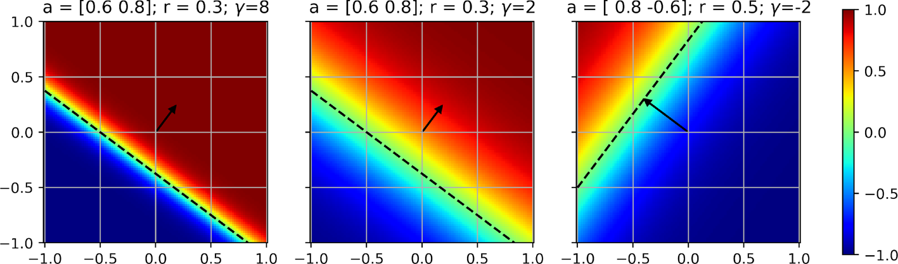
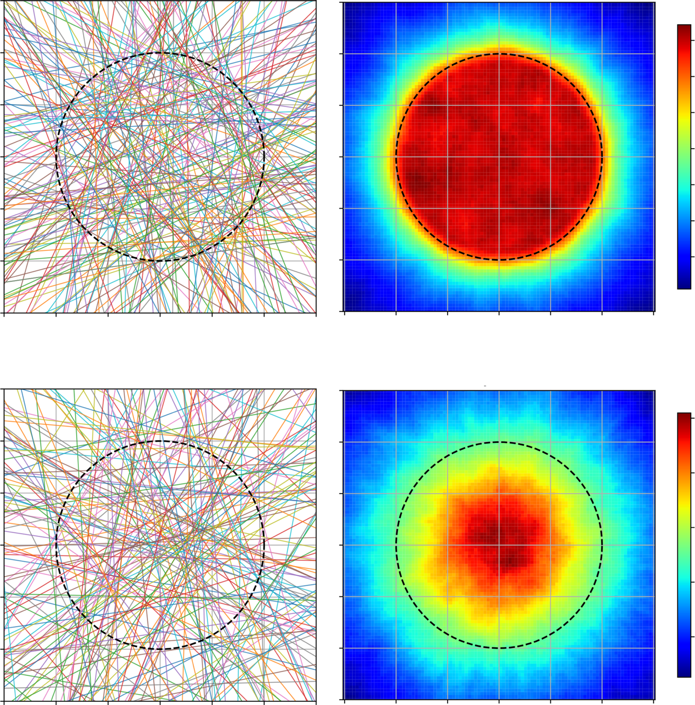
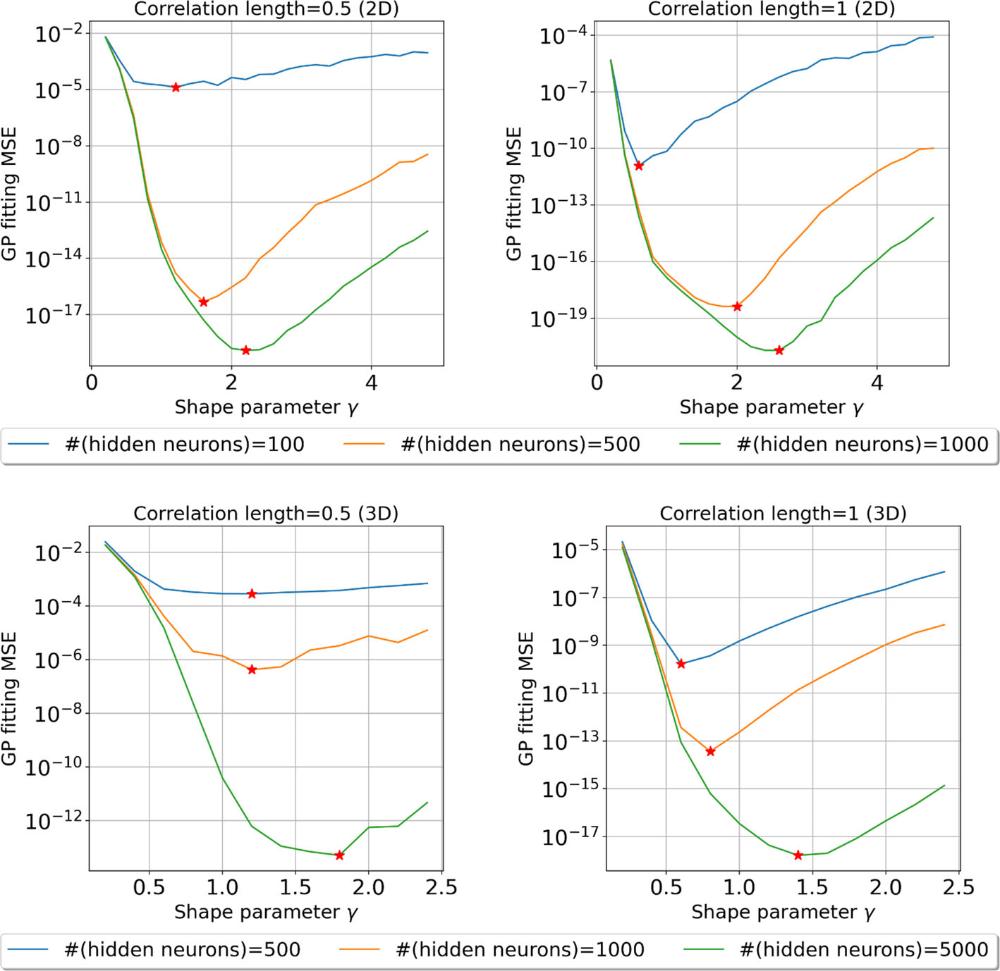
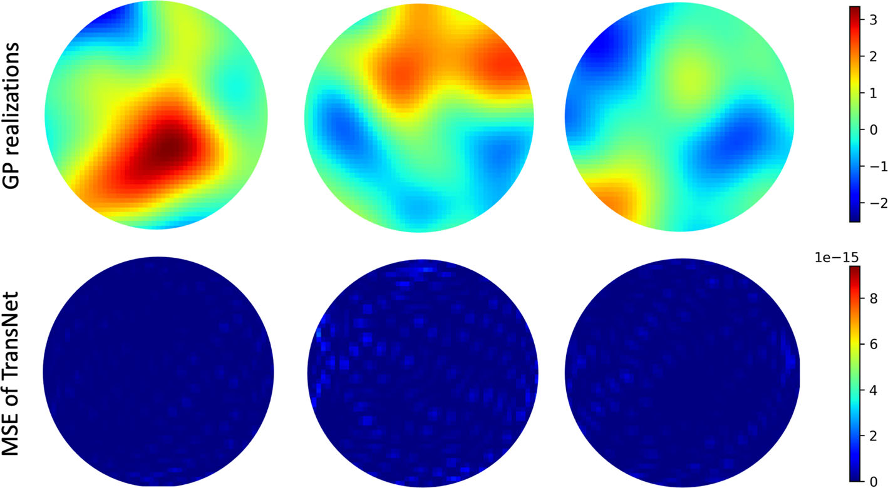
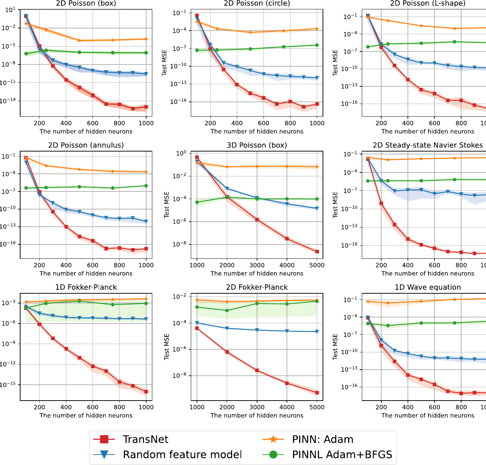
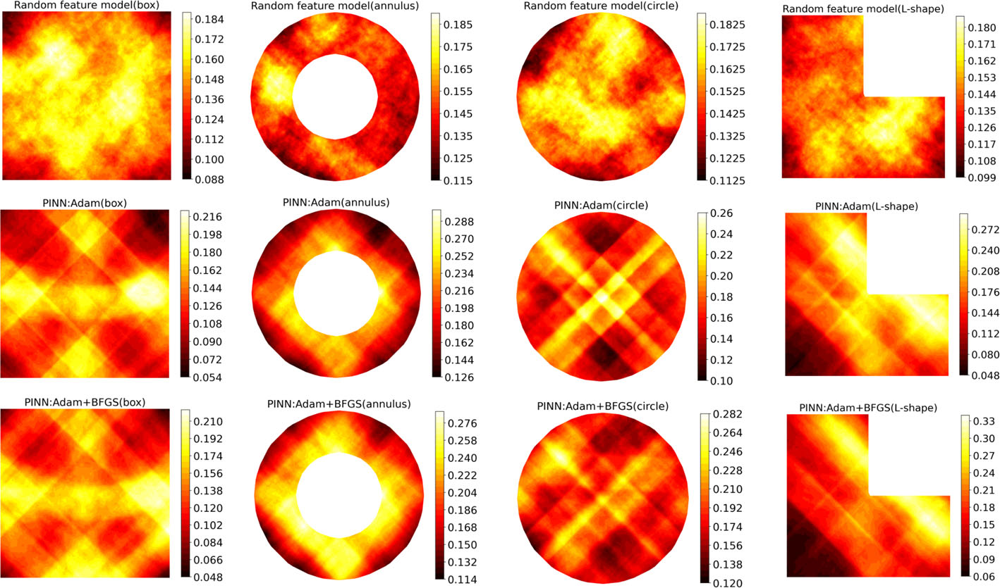
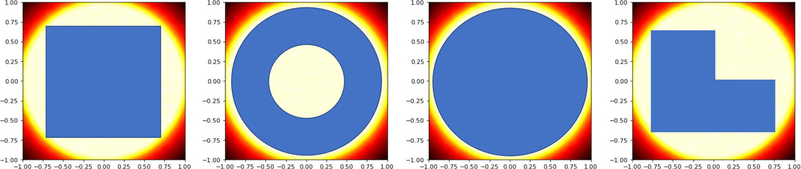

# Transferable Neural Networks for Partial Differential Equations

Zezhong Zhang \( {}^{1} \) - Feng Bao \( {}^{1} \) - Lili Ju \( {}^{2} \) - Guannan Zhang \( {}^{3} \)

Received: 6 May 2023 / Revised: 21 November 2023 / Accepted: 15 January 2024 / Published online: 21 February 2024

© The Author(s), under exclusive licence to Springer Science+Business Media, LLC, part of Springer Nature 2024

## Abstract

Transfer learning for partial differential equations (PDEs) is to develop a pre-trained neural network that can be used to solve a wide class of PDEs. Existing transfer learning approaches require much information about the target PDEs such as its formulation and/or data of its solution for pre-training. In this work, we propose to design transferable neural feature spaces for the shallow neural networks from purely function approximation perspectives without using PDE information. The construction of the feature space involves the re-parameterization of the hidden neurons and uses auxiliary functions to tune the resulting feature space. Theoretical analysis shows the high quality of the produced feature space, i.e., uniformly distributed neurons. We use the proposed feature space as the pre-determined feature space of a random feature model, and use existing least squares solvers to obtain the weights of the output layer. Extensive numerical experiments verify the outstanding performance of our method, including significantly improved transferability, e.g., using the same feature space for various PDEs with different domains and boundary conditions, and the superior accuracy, e.g., several orders of magnitude smaller mean squared error than the state of the art methods.

---

This manuscript has been authored by UT-Battelle, LLC, under contract DE-AC05-00OR22725 with the US Department of Energy (DOE). The US government retains and the publisher, by accepting the article for publication, acknowledges that the US government retains a nonexclusive, paid-up, irrevocable, worldwide license to publish or reproduce the published form of this manuscript, or allow others to do so, for US government purposes. DOE will provide public access to these results of federally sponsored research in accordance with the DOE Public Access Plan.

M Lili Ju

ju@math.sc.edu

Zezhong Zhang

zzhang10@fsu.edu

Feng Bao

baof@fsu.edu

Guannan Zhang

zhangg@ornl.gov

Department of Mathematics, Florida State University, Tallahassee, FL 32306, USA

Department of Mathematics, University of South Carolina, Columbia, SC 29208, USA

Computational and Applied Mathematics Division, Oak Ridge National Laboratory, Oak Ridge, TN 37831, USA

---

Keywords Partial differential equations \( \cdot \) Neural network \( \cdot \) Transfer learning \( \cdot \) Neural feature space

Mathematics Subject Classification 65M12 · 65N22 · 68T07

## 1 Introduction

The rapid advancement of deep learning has attracted significant attention of researchers to explore how to use deep learning to solve scientific and engineering problems. Since numerical solutions of partial differential equations (PDEs) sit at the heart of many scientific areas, there is a surge of studies on how to use neural networks to leverage data and physical knowledge to solve PDEs [1-11]. The neural network-based methods have several advantages over traditional numerical methods (e.g., finite element, finite difference, and finite volume), such as avoiding the need for numerical integration, generating differentiable solutions, exploiting advanced computing capabilities, e.g., GPUs. Nevertheless, a major drawback of these deep learning methods for solving PDEs is the high computational cost associated with the neural network training/retraining using stochastic gradient descent (SGD). One of the popular strategies to alleviate this issue is transfer learning.

Transfer learning for PDEs is to develop a pre-trained neural network that can be effectively re-used to solve a PDE with multiple coefficients or in various domains, or to solve multiple types of PDEs. When transferring a pre-trained neural network from one scenario to another, the feature space, e.g., the hidden layers, is often frozen or slightly perturbed, which can dramatically reduce the training overhead by orders of magnitude. However, existing transfer learning approaches for PDEs, e.g., [5, 7, 12, 13], require information/knowledge of the target family of PDEs to pre-train a neural network model. The needed information could be the analytical definitions of the PDEs including initial and boundary conditions, and/or measurement data of the PDE's solution. These requirements not only lead to time-consuming simulation data generation using other PDE solvers, but also limits the transferability of the pre-trained neural network (i.e., the pre-trained network is only transferable to the same or similar type of PDEs that are used for pre-training).

To overcome the above challenges, in this paper, we propose a transferable neural network (TransNet) to improve the transferability of neural networks for solving PDEs. The key idea is to construct a pre-trained neural feature space without using any PDE information so that the pre-trained feature space could be transferred to a variety of PDEs with different domains and boundary conditions. We limit our attention to the so-called shallow neural networks, which have only one hidden layer between the input and output layers. Such single-hidden-layer fully-connected neural networks have sufficient expressive power for low-dimensional PDEs that are commonly used in science and engineering fields [14-17]. Specifically, we treat each hidden neuron as a basis function and re-parameterize all the neurons to separate the parameters that determine the neuron's location and the ones that control the shape (i.e., the slope) of the activation function. Then, we develop a simple, yet very effective, approach to generate uniformly distributed neurons in the unit ball, and rigorously prove the uniform neuron distribution. Then, the shape parameters of the neurons are tuned using auxiliary functions, i.e., realizations of a Gaussian process. The entire feature space construction (determining the hidden neurons' parameters) does not require the PDE's formulation or data of the PDE's solution. When applying the constructed feature space to a PDE problem, we use the proposed feature space as the pre-determined feature space of a random feature model [18-20], and use existing least squares solvers to solve for the parameters of the output layer by minimizing the standard PDE residual loss. This can be done by either solving a simple least squares problem for linear PDE or combining a least squares solver with a nonlinear iterative solver, e.g., Picard iteration, for nonlinear PDEs. The major contributions are summarized as

- We develop transferable neural feature spaces for the shallow neural networks that are independent of any PDE, and can be applied to effectively solve various linear and nonlinear PDE problems.

- We theoretically and computationally prove the uniform distribution of the hidden neurons, viewed as global non-orthogonal basis functions, for the proposed TransNet in the unit ball of any dimension.

- We demonstrate the superior accuracy and efficiency of the proposed TransNet for solving PDEs, e.g., the mean square errors of TransNet are several orders of magnitudes smaller than those by the state-of-the-art methods.

The rest of the paper is organized as follows. In Sect. 1.1 we briefly review some related work. In Sect. 2, we first discuss the transferable neural feature space and the uniformly distributed neurons and then present the TransNet and its application to solving general linear and nonlinear PDEs. Various numerical tests and comparisons are carried out in Sect. 3 to demonstrate the superior performance of the proposed TransNet. Finally, some concluding remarks are given in Sect. 4.

### 1.1 Related work

Studies on using neural networks for solving PDEs can be traced back to some early works, e.g., [21, 22]. Recent advances mostly have been focused on physics-informed neural networks (PINN). The general idea of PINN is to represent the PDE's solution by a neural network, and then train the network by minimizing the residual function of the PDE at a set of samples in the domain of computation. Several improvements on the training and sampling were proposed in [23-26]. Besides directly minimizing the PDE's residual, there are studies on how to combine traditional PDE solvers with neural networks. For example, the deep Ritz method [2] uses the variational form of PDEs and combines the SGD with numerical integration to train the network; the deep Galerkin method [27] combines the Galerkin method with machine learning; the PDE-Net [3] uses a stack of neural networks to approximate the PDE solutions over a multiple of time steps, which was further combined with a symbolic multilayer neural network for recovering PDE models in [28].

Another type of deep learning method for PDEs is to use neural networks to learn a family of PDE operators, instead of a single equation. The Fourier neural operator (FNO) [5] parameterizes the integral kernel in Fourier space and is generalizable to different spatial/time resolutions. The DeepONet [7] extends the universal approximation theorem [29] to deep neural networks, and its variant [30] further reduces the amount of data needed for training. The physics-informed neural operator (PINO) [31] combines operator learning with function approximation to achieve higher accuracy. MIONet [32] was proposed to learn multiple-input operators via tensor product based on low-rank approximation.

Random feature models together with shallow neural networks have also been used to solve PDEs [18-20] or learn PDE operators [33]. The theory of random feature models for function approximation was developed due to its natural connection with kernel methods [34, 35]. The proposed TransNet can be viewed as an improved random feature model for PDEs from two perspectives: (1) the re-parameterization of the weight and bias parameters of the hidden neurons into two separate parameters that determine the location and shape of each neuron respectively, (2) the usage of auxiliary functions to tune the neural feature space, which makes a critical contribution to the improvement of the accuracy of TransNet in solving PDEs.

## 2 Transferable Neural Networks for Partial Differential Equations

### 2.1 Problem Setting and Background

We introduce the problem setup for using neural networks to solve partial differential equations. The PDE of interest can be presented in a general formulation, i.e.,

\[\left\{  \begin{array}{ll} \mathcal{L}\left( {u\left( \mathbf{y}\right) }\right)  = f\left( \mathbf{y}\right) & \text{ for }\mathbf{y} \in  \Omega, \\  \mathcal{B}\left( {u\left( \mathbf{y}\right) }\right)  = g\left( \mathbf{y}\right) & \text{ for }\mathbf{y} \in  \partial \Omega, \end{array}\right. \tag{1}\]

where \( \Omega  \subset  {\mathbb{R}}^{d} \) with the boundary \( \partial \Omega \) is the spatial-temporal bounded domain under consideration, \( \mathbf{y} \mathrel{\text{:= }} \left( {\mathbf{x}, t}\right)  = {\left( {x}_{1},\ldots,{x}_{d - 1}, t\right) }^{\top } \in  {\mathbb{R}}^{d} \) is a column vector includes both spatial and temporal variables, \( u \) denotes the unknown solution of the PDE, \( \mathcal{L}\left( \cdot \right) \) is a differential operator, \( \mathcal{B}\left( \cdot \right) \) is the operator defining the initial and/or boundary conditions, \( f\left( \mathbf{y}\right) \) and \( g\left( \mathbf{y}\right) \) are the right-hand sides associated with the operators \( \mathcal{L}\left( \cdot \right) \) and \( \mathcal{B}\left( \cdot \right) \), respectively. For notational simplicity, we assume that the solution is a scalar function; the proposed method can be extended to vector-valued functions without any essential difficulty. Let us consider a single-hidden-layer fully-connected neural network, denoted by

\[{u}_{\mathrm{{NN}}}\left( \mathbf{y}\right)  \mathrel{\text{:= }} \mathop{\sum }\limits_{{m = 1}}^{M}{\alpha }_{m}\sigma \left( {{\mathbf{w}}_{m}^{\top }\mathbf{y} + {b}_{m}}\right)  + {\alpha }_{0}, \tag{2}\]

where \( M \) is the number of hidden neurons, the vector \( {\mathbf{w}}_{m} = {\left( {w}_{m,1},\ldots,{w}_{m, d}\right) }^{\top } \) and the scalar \( {b}_{m} \) are the weights and bias of the \( m \) th hidden neuron, the vector \( \mathbf{\alpha } = {\left( {\alpha }_{0},{\alpha }_{1},\ldots,{\alpha }_{M}\right) }^{\top } \) includes the weights and bias of the output layer, and \( \sigma \left( \cdot \right) \) is the activation function. As demonstrated in Sect. 3, this type of neural network have sufficient expressive power for solving a variety of PDEs with satisfactory accuracy.

A typical method [36] for solving the PDE in Eq. (1) is to directly parameterize the solution \( u\left( y\right) \) as a neural network \( {u}_{\mathrm{{NN}}}\left( y\right) \) in Eq. (2) and optimize the neural network’s parameters by minimizing the PDE residual loss, e.g., \( L\left( \mathbf{y}\right)  = {\begin{Vmatrix}\mathcal{L}\left( u\left( \mathbf{y}\right) \right)  - \mathcal{L}\left( {u}_{\mathrm{{NN}}}\left( \mathbf{y}\right) \right) \end{Vmatrix}}_{2} + \; {\begin{Vmatrix}\mathcal{B}\left( u\left( \mathbf{y}\right) \right)  - \mathcal{B}\left( {u}_{\mathrm{{NN}}}\left( \mathbf{y}\right) \right) \end{Vmatrix}}_{2} \), at a set of spatial-temporal locations. Despite the good performance of these approaches in solving PDE problems, its main drawback is the limited transferability because of the high computational cost of gradient-based re-training and hyperparameter retuning. When there is any change to the operators \( \mathcal{L}\left( \cdot \right),\mathcal{B}\left( \cdot \right) \), the right-hand-side functions \( f\left( \mathbf{y}\right), g\left( \mathbf{y}\right) \), or the shape of the domain \( \Omega \), the neural network \( {u}_{\mathrm{{NN}}}\left( \mathbf{y}\right) \) often needs to be retrained using gradient-based optimization (even though the current parameter values could provide a good initial guess for the re-training), or the hyperparameters associated with the network and the optimizer need to be re-tuned. In comparison, the random feature models have much lower re-training costs, which has been exploited in learning operators [33] and dynamical systems [19, 37].

### 2.2 The Neural Feature Space

We can treat each hidden neuron \( \sigma \left( {{\mathbf{w}}_{m}^{\top }\mathbf{y} + {b}_{m}}\right) \) as a nonlinear feature map from the input space of \( \mathbf{y} \in  {\mathbb{R}}^{d} \) to the output space \( \mathbb{R} \). From the perspective of approximation theory, the set of hidden neurons \( {\left\{  \sigma \left( {\mathbf{w}}_{m}^{\top }\mathbf{y} + {b}_{m}\right) \right\}  }_{m = 1}^{M} \) can be viewed as a globally supported basis in \( {\mathbb{R}}^{d} \). The neural feature space, denoted by \( {\mathcal{P}}_{\mathrm{{NN}}} \), can be defined by the linear space expanded by the basis \( {\left\{  \sigma \left( {\mathbf{w}}_{m}^{\top }\mathbf{y} + {b}_{m}\right) \right\}  }_{m = 1}^{M} \), i.e.,

\[{\mathcal{P}}_{\mathrm{{NN}}} = \operatorname{span}\left\{  {1,\sigma \left( {{\mathbf{w}}_{1}^{\top }\mathbf{y} + {b}_{1}}\right),\ldots,\sigma \left( {{\mathbf{w}}_{M}^{\top }\mathbf{y} + {b}_{M}}\right) }\right\} , \tag{3}\]

where the constant basis corresponds to the bias of the output layer. Then, the neural network in Eq. (2) lives in the linear space, i.e., \( {u}_{\mathrm{{NN}}}\left( \mathbf{y}\right)  \in  {\mathcal{P}}_{\mathrm{{NN}}} \). In other words, the neural network approximation can be viewed as a spectral method with non-orthogonal basis, and the parameters \( \mathbf{\alpha } \) in Eq. (2) of the output layer of \( {u}_{\mathrm{{NN}}}\left( \mathbf{y}\right) \) is the coefficients of the expansion in the neural feature space \( {\mathcal{P}}_{\mathrm{{NN}}} \).

In the PINN methods, the neural feature space \( {\mathcal{P}}_{\mathrm{{NN}}} \) and the coefficient \( \mathbf{\alpha } \) are trained simultaneously using SGD methods, which often leads to a non-convex and ill-conditioned optimization problem. It has been shown that the non-convexity and ill-conditioning in the neural network training are major reasons for the unsatisfactory accuracy of the trained neural network. A natural idea to reduce the complexity of the training is to decouple the training of \( {\mathcal{P}}_{\mathrm{{NN}}} \) from that of \( \mathbf{\alpha } \). For example, in random feature models, \( {\mathcal{P}}_{\mathrm{{NN}}} \) is defined by randomly generating the parameters \( {\left\{  \left( {\mathbf{w}}_{m},{b}_{m}\right) \right\}  }_{m = 1}^{M} \) from a user-defined probability distribution; the coefficients \( \mathbf{\alpha } \) can then be obtained by solving a linear system when the operators \( \mathcal{L},\mathcal{B} \) in Eq. (1) are linear. However, the numerical experiments in Sect. 3 show that the random feature model based on Eq. (2) converges very slowly with the increase of the number of features. This drawback motivates us to develop a methodology to customize the neural feature space \( {\mathcal{P}}_{\mathrm{{NN}}} \) to improve the accuracy, efficiency, and transferability of \( {u}_{\mathrm{{NN}}} \) in solving PDEs.

### 2.3 Constructing the transferable neural feature space

This section contains the key ingredients of the proposed TransNet. The goal is to construct a single neural feature space \( {\mathcal{P}}_{\mathrm{{NN}}} \) that can be used to solve various PDEs in different domains.

#### 2.3.1 Re-parameterization of \( {\mathcal{P}}_{\mathrm{{NN}}} \)

The first step is to re-parameterize the weight and bias of each hidden neuron \( \sigma \left( {{\mathbf{w}}_{m}^{\top }\mathbf{y} + {b}_{m}}\right) \), into distinct parameters that determine the location and shape of the neuron. Each hidden neuron is viewed as a globally supported basis function \( {\psi }_{m}\left( \mathbf{y}\right) \) in \( \Omega \), i.e., \( {\psi }_{m}\left( \mathbf{y}\right)  = \sigma \left( {{\mathbf{w}}_{m}^{\top }\mathbf{y} + {b}_{m}}\right) \). If we rewrite the hidden neuron as

\[\sigma \left( {{\mathbf{w}}_{m}^{\top }\mathbf{y} + {b}_{m}}\right)  = \sigma \left( {{\gamma }_{m}\left( {{\mathbf{a}}_{m}^{\top }\mathbf{y} + {r}_{m}}\right) }\right) \tag{4}\]

where \( {\begin{Vmatrix}{\mathbf{a}}_{m}\end{Vmatrix}}_{2} = 1 \) and \( {\gamma }_{m} \geq  0 \), we obtain the re-parameterization of \( \left( {{\mathbf{w}}_{m},{b}_{m}}\right) \) into the location parameter \( \left( {{\mathbf{a}}_{m},{r}_{m}}\right) \) and shape parameter \( {\gamma }_{m} \). Their equivalence is given by

\[\left\{  {\begin{array}{l} {\mathbf{w}}_{m} = {\gamma }_{m}{\mathbf{a}}_{m} \\  {b}_{m} = {\gamma }_{m}{r}_{m} \end{array} \Leftrightarrow  \left\{  \begin{array}{l} {\mathbf{a}}_{m} = \frac{{\mathbf{w}}_{m}}{{\begin{Vmatrix}{\mathbf{w}}_{m}\end{Vmatrix}}_{2}} \\  {r}_{m} = \frac{{b}_{m}}{{\begin{Vmatrix}{\mathbf{w}}_{m}\end{Vmatrix}}_{2}} \\  {\gamma }_{m} = {\begin{Vmatrix}{\mathbf{w}}_{m}\end{Vmatrix}}_{2}. \end{array}\right. }\right. \tag{5}\]

Fig. 1 Visualization of the neural basis function \( {\psi }_{m}\left( \mathbf{y}\right) \) defined in Eq.(4) with different location and shape parameters. The black dashed line is the partition hyperplane and the black arrow \( {\mathbf{a}}_{m}\left| {r}_{m}\right| \operatorname{sign}\left( {\gamma }_{m}\right) \) is the normal direction \( {\mathbf{a}}_{m} \) scaled by \( \left| {r}_{m}\right| \operatorname{sign}\left( {\gamma }_{m}\right) \)

After the re-parametrization, each parameter now holds a distinct geometric interpretation towards the basis function \( {\psi }_{m}\left( \mathbf{y}\right) \).

When the activation \( \sigma \) is the ReLU function, there is an important concept called partition hyperplane which separates the activated region and unactivated region and is defined by

\[{\mathbf{w}}_{m}^{\top }\mathbf{y} + {b}_{m} = 0 \tag{6}\]

This partition hyperplane can be exactly recovered by the location parameter as

\[{\mathbf{a}}_{m}^{\top }\mathbf{y} + {r}_{m} = 0. \tag{7}\]

The geometric significance of the partition hyperplane is also crucial for other activation functions, such as tanh \( \left( \cdot \right) \), which is widely employed in solving PDEs due to its smoothness, including in this work. We will now discuss the geometric interpretation of the shape and location parameter with \( \tanh \left( \cdot \right) \) as the activation function.

The partition hyperplane in Eq. (7) describes the transition plane from -1 to 1. More specifically, the unit vector \( {\mathbf{a}}_{m} \) represents the normal direction of the partition hyperplane, while \( \left| {r}_{m}\right| \) indicates its distance from the origin. The shape parameter \( {\gamma }_{m} \) governs the steepness of the pre-activation value \( {\mathbf{w}}_{m}\mathbf{y} + {b}_{m} \) along the normal direction \( {\mathbf{a}}_{m} \), which translates to the transition rate from -1 to 1 on basis \( {\psi }_{m}\left( \mathbf{y}\right) \). This can also be geometrically interpreted as the width of the transition band (see Fig. 1).

Figure 1 shows three 2D basis functions with different shape and location parameters, where the black dashed lines represent the partition hyperplanes and the black arrows denote the normal direction \( {\mathbf{a}}_{m} \) scaled by \( \left| {r}_{m}\right| \operatorname{sign}\left( {\gamma }_{m}\right) \), i.e., \( {\mathbf{a}}_{m}\left| {r}_{m}\right| \operatorname{sign}\left( {\gamma }_{m}\right) \). The arrow marks the direction of increase in \( {\psi }_{m}\left( \mathbf{y}\right) \), and its length equals the distance from the origin to the hyperplane. It is evident that the value of the basis functions changes at the partition hyperplane along the normal direction, while its value remains constant orthogonal to the normal direction. For a larger \( \gamma \), the transition band is narrower compared to a small \( \gamma \). Comparing different basis functions (from the middle to the left and middle to the right), it becomes evident that changing the location parameter solely affects the location of the basis function but not its shape, and vice versa. Thus, the re-parameterization in Eq. (4) effectively segregates location and shape parameters, each possessing almost independent geometric significance, making it natural to handle them differently.

#### 2.3.2 Generating uniformly distributed neurons for \( {\mathcal{P}}_{\mathrm{{NN}}} \)

The second step for constructing \( {\mathcal{P}}_{\mathrm{{NN}}} \) is to determine the location parameters \( {\left\{  \left( {\mathbf{a}}_{m},{r}_{m}\right) \right\}  }_{m = 1}^{M} \) in Eq. (4). As illustrated in Fig. 1, it is evident that the location parameter exerts its influence on the basis function through the position of the partition hyperplane. And our approach is to generate a set of random \( {\left\{  \left( {\mathbf{a}}_{m},{r}_{m}\right) \right\}  }_{m = 1}^{M} \), to ensure the creation of uniformly distributed partition hyperplanes within \( \Omega \).

The idea for handling the location parameters for \( {\psi }_{m}\left( \mathbf{y}\right) \) through the partition hyperplane is inspired by studies on the activation patterns of ReLU networks. A ReLU network is essentially a piecewise-linear function in the input domain, where the boundary of each linear piece is determined by the partition hyperplanes. For a ReLU network to exhibit good expressive power, it is believed that having more linear pieces within the computational domain is desirable. Studies [38, 39] have shown that the number of linear pieces is directly related to the class of functions that can be well approximated by the ReLU network, i.e., the expressive power. This correlation also gives rise to a line of research [38, 40-43] that focus on estimating the number of linear pieces in the ReLU networks. Intuitively, relating the expressive power of the ReLU network to the number of linear pieces is also understandable, as a ReLU network with only one linear piece reduces to a simple linear map.

In addition to the number of linear pieces, the distribution of linear pieces also plays a crucial role. A denser distribution of linear pieces in a specific region of the domain may enhance approximation quality for that region. However, to ensure good transferability, which means the feature space is effective for a wide range of PDEs with different domain shapes, our goal is to establish uniformly distributed linear pieces throughout the domain. This guarantees equal expressive power across all parts of the domain. Intuitively, the density of the linear pieces can be defined as the number of linear pieces in a given region divided by its volume. Alternatively, it can also be indirectly measured by the boundary volume in that given region [44]. Building upon this concept, in this work, we propose using the density of the partition hyperplane to quantify the local expressive power.

In this subsection, we assume \( \Omega \) is a unit ball, i.e., \( {B}_{1}\left( \mathbf{0}\right)  = \left\{  {\mathbf{y}: \parallel \mathbf{y}{\parallel }_{2} \leq  1}\right\}   \subset  {\mathbb{R}}^{d} \). For an arbitrary point \( \mathbf{y} \in  \Omega \), we denote the partition hyperplane density as \( {D}_{M}^{\tau }\left( \mathbf{y}\right) \), where the \( M \) is the number of partition hyperplanes and \( \tau  > 0 \) is the bandwidth for calculating the density. To proceed, we first measure the distance from \( \mathbf{y} \) to each partition hyperplane defined in Eq. (7) by

\[{d}_{m}\left( \mathbf{y}\right)  = \frac{\left| {\mathbf{a}}_{m}^{\top }\mathbf{y} + {r}_{m}\right| }{{\begin{Vmatrix}{\mathbf{a}}_{m}\end{Vmatrix}}_{2}} = \left| {{\mathbf{a}}_{m}^{\top }\mathbf{y} + {r}_{m}}\right|,\text{ for }m = 1,\ldots, M. \tag{8}\]

Based on the above point-to-plane distance, we then define the partition hyperplane density \( {D}_{M}^{\tau }\left( \mathbf{y}\right) \) as

\[{D}_{M}^{\tau }\left( \mathbf{y}\right)  = \frac{1}{M}\mathop{\sum }\limits_{{m = 1}}^{M}{\mathbf{1}}_{\left\{  {d}_{m}\left( \mathbf{y}\right)  < \tau \right\}  }\left( \mathbf{y}\right), \tag{9}\]

where \( {\mathbf{1}}_{\left\{  {d}_{m}\left( \mathbf{y}\right)  < \tau \right\}  }\left( \mathbf{y}\right) \) is the indicator function of whether the distance between \( \mathbf{y} \) and the \( m \) -th partition hyperplane is smaller than \( \tau \). Intuitively, \( {D}_{M}^{\tau }\left( \mathbf{y}\right) \) measures the percentage of neurons whose partition hyperplane intersects the ball with center \( \mathbf{y} \) and radius \( \tau,{B}_{\tau }\left( \mathbf{y}\right) \). The uniformity of the partition hyperplane can be formally measured by how much \( {D}_{M}\left( y\right) \) varies in \( \Omega \).

Next, we outline the sampling process for the random location parameters \( {\left\{  \left( {\mathbf{a}}_{m},{r}_{m}\right) \right\}  }_{m = 1}^{M} \) that yield a constant hyperplane density \( {D}_{M}^{\tau }\left( \mathbf{y}\right) \) in \( \Omega \) under expectation. Specifically, we start by generating the normal directions \( {\left\{  {\mathbf{a}}_{m}\right\}  }_{m = 1}^{M} \) uniformly distributed on the \( d \) -dimensional unit sphere. It's important to note that when \( d > 2 \), sampling uniformly in the angular space in the hyperspherical coordinate system doesn't result in uniformly distributed samples on the unit sphere. This challenge is known as the sphere point picking problem. To address this, we draw samples from the \( d \) -dimensional standard Gaussian distribution in the Cartesian coordinate system and normalize the samples to unit vectors to obtain \( {\left\{  {\mathbf{a}}_{m}\right\}  }_{m = 1}^{M} \). Then, \( {\left\{  {r}_{m}\right\}  }_{m = 1}^{M} \) is generated from a uniform distribution on \( \left\lbrack  {0,1}\right\rbrack \). The complete sampling procedure is expressed as follows:

\[{\mathbf{a}}_{m} = \frac{{X}_{m}}{{\begin{Vmatrix}{X}_{m}\end{Vmatrix}}_{2}}\text{ and }{r}_{m} = {U}_{m}, m = 1,\ldots, M \tag{10}\]

where \( {X}_{m} \) are i.i.d. standard Gaussian distribution and \( {U}_{m} \) follows i.i.d. uniform distribution on \( \left\lbrack  {0,1}\right\rbrack \). The subsequent theorem demonstrates that our approach yields a set of uniformly distributed partition hyperplanes in \( \Omega \), measured by a constant expected density \( \mathbb{E}\left\lbrack  {{D}_{M}^{\tau }\left( y\right) }\right\rbrack \) in \( \Omega \).

Theorem 1 (Uniform neuron distribution) Given the partition hyperplane defined in Eq. (7), if \( {\left\{  {\mathbf{a}}_{m}\right\}  }_{m = 1}^{M} \) are i.i.d. and uniformly distributed on the d-dimensional unit sphere, i.e., \( {\begin{Vmatrix}{\mathbf{a}}_{m}\end{Vmatrix}}_{2} = \) 1, and \( {\left\{  {r}_{m}\right\}  }_{m = 1}^{M} \) are i.i.d. and uniformly distributed in \( \left\lbrack  {0,1}\right\rbrack \), then, for a fixed \( \tau  \in  \left( {0,1}\right) \),

\[\mathbb{E}\left\lbrack  {{D}_{M}^{\tau }\left( \mathbf{y}\right) }\right\rbrack   = \tau \text{ for all }\parallel \mathbf{y}{\parallel }_{2} \leq  1 - \tau \text{, }\]

where \( {D}_{M}^{\tau }\left( \mathbf{y}\right) \) is the density function defined in Eq. (9).

Proof For a fixed \( \mathbf{y} \in  \Omega \), we can write the expectation of \( {D}_{M}^{\tau }\left( \mathbf{y}\right) \) as

\[\mathbb{E}\left\lbrack  {{D}_{M}^{\tau }\left( \mathbf{y}\right) }\right\rbrack   = \mathbb{E}\left\lbrack  {\frac{1}{M}\mathop{\sum }\limits_{{m = 1}}^{M}{\mathbf{1}}_{\left\{  {d}_{m}\left( \mathbf{y}\right)  < \tau \right\}  }\left( \mathbf{y}\right) }\right\rbrack \tag{11}\]

\[= \frac{1}{M}\mathop{\sum }\limits_{{m = 1}}^{M}\mathbb{E}\left\lbrack  {{\mathbf{1}}_{\left\{  {d}_{m}\left( \mathbf{y}\right)  < \tau \right\}  }\left( \mathbf{y}\right) }\right\rbrack \tag{12}\]

Use the i.i.d. property of \( {\left\{  {\mathbf{a}}_{m}\right\}  }_{m = 1}^{M} \) and \( {\left\{  {r}_{m}\right\}  }_{m = 1}^{M} \), we have

\[\mathbb{E}\left\lbrack  {{\mathbf{1}}_{\left\{  {d}_{m}\left( \mathbf{y}\right)  < \tau \right\}  }\left( \mathbf{y}\right) }\right\rbrack   = \mathbb{E}\left\lbrack  {{\mathbf{1}}_{\left\{  {d}_{{m}^{\prime }}\left( \mathbf{y}\right)  < \tau \right\}  }\left( \mathbf{y}\right) }\right\rbrack ,\;\forall 1 \leq  m,{m}^{\prime } \leq  M. \tag{13}\]

Therefore, we can simplify the notation by dropping the subscript \( m \) from \( \left( {{\mathbf{a}}_{m},{r}_{m}}\right) \) and \( {\mathbf{1}}_{\left\{  {d}_{m}\left( \mathbf{y}\right)  < \tau \right\}  }\left( \mathbf{y}\right) \), and use \( \left( {\mathbf{a}, r}\right) \) and \( {\mathbf{1}}_{\left\{  d\left( \mathbf{y}\right)  < \tau \right\}  }\left( \mathbf{y}\right) \) to denote them in the following derivation. The expected density can now be written as

\[\mathbb{E}\left\lbrack  {{D}_{M}^{\tau }\left( \mathbf{y}\right) }\right\rbrack   = \mathbb{E}\left\lbrack  {{\mathbf{1}}_{\{ d\left( \mathbf{y}\right)  < \tau \} }\left( \mathbf{y}\right) }\right\rbrack\]

\[= \mathbb{E}\left\lbrack  {{\mathbf{1}}_{\left\{  \left| {\mathbf{a}}^{\top }\mathbf{y} + r\right|  < \tau \right\}  }\left( \mathbf{y}\right) }\right\rbrack \tag{14}\]

\[= \mathbb{P}\left\lbrack  {\left| {{\mathbf{a}}^{\top }\mathbf{y} + r}\right|  < \tau }\right\rbrack\]

Given the independence between \( \mathbf{a} \) and \( r \), and the fact that the distribution of \( r \) is known, we are only left with the unknown distribution of \( {\mathbf{a}}^{\top }\mathbf{y} \). By our assumption, \( \mathbf{a} \) is uniformly distributed on a \( d \) -dimensional unit sphere, and \( \mathbf{y} \) is a constant vector.

To proceed, we begin by considering a unitary matrix \( Q \), such that \( Q\mathbf{y} = {\left( \parallel \mathbf{y}{\parallel }_{2},0,\ldots,0\right) }^{\top } \) and define \( \widetilde{\mathbf{y}} = Q\mathbf{y} \) and \( \widetilde{\mathbf{a}} = Q\mathbf{a} \). And we can write the inner product as follows:

\[{\mathbf{a}}^{\top }\mathbf{y} = {\mathbf{a}}^{\top }\left( {{Q}^{\top }Q}\right) \mathbf{y}\]

\[= {\left( Q\mathbf{a}\right) }^{\top }\left( {Q\mathbf{y}}\right)\]

\[= {\widetilde{a}}^{\top }\widetilde{y}\]

\[= {\widetilde{a}}_{1}\parallel \mathbf{y}{\parallel }_{2}\]

where \( {\widetilde{a}}_{1} \) is the first component of \( \widetilde{\mathbf{a}} \). Now we only need to find the distribution of \( {\widetilde{a}}_{1} \).

Given that \( Q \) is a unitary (rotation) matrix and \( \mathbf{a} \) is uniform on the d-dimensional unit sphere, \( \widetilde{\mathbf{a}} \) will also follow the same distribution as \( \mathbf{a} \). By the construction of \( \mathbf{a} \) in Eq. (10), we know \( \widetilde{\mathbf{a}} \) can also be written in the same form as:

\[\widetilde{\mathbf{a}} = \frac{X}{\parallel X{\parallel }_{2}}\]

where \( X = {\left( {X}_{1},\ldots,{X}_{d}\right) }^{\top } \) is d-dimensional standard Gaussian. The density of \( {\widetilde{a}}_{1} = \frac{{X}_{1}}{\parallel X{\parallel }_{2}} \) can be obtained from Eq. (1.26) in [45], as the marginal density for the normalized Gaussian:

\[{p}_{{\widetilde{a}}_{1}}\left( z\right)  = \frac{\Gamma \left( \frac{d}{2}\right) }{\Gamma \left( \frac{d - 1}{2}\right) {\pi }^{\frac{1}{2}}}{\left( 1 - {z}^{2}\right) }^{\frac{d - 3}{2}},\; z \in  \left\lbrack  {-1,1}\right\rbrack . \tag{15}\]

The only property we need for the proof is the symmetry of \( {p}_{{\widetilde{a}}_{1}}\left( z\right) \), i.e., \( {p}_{{\widetilde{a}}_{1}}\left( z\right)  = {p}_{{\widetilde{a}}_{1}}\left( {-z}\right) \).

Next we derive the analytical form of the probability \( \mathbb{P}\left\lbrack  {\left| {{\mathbf{a}}^{\top }\mathbf{y} + r}\right|  < \tau }\right\rbrack \). With the probability density function \( {p}_{{\widetilde{a}}_{1}}\left( z\right) \), we can write the probability as the following integral

\[\mathbb{P}\left\lbrack  {\left| {{\mathbf{a}}^{\top }\mathbf{y} + r}\right|  < \tau }\right\rbrack   = \mathbb{P}\left\lbrack  {\left| {\widetilde{a}}_{1}\right| \parallel \mathbf{y}{\parallel }_{2} + r \mid   < \tau }\right\rbrack\]

\[= {\int }_{\left\{  {s <  - z\parallel y{\parallel }_{2} + \tau }\right\}   \cup  \left\{  {s >  - z\parallel y{\parallel }_{2} - \tau }\right\}  }{p}_{{\widetilde{a}}_{1}}\left( z\right) {p}_{r}\left( s\right) {dzds}\]

\[= {\int }_{\left\{  -z\parallel y{\parallel }_{2} - \tau  < s <  - z\parallel y{\parallel }_{2} + \tau \right\}  }{p}_{{\widetilde{a}}_{1}}\left( z\right) {dzds}.\]

Here the support for \( z \) and \( s \) are \( \left\lbrack  {-1,1}\right\rbrack \) and \( \left\lbrack  {0,1}\right\rbrack \) respectively. Assume that \( \parallel \mathbf{y}{\parallel }_{2} \leq  1 - \tau \), then the above integral can be exactly calculated by the following two cases.

- Case \( \mathbf{1} \Rightarrow  \parallel \mathbf{y}{\parallel }_{2} < \tau \): In this case, the integration domain is prescribed by four lines: \( s =  - z\parallel \mathbf{y}{\parallel }_{2} + \tau, s = 0, z =  - 1 \), and \( z = 1 \). Using the symmetry property \( {p}_{{\widetilde{a}}_{1}}\left( z\right) \), we can reorganize the integration domain as a rectangular area defined by: \( s = 0, s = \tau \). \( z =  - 1 \) and \( z = 1 \). The integral is calculated as

\[\mathbb{P}\left\lbrack  {\left| {{\mathbf{a}}^{\top }\mathbf{y} + r}\right|  < \tau }\right\rbrack   = {\int }_{-1}^{1}{\int }_{0}^{\tau }{p}_{{\widetilde{a}}_{1}}\left( z\right) {dsdz}\]

\[= {\int }_{-1}^{1}\tau {p}_{{\widetilde{a}}_{1}}\left( z\right) {dz}\]

\[= \tau \text{. }\]

- Case \( \mathbf{2} \Rightarrow  \tau  \leq  \parallel \mathbf{y}{\parallel }_{2} \leq  1 - \tau \): In this case, the integration domain is defined by four lines: \( s =  - z\parallel \mathbf{y}{\parallel }_{2} + \tau \) and \( s =  - z\parallel \mathbf{y}{\parallel }_{2} - \tau, s = 0 \) and \( z =  - 1 \). Once again, utilizing the symmetry property \( {p}_{{\widetilde{a}}_{1}}\left( z\right) \), we can redefine the integration domain as bounded by: \( s =  - z\parallel \mathbf{y}{\parallel }_{2} + \tau \) and \( s =  - z\parallel \mathbf{y}{\parallel }_{2} - \tau, z = 0 \) and \( z =  - 1 \). The integral is calculated as

\[\mathbb{P}\left\lbrack  {\left| {{\mathbf{a}}^{\top }\mathbf{y} + r}\right|  < \tau }\right\rbrack   = {\int }_{-1}^{0}{\int }_{-z\parallel \mathbf{y}{\parallel }_{2} - \tau }^{-z\parallel \mathbf{y}{\parallel }_{2} + \tau }{p}_{{\widetilde{a}}_{1}}\left( z\right) {dsdz}\]

\[= {\int }_{-1}^{0}\left( {2\tau }\right) {p}_{{\widetilde{a}}_{1}}\left( z\right) {dz}\]

\[= \left( {2\tau }\right) \frac{1}{2}\]

\[= \tau \text{. }\]

Combining case 1 and case 2, we have

\[\mathbb{P}\left\lbrack  {\left| {{\mathbf{a}}^{\top }\mathbf{y} + r}\right|  < \tau }\right\rbrack   = \tau \text{ for any }\parallel \mathbf{y}{\parallel }_{2} \leq  1 - \tau.\]

Substituting this into Eq. (14) concludes the proof.

An illustration of the density function and the partition hyperplane is provided in Fig. 2. It is evident that the cutting hyperplane density \( {D}_{M}\left( y\right) \) for our method remains constant inside the ball \( {B}_{1 - \tau }\left( \mathbf{0}\right) \), matching the value prescribed by our theorem with \( \tau  = {0.1} \). The density of the Gaussian random feature is not uniform and predominantly centered at the origin. To our surprise, the highest density value in the Gaussian random feature is even smaller than the constant density value from our method. We believe this comes from the fact that some partition hyperplanes are entirely outside of the unit ball, providing no contribution to the expressive power inside the unit ball. This observation is also evident from the Fig. 2.

Regarding the number of linear pieces, in our method, the partition hyperplanes have an equal chance of intersecting other planes throughout the entire domain \( \Omega \), thus creating more linear pieces uniformly. In contrast, for Gaussian random features, the partition planes have a high chance of being close to the origin, resulting in fewer intersections at the perimeter of \( \Omega \). This is also reflected in Fig. 2, where the linear pieces from our method are dense and fine across the entire domain, while in Gaussian random features, the linear pieces are very fine near the origin and coarser near the boundary of \( \Omega \). This will also limit the expressive power of the Gaussian random feature model if the target function has complicated behaviors near the boundary of the domain.

Remark 1 (The dimensionality) Even though Theorem 1 holds for any dimension \( d \), the number of neurons required to cover a high-dimensional unit ball still could be intractable. On the other hand, the majority of PDEs commonly used in science and engineering are defined in low-dimensional domains, e.g., 3D spatial domain + 1D time domain. In this scenario, the proposed method is effective and easy to implement, as demonstrated in Sect. 3.

#### 2.3.3 Tuning the Shape of the Neurons in \( {\mathcal{P}}_{\mathrm{{NN}}} \) using Auxiliary Functions

The third step is to tune the shape parameters \( {\left\{  {\gamma }_{m}\right\}  }_{m = 1}^{M} \) in Eq. (4) that control the shape of the neural basis function \( {\psi }_{m}\left( \mathbf{y}\right) \). The experimental tests in Sect. 3.1 show that the shape parameters play a critical role in determining the accuracy of the neural network approximator \( {u}_{\mathrm{{NN}}} \). For simplicity, we assume the same shape parameter value for all neurons, i.e., \( \gamma  = \; {\gamma }_{m} \) for \( m = 1,\ldots, M \). To tune the shape parameter \( \gamma \), the general idea is to use a collection of auxiliary functions with spatial-temporal variation frequencies comparable to or more complicated than those present in the target PDE solutions and the turning process is to find the \( \gamma \) that minimizes the fitting error over all auxiliary functions.

As our goal is to create a feature space \( {\mathcal{P}}_{\mathrm{{NN}}} \) that is applicable to different scenarios, e.g., various PDEs with different domains and boundary conditions, we want to avoid adjusting \( \gamma \) based on information specific to any particular PDE. To this end, we propose to use realizations of Gaussian random fields (GRFs) as the auxiliary functions for tuning \( \gamma \). This choice offers several advantages. Firstly, GRFs require no specific PDE information and are computationally efficient for generating numerous realizations of them. Secondly, the inherent smoothness of GRFs closely resembles that of many PDE solutions. Thirdly, the GRFs exhibit random spatial variations, and for optimal fitting of all realizations, the best \( \gamma \) must accommodate these variations across all regions of the domain. This random variation ensures that the neural feature space \( {\mathcal{P}}_{\mathrm{{NN}}} \) is proficient in capturing the entirety of variations present within the domain. The frequency of the spatial variations in the GRFs can be easily adjusted by changing the correlation length.

Fig. 2 Top left: 200 partition hyperplanes generated from TransNet. Top right: Partition hyperplane density of TransNet. Bottom left: 200 partition hyperplanes generated from the Gaussian random feature model. Bottom right: Partition hyperplane density of Gaussian random feature model. In the Gaussian random feature model, \( {\mathbf{w}}_{m} \) and \( {\mathbf{b}}_{m} \) are all directly generated from i.i.d. standard Gaussian, and all the partition hyperplane density values \( {D}_{M}^{\tau }\left( y\right) \) are estimated from Monte Carlo simulation with \( M = {50},{000} \) and \( \tau  = {0.1} \)

Let us use \( G\left( {\mathbf{y} \mid  \omega,\eta }\right) \) to denote the GRF for generating the auxiliary tuning function, where \( \omega \) represents the abstract randomness and \( \eta \) is a fixed correlation length. We first generate K realizations of the GRF, denoted by \( {\left\{  G\left( \mathbf{y} \mid  {\omega }_{k},\eta \right) \right\}  }_{k = 1}^{K} \). For each realization, we evaluate its value \( {g}_{j}^{k} = G\left( {{\mathbf{y}}_{j} \mid  {\omega }_{k},\eta }\right) \) at J samples that are \( {\left\{  {\mathbf{y}}_{j}^{k}\right\}  }_{j = 1}^{J} \) uniformly distributed in the unit ball \( {B}_{1}\left( \mathbf{0}\right) \). The corresponding fitting error for this particular realization is defined as the mean squared error of a least squares problem, i.e.,

(16)

\[{\operatorname{MSE}}_{k}\left( \gamma \right)  = \mathop{\min }\limits_{\mathbf{\alpha }}\mathop{\sum }\limits_{{j = 1}}^{J}{\left\lbrack  {g}_{j}^{k} - \left( \mathop{\sum }\limits_{{m = 1}}^{M}{\alpha }_{m}\sigma \left( \gamma {\mathbf{a}}_{m}{\mathbf{y}}_{j}^{k} + \gamma {r}_{m}\right)  + {\alpha }_{0}\right) \right\rbrack  }^{2}\]

\[= \mathop{\min }\limits_{\mathbf{\alpha }}\mathop{\sum }\limits_{{j = 1}}^{J}{\left\lbrack  {g}_{j}^{k} - \mathop{\sum }\limits_{{m = 0}}^{M}{\alpha }_{m}{\psi }_{m}\left( {\mathbf{y}}_{j}^{k}\right) \right\rbrack  }^{2}\]

where \( {\mathbf{a}}_{m} \) and \( {r}_{m} \) are generated according to Eq. (10) and \( {\psi }_{0}\left( \cdot \right)  \equiv  1 \). Therefore, for a given \( \gamma,{\operatorname{MSE}}_{k}\left( \gamma \right) \) can be evaluated by solving a simple least squares problem. And the optimal \( {\gamma }^{\text{ opt }} \) minimizes the average MSE, i.e.,

\[{\gamma }^{\text{ opt }} = \arg \mathop{\min }\limits_{\gamma }\frac{1}{K}\mathop{\sum }\limits_{{k = 1}}^{K}{\operatorname{MSE}}_{k}\left( \gamma \right) \tag{17}\]

The minimization problem in Eq. (17) can be easily solved by grid search since it is one-dimensional and we summarize the main steps for solving \( {\gamma }^{\text{ opt }} \) in Algorithm 1.

Algorithm 1: Tuning shape parameter \( \gamma \)

---

Input: Number is basis functions \( M \); correlation length \( \eta \); number of GFR realizations \( K \); grid search

&nbsp;&nbsp;&nbsp;&nbsp;&nbsp;&nbsp;&nbsp;&nbsp; range \( \left( {{\gamma }^{\min },{\gamma }^{\max }}\right) \) and mesh size \( S \)

Output: Optimal shape parameter \( {\gamma }^{\text{ opt }} \)

for \( k = 1: K \) do

&nbsp;&nbsp;&nbsp;&nbsp; Sample \( {\left\{  {\mathbf{y}}_{j}^{k}\right\}  }_{j = 1}^{J} \) uniformly in the unit ball.

&nbsp;&nbsp;&nbsp;&nbsp; Evaluate a realization of GRF on \( {\left\{  {\mathbf{y}}_{j}^{k}\right\}  }_{j = 1}^{J}: {\left\{  {g}_{j}^{k} = G\left( {\mathbf{y}}_{j} \mid  {\omega }_{k},\eta \right) \right\}  }_{j = 1}^{J} \)

end

Generate uniform mesh for \( \gamma : {\gamma }^{\min } = {\gamma }_{1} < \ldots  < {\gamma }_{S} = {\gamma }^{\max } \)

for \( s = 1: S \) do

&nbsp;&nbsp;&nbsp;&nbsp; for \( k = 1: K \) do

&nbsp;&nbsp;&nbsp;&nbsp;&nbsp;&nbsp;&nbsp;&nbsp; Set \( {\psi }_{0}\left( \mathbf{y}\right)  = 1 \)

&nbsp;&nbsp;&nbsp;&nbsp;&nbsp;&nbsp;&nbsp;&nbsp; for \( m = 1: M \) do

&nbsp;&nbsp;&nbsp;&nbsp;&nbsp;&nbsp;&nbsp;&nbsp;&nbsp;&nbsp;&nbsp;&nbsp; Generate shape parameter \( \left( {{\mathbf{a}}_{m},{r}_{m}}\right) \) according to Eq.(10)

&nbsp;&nbsp;&nbsp;&nbsp;&nbsp;&nbsp;&nbsp;&nbsp;&nbsp;&nbsp;&nbsp;&nbsp; Calculate weight and bias: \( {\mathbf{w}}_{m} = {\gamma }_{s}{\mathbf{a}}_{m},{b}_{m} = {\gamma }_{s}{r}_{m} \)

&nbsp;&nbsp;&nbsp;&nbsp;&nbsp;&nbsp;&nbsp;&nbsp;&nbsp;&nbsp;&nbsp;&nbsp; Construct the neural basis function: \( {\psi }_{m}\left( \mathbf{y}\right)  = \sigma \left( {{\mathbf{w}}_{m}^{\top }\mathbf{y} + {b}_{m}}\right) \)

&nbsp;&nbsp;&nbsp;&nbsp;&nbsp;&nbsp;&nbsp;&nbsp; end

&nbsp;&nbsp;&nbsp;&nbsp;&nbsp;&nbsp;&nbsp;&nbsp; Compute the least square MSE:

\[{\operatorname{MSE}}_{s, k} = \mathop{\min }\limits_{\alpha }\mathop{\sum }\limits_{j}{\left\lbrack  {g}_{j}^{k} - \mathop{\sum }\limits_{{m = 0}}^{M}{\alpha }_{m}{\psi }_{m}\left( {\mathbf{y}}_{j}^{k}\right) \right\rbrack  }^{2}\]

&nbsp;&nbsp;&nbsp;&nbsp; end

&nbsp;&nbsp;&nbsp;&nbsp;\( {\operatorname{avgMSE}}_{s} = \frac{1}{K}\mathop{\sum }\limits_{{k = 1}}^{K}{\operatorname{MSE}}_{s, k} \)

end

Find the smallest \( {\operatorname{avgMSE}}_{s}: {s}^{ * } = \arg \mathop{\min }\limits_{{s = 1}}^{S}{\operatorname{avgMSE}}_{s} \)

return \( {\gamma }^{\text{ opt }} = {\gamma }_{{s}^{ * }} \)

---

It is important to note that the \( {\gamma }^{\text{ opt }} \) obtained in Eq. (17) is dependent on the number of neurons \( M \) and the correlation length \( \eta \), and in Sect. 3.1 we numerically investigate their relationship.

Remark 2 (Offline computational cost for tuning \( {\gamma }^{\text{ opt }} \) ) To evaluate the average MSE at a candidate \( \gamma \), one needs to solve \( \mathrm{K} \) least squares problems, and the cost of obtaining one \( {\gamma }^{\text{ opt }} \) for a given \( M \) involves solving \( {SK} \) least squares problems. To reduce computational costs, one may solve for \( {\gamma }^{\text{ opt }} \) only for some selected values of \( M \) and use interpolation techniques to estimate \( {\gamma }^{\text{ opt }} \) for other \( M \) without solving the optimization again. Alternatively, better optimization algorithms such as the bisection method can be employed since our numerical results show there is only one local optimum when minimizing average MSE for all cases. Despite the potentially high computational cost for obtaining \( {\gamma }^{\text{ opt }} \) for each \( M \), it is important to emphasize that this cost is incurred offline. The relationship between \( {\gamma }^{\text{ opt }}, M \), and \( \eta \) needs to be determined only once, and this information can be directly applied to all future problems, significantly reducing computational overhead.

Remark 3 (The choice of the correlation length) There are two strategies to choose the correlation length \( \eta \). One is to use the prior knowledge about the PDE. For example, for the Navier-Stokes equations with low Reynolds' number, we know the solution will not have very high-frequency oscillation. The other is to use an over-killing correlation length to ensure that the feature space has sufficient expressive power to solve the target PDE.

### 2.4 Applying TransNet to Linear and Nonlinear PDEs

Once the neural feature space \( {\mathcal{P}}_{\mathrm{{NN}}} \) is constructed and tuned, we can readily use it to solve PDE problems. Even though \( {\mathcal{P}}_{\mathrm{{NN}}} \) is defined on the unit ball, i.e., \( {B}_{1}\left( \mathbf{0}\right) \), we can always place the (bounded) domain \( \Omega \) for the target PDE in \( {B}_{1}\left( \mathbf{0}\right) \) by simple translation and dilation. Thus, the feature space can be used to handle PDEs defined in various domains, as demonstrated in Sect. 3.

#### 2.4.1 Linear PDEs

Let \( {\left\{  {\mathbf{y}}_{{j}_{1}}^{\mathrm{{PDE}}}\right\}  }_{{j}_{1} = 1}^{{J}_{1}} \) and \( {\left\{  {\mathbf{y}}_{{j}_{2}}^{\mathrm{{BD}}}\right\}  }_{{j}_{2} = 1}^{{J}_{2}} \) denote the samples from from \( \Omega \) and \( \partial \Omega \) respectively. The neuron basis functions \( {\left\{  {\psi }_{m}\left( \mathbf{y}\right) \right\}  }_{m = 0}^{M} \), where \( {\psi }_{0}\left( \mathbf{y}\right)  \equiv  1 \), are constructed from the location and shape parameter described in Sects. 2.3.2 and 2.3.3. The PDE problem in Eq. (1) can be written as an optimization problem as

\[\mathop{\min }\limits_{\alpha }\left\{  {\frac{1}{{J}_{1}}\mathop{\sum }\limits_{{{j}_{1} = 1}}^{{J}_{1}}{\left\lbrack  f\left( {\mathbf{y}}_{{j}_{1}}^{\mathrm{{PDE}}}\right)  - \mathcal{L}\left( \mathop{\sum }\limits_{{m = 0}}^{M}{\alpha }_{m}{\psi }_{m}\left( {\mathbf{y}}_{{j}_{1}}^{\mathrm{{PDE}}}\right) \right) \right\rbrack  }^{2}}\right. \tag{18}\]

\[\left. {+\frac{1}{{J}_{2}}\mathop{\sum }\limits_{{{j}_{2} = 1}}^{{J}_{2}}{\left\lbrack  g\left( {\mathbf{y}}_{{j}_{2}}^{\mathrm{{BD}}}\right)  - \mathcal{B}\left( \mathop{\sum }\limits_{{m = 0}}^{M}{\alpha }_{m}{\psi }_{m}\left( {\mathbf{y}}_{{j}_{2}}^{\mathrm{{BD}}}\right) \right) \right\rbrack  }^{2}}\right\}  \text{. }\]

When \( \mathcal{L} \) and \( \mathcal{B} \) in Eq. (1) are linear operators, the unknown parameters \( \mathbf{\alpha } = \left( {{\alpha }_{0},\ldots,{\alpha }_{M}}\right) \) in Eq. (18) can be easily determined by solving the following least squares problem, i.e.,

(19)

\[\mathop{\min }\limits_{\alpha }\left\{  {\frac{1}{{J}_{1}}\mathop{\sum }\limits_{{{j}_{1} = 1}}^{{J}_{1}}{\left\lbrack  f\left( {\mathbf{y}}_{{j}_{1}}^{\mathrm{{PDE}}}\right)  - \mathop{\sum }\limits_{{m = 0}}^{M}{\alpha }_{m}\mathcal{L}\left( {\psi }_{m}\left( {\mathbf{y}}_{{j}_{1}}^{\mathrm{{PDE}}}\right) \right) \right\rbrack  }^{2}}\right.\]

\[\left. {+\frac{1}{{J}_{2}}\mathop{\sum }\limits_{{{j}_{2} = 1}}^{{J}_{2}}{\left\lbrack  g\left( {\mathbf{y}}_{{j}_{2}}^{\mathrm{{BD}}}\right)  - \mathop{\sum }\limits_{{m = 0}}^{M}{\alpha }_{m}\mathcal{B}\left( {\psi }_{m}\left( {\mathbf{y}}_{{j}_{2}}^{\mathrm{{BD}}}\right) \right) \right\rbrack  }^{2}}\right\} .\]

The main steps for using TransNet to solve a linear PDE are summarized in Algorithm 2.

Algorithm 2: Solving linear PDE with TransNet

---

Input: Number is basis functions, \( M \); samples from \( \Omega,{\left\{  {\mathbf{y}}_{{j}_{1}}^{\mathrm{{PDE}}}\right\}  }_{{j}_{1} = 1}^{{J}_{1}} \); samples from \( \partial \Omega,{\left\{  {\mathbf{y}}_{{j}_{2}}^{\mathrm{{BD}}}\right\}  }_{{j}_{2} = 1}^{{J}_{2}} \)

Output: \( {\alpha }^{\mathrm{{OPT}}} \)

Get \( {\gamma }^{\mathrm{{OPT}}} \) for \( M \) from the offline tuning result in Sect. 2.3.3

Set \( {\psi }_{0}\left( \mathbf{y}\right)  = 1 \)

for \( m = 1: M \) do

&nbsp;&nbsp;&nbsp;&nbsp; Generate shape parameter \( \left( {{\mathbf{a}}_{m},{r}_{m}}\right) \) according to Eq.(10)

&nbsp;&nbsp;&nbsp;&nbsp; Calculate weight and bias: \( {\mathbf{w}}_{m} = {\gamma }^{\mathrm{{OPT}}}{\mathbf{a}}_{m},{b}_{m} = {\gamma }^{\mathrm{{OPT}}}{r}_{m} \)

&nbsp;&nbsp;&nbsp;&nbsp; Construct the neural basis function: \( {\psi }_{m}\left( \mathbf{y}\right)  = \sigma \left( {{\mathbf{w}}_{m}^{\top }\mathbf{y} + {b}_{m}}\right) \)

end

Evaluate the PDE feature \( {F}^{\mathrm{{PDE}}} \in  {\mathbb{R}}^{{J}_{1} \times  M + 1}: {F}_{i, j}^{\mathrm{{PDE}}} = \mathcal{L}{\psi }_{j - 1}\left( {\mathbf{y}}_{i}^{\mathrm{{PDE}}}\right) \)

Evaluate the PDE target \( {T}^{PDE} \in  {\mathbb{R}}^{{J}_{1} \times  1}: {T}_{i}^{PDE} = f\left( {\mathbf{y}}_{i}^{\mathrm{{PDE}}}\right) \)

Evaluate the boundary feature \( {F}^{\mathrm{{BD}}} \in  {\mathbb{R}}^{{J}_{2} \times  M + 1}: {F}_{i, j}^{\mathrm{{BD}}} = \mathcal{B}{\psi }_{j - 1}\left( {\mathbf{y}}_{i}^{\mathrm{{BD}}}\right) \)

Evaluate the boundary target \( {T}^{BD} \in  {\mathbb{R}}^{{J}_{2} \times  1}: {T}_{i}^{BD} = g\left( {\mathbf{y}}_{i}^{\mathrm{{BD}}}\right) \)

Solve the least square problem:

\[{\mathbf{\alpha }}^{\mathrm{{OPT}}} = \arg \mathop{\min }\limits_{\mathbf{\alpha }}{\begin{Vmatrix}\left\lbrack  \begin{matrix} {F}^{\mathrm{{PDE}}} \\  {F}^{\mathrm{{BD}}} \end{matrix}\right\rbrack  \mathbf{\alpha } - \left\lbrack  \begin{matrix} {T}^{\mathrm{{PDE}}} \\  {T}^{\mathrm{{BD}}} \end{matrix}\right\rbrack  \end{Vmatrix}}_{2}^{2}\]

&nbsp;&nbsp;&nbsp;&nbsp;&nbsp;&nbsp;&nbsp;&nbsp;&nbsp;&nbsp;&nbsp;&nbsp;&nbsp;&nbsp;&nbsp;&nbsp;&nbsp;&nbsp;&nbsp;&nbsp;&nbsp;&nbsp;&nbsp;&nbsp;&nbsp;&nbsp;&nbsp;&nbsp;&nbsp;&nbsp;&nbsp;&nbsp;&nbsp;&nbsp;&nbsp;&nbsp;&nbsp;&nbsp;&nbsp;&nbsp;&nbsp;&nbsp;&nbsp;&nbsp;&nbsp;&nbsp;&nbsp;&nbsp;&nbsp;&nbsp;&nbsp;&nbsp;&nbsp;&nbsp;&nbsp;&nbsp;&nbsp;&nbsp;&nbsp;&nbsp;&nbsp;&nbsp;&nbsp;&nbsp;&nbsp;&nbsp;&nbsp;&nbsp;&nbsp;&nbsp;&nbsp;&nbsp;&nbsp;&nbsp;&nbsp;&nbsp;&nbsp;&nbsp;&nbsp;&nbsp;&nbsp;&nbsp;&nbsp;&nbsp;&nbsp;&nbsp;&nbsp;&nbsp;&nbsp;&nbsp;&nbsp;&nbsp;&nbsp;&nbsp;&nbsp;&nbsp;&nbsp;&nbsp;&nbsp;&nbsp;&nbsp;&nbsp;&nbsp;&nbsp;&nbsp;&nbsp;&nbsp;&nbsp;(20)

return \( {\alpha }^{OPT} \)

---

Note that Algorithm 2 describes the steps for solving a linear PDE with one equation and one output variable. For a PDE system with multiple equations, we stack all PDE features and PDE targets vertically, resulting in a taller least squares feature matrix. The same approach is applied to multiple boundary conditions. For a PDE system with multiple output variables, we prescribe a coefficient vector \( \mathbf{\alpha } \) for each output variable, resulting in a wider least squares feature matrix.

#### 2.4.2 Nonlinear PDEs

When one or both operators, \( \mathcal{L} \) and \( \mathcal{B} \), are nonlinear, there are two approaches to handle the situation. The first way is to wrap the least squares problem with a well-established nonlinear iterative solver, e.g., Picard's methods, to solve the PDE. Within each iteration, the PDE is linearized such that we can update the coefficient \( \mathbf{\alpha } \) by solving the least squares problem as mentioned above. When there is sufficient knowledge to choose a proper nonlinear solver, we prefer this approach because the well-established theory on nonlinear solvers can ensure a good convergence rate. Thus, we in fact adopt this approach for numerical experiments in this paper. The second feasible approach is to wrap a gradient descent optimizer around the total loss \( L\left( \mathbf{y}\right)  = {\begin{Vmatrix}\mathcal{L}\left( u\left( \mathbf{y}\right) \right)  - \mathcal{L}\left( {u}_{\mathrm{{NN}}}\left( \mathbf{y}\right) \right) \end{Vmatrix}}_{2}^{2} + {\begin{Vmatrix}\mathcal{B}\left( u\left( \mathbf{y}\right) \right)  - \mathcal{B}\left( {u}_{\mathrm{{NN}}}\left( \mathbf{y}\right) \right) \end{Vmatrix}}_{2}^{2} \). Because the neural feature space \( {\mathcal{P}}_{\mathrm{{NN}}} \) is fixed, the optimization will be simpler than training the entire neural network from scratch. This approach is easier to implement and suitable for scenarios where standard nonlinear solvers do not provide a satisfactory solution.

Remark 4 (Not using PDE's solution data) In this work, we do not rely on any measurement data of the solution \( u\left( \mathbf{y}\right) \) when using TransNet to solve PDEs, because the operators \( \mathcal{L} \) and \( \mathcal{B} \) in Eq. (1) are sufficient to ensure the existence and uniqueness of the PDE's solution. On the other hand, if any extra data of \( u\left( y\right) \) are available, TransNet can easily incorporate it into the least squares problem in Eq. (18) as a supervised learning loss.

### 2.5 Complexity and Accuracy of TransNet

The complexity of TransNet is greatly reduced compared to the scenario of using SGD to train the entire network. The construction of the neural feature space \( {\mathcal{P}}_{\mathrm{{NN}}} \) only involves random number generations and a simple one-dimensional optimization in Sect. 2.3.3. Moreover, these costs are completely offline, and the constructed \( {\mathcal{P}}_{\mathrm{{NN}}} \) is transferable to various PDE problems. The online operation for solving linear PDEs only requires solving one least squares problem, where the assembling of the least squares matrix can be efficiently done using the autograd function in Tensorflow or Pytorch. The numerical experiments in Sect. 3 show that the accuracy and efficiency of TransNet is significantly improved compared with several baseline methods because our method does not suffer from the slow convergence of SGD in neural network training.

## 3 Numerical Experiments

We now demonstrate the performance of TransNet by testing several classic steady-state or time-dependent PDEs in two and three-dimensional spaces. In Sect. 3.1, we illustrate how to construct the transferable feature space \( {\mathcal{P}}_{\mathrm{{NN}}} \). To test and demonstrate the transferability of our model, we build and test two neural feature spaces, one for the 2D case and the other for the 3D case. \( {}^{1} \) The constructed feature spaces are then used in Sect. 3.2 to solve the model PDE problems.

### 3.1 Uniform Neuron Distribution

This experiment is to use and test the algorithm proposed in Sect. 2.3 to construct transferable neural feature spaces \( {\mathcal{P}}_{\mathrm{{NN}}} \) in the 2D and 3D unit balls. We tune the shape parameter \( \gamma  = {\gamma }_{m} \) for \( m = 1,\ldots, M \) in Eq. (4) with \( K = {50} \) realizations of the Gaussian process following Algorithm 1. In addition, we also test the effect of the correlation length and the number of hidden neurons by setting different values for \( \eta \) and \( M \). For each setting of \( \eta \) and \( M \), the shape parameter \( \gamma \) is tuned separately. We use the python package gstools (https://github.com/GeoStat-Framework/GSTools) to generate realizations of the Gaussian process. For a fixed correlation length, we generate 10 realizations of the Gaussian process, i.e., \( K = {10} \) in Eq. (17), to tune the shape parameter \( \gamma \) of the transferable feature space. For the feature space for the two-dimensional PDEs, we sample each realization at \( {50}^{2} \) uniformly distributed locations in \( {B}_{1}\left( \mathbf{0}\right) \), i.e., \( J = {2500} \) in Eq. (16), to compute the MSE in Eq. (16). For the feature space for the three-dimensional PDEs, we sample each realization at \( {50}^{3} \), i.e., \( J = {125},{000} \) in Eq. (16), to compute the MSE in Eq. (16). A simple grid search is used to solve the one-dimensional optimization problem in Eq. (17) to find the optimal shape parameter \( \gamma \).

Figure 3 illustrates the landscapes of the loss function of the optimization problem in Eq. (17) for 2D and 3D neural feature spaces. We report the results for two correlation lengths \( \left( {\eta  = {0.5}\text{ and }\eta  = {1.0}}\right) \) combined with three numbers of hidden neurons \( (M = {100},{500},{1000} \) for \( 2\mathrm{D} \) and \( M = {500},{1000},{5000} \) for \( 3\mathrm{D} \) ). We observe that the loss function behaves roughly like a parabolic curve for a fixed number of hidden neurons so that the problem in Eq. (17) can be solved by a simple solver for one-dimensional optimization. More importantly, we observe that the optimal value for \( \gamma \) varies with the number of hidden neurons. This provides an important insight that tuning \( \gamma \) is a necessary operation to achieve optimal accuracy of \( {u}_{\mathrm{{NN}}} \) when changing the number of hidden neurons.

---

1 Note that the dimension of the feature space is the sum of both space and time dimensions since it doesn't differ them.

---

Fig. 3 The loss landscapes of the optimizing problem in Eq. (17) for tuning the shape parameter \( \gamma \) of the feature space \( {\mathcal{P}}_{\mathrm{{NN}}} \) in two and three dimensional cases. The red star is the optimal value for \( \gamma \) found by our method. It shows that the optimal value for \( \gamma \) varies with the number of hidden neurons, meaning that tuning \( \gamma \) is a necessary operation to achieve optimal accuracy of \( {u}_{\mathrm{{NN}}} \) when changing the number of hidden neurons

Figure 4 illustrates the error distribution when using TransNet to approximate three realizations of the Gaussian process with correlation length \( \eta  = {0.5} \) in the \( 2\mathrm{D} \) unit ball. Even though the purpose of TransNet is not to approximate the Gaussian process, it is interesting to check whether the uniform density \( {D}_{M}\left( \mathbf{y}\right) \) (proved in Theorem 1) leads to uniform error distribution. We use 1000 hidden neurons and the shape parameter \( \gamma \) is set to 2. The bottom row of Fig. 4 shows that the MSE error distributes uniformly in the unit ball, which demonstrates the effectiveness of the feature space generation method proposed in Sect. 2.3.

Fig. 4 Top row: three realizations of the auxiliary Gaussian process with the correlation length \( \eta  = {0.5} \). Bottom row: the distribution of the MSE of TransNet's approximation with 1000 hidden neurons. Thanks to the feature space with the uniform density in the 2D unit ball (illustrated in Fig. 2), we obtain a TransNet approximation with very small MSE fluctuation

### 3.2 PDE Examples

We then use the constructed 2D and 3D neural feature spaces from Sect. 3.1 to solve two steady-state PDEs (i.e., the Poisson equation and the time-independent Navier-Stokes equation) and two time-dependent PDEs (i.e., the Fokker-Planck equation and the wave equation). The definitions of the PDEs under consideration are given in Appendix A. We perform the following testing cases:

\( \left( {C}_{1}\right) \) Poisson equation (2D space) in a box domain;

\( \left( {C}_{2}\right) \) Poisson equation (2D space) in a circular domain;

\( \left( {C}_{3}\right) \) Poisson equation (2D space) in an L-shaped domain;

\( \left( {C}_{4}\right) \) Poisson equation (2D space) in an annulus domain;

\( \left( {C}_{5}\right) \) Poisson equation (3D space) in a box domain;

\( \left( {C}_{6}\right) \) Steady-state Navier-Stokes equation (2D space);

\( \left( {C}_{7}\right) \) Fokker-Planck equation (1D space + 1D time);

\( \left( {C}_{8}\right) \) 2D Fokker-Planck equation (2D space + 1D time);

\( \left( {C}_{9}\right) \) 1D wave equation (1D space + 1D time)

to demonstrate the transferability of TransNet in solving various PDEs in different domains. Recall that for time-dependent PDEs, the temporal variable is simply treated as an extra dimension so that we will use the 2D feature space to solve problems \( \left( {C}_{7}\right) \) and \( \left( {C}_{9}\right) \) and the 3D feature space to solve problem \( \left( {C}_{8}\right) \).

We compare our method with two baseline methods, i.e., the random feature model and the PINN. All the methods use the same network architecture, i.e., Eq. (2) with the tanh activation. Additional information about the setup of the experiments is given in Appendix B.

Figure 5 shows the MSE decay with the increase of the number of hidden neurons, where the numbers of hidden neurons are chosen as \( M = {100},{200},{300},{400},{500},{600},{700} \), 800,900,1000, respectively, for the 2D feature space, and \( M = {1000},{2000},{3000},{4000} \), 5000, respectively, for the 3D feature space. We observe that our TransNet achieves superior performance for all nine test cases, which demonstrates the outstanding transferability of TransNet. PINN with BFGS acceleration provides a good accuracy gain compared with PINN with only Adam, which means the landscape of the PDE loss exhibits severe ill-conditioning as the SGD method approaches the minimizer. \( {}^{2} \) Moreover, from the results of the 1D and 2D Fokker-Planck equations, we can also observe the stability issue of BFGS, as illustrated by a very wide confidence band compared to other methods. In comparison, TransNet does not require SGD to solve the PDEs, so that TransNet does not suffer from the slow convergence of SGD used in PINN. Table 1 reports the computing times of TransNet and the baselines in solving the nine PDE test cases with 1000 hidden neurons, which shows that our TransNet is as efficient as the random feature model and much faster than PINN.

Fig. 5 The mean MSE decay along with the increasing of the number of hidden neurons for \( \left( {C}_{1}\right) \) to \( \left( {C}_{9}\right) \), where all the methods use the same network architecture. The confidence band shows the 10-th and 90-th percentile from 10 repeated runs. Our TransNet significantly outperforms the baseline methods from two aspects: (i) Transferability: for a fixed number of hidden neurons, TransNet only needs to use one 2D feature space and one 3D feature space; (ii) Accuracy: TransNet achieves several orders of magnitude smaller MSE than PINN and the random feature models. TransNet does not suffer from the slow convergence in SGD-based neural network training and can exploit more expressive power of a given neural network \( {u}_{\mathrm{{NN}}} \) to obtain more accurate PDE solutions

---

2 BFGS can alleviate ill-conditioning by exploiting the second-order information, e.g., the approximate Hessian.

---

Table 1 The computing times of TransNet and the baselines in solving the nine PDE test cases with 1000 hidden neurons

<table><tr><td></td><td>Random feature model</td><td>PINN: Adam</td><td>PINN: Adam +BFGS</td><td>TransNet</td></tr><tr><td>\( \left( {C}_{1}\right) \)</td><td>0.25s</td><td>29.69s</td><td>125.78s</td><td>0.27s</td></tr><tr><td>\( \left( {C}_{2}\right) \)</td><td>0.22s</td><td>25.34s</td><td>121.46s</td><td>0.20s</td></tr><tr><td>\( \left( {C}_{3}\right) \)</td><td>0.22s</td><td>24.57s</td><td>120.93s</td><td>0.20s</td></tr><tr><td>\( \left( {C}_{4}\right) \)</td><td>0.19s</td><td>22.24s</td><td>119.24s</td><td>0.17s</td></tr><tr><td>\( \left( {C}_{5}\right) \)</td><td>0.96s</td><td>110.59s</td><td>264.62s</td><td>1.03s</td></tr><tr><td>\( \left( {C}_{6}\right) \)</td><td>12.85s</td><td>69.73s</td><td>191.53s</td><td>11.14s</td></tr><tr><td>(C7)</td><td>0.92s</td><td>61.45s</td><td>172.86s</td><td>0.97s</td></tr><tr><td>( \( {C}_{8} \) )</td><td>1.21s</td><td>97.12s</td><td>178.99s</td><td>1.27s</td></tr><tr><td>(C9)</td><td>0.47s</td><td>49.25s</td><td>152.71s</td><td>0.51s</td></tr></table>

TransNet and the random feature model are significantly faster than PINN because SGD is not required in them

Fig. 6 The density function \( {D}_{M}\left( y\right) \) with \( \tau  = {0.2} \) in Eq. (9) of the neural feature spaces obtained by training PINN and the random feature models in solving the Poisson equation in the 2D space, i.e., problems \( \left( {C}_{1}\right) \) - \( \left( {C}_{4}\right) \). Compared to the uniform density of TransNet in Fig. 2, both PINN and the random feature model cannot provide feature spaces with uniform density, which is one explanation of their under-performance shown in Fig. 5

Figure 6 shows the density function \( {D}_{M}\left( y\right) \) in Eq. (9) of the feature spaces obtained by training PINN and the random feature models in solving the Poisson equation in the 2D space, i.e., case \( \left( {C}_{1}\right)  - \left( {C}_{4}\right) \), where the constant \( \tau \) in Eq. (9) is set to 0.2. Compared with TransNet’s uniform density shown in Fig. 2, the feature spaces obtained by the baseline methods have highly non-uniform densities in the domain of computation. The random feature models tend to have higher density, i.e., more hidden neurons, near the center of the domain. The first row in Fig. 6 can be viewed as the initial densities of the feature space for PINN; the second and third rows are the final densities. We can see that the training of PINN does not necessarily lead to a more uniform density function \( {D}_{M}\left( \mathbf{y}\right) \), which is one of the reasons why PINN cannot exploit the full expressive power of the neural network \( {u}_{\mathrm{{NN}}} \).

## 4 Conclusion

We propose a transferable neural network model based on the shallow neural networks to advance the state-of-the-art of using neural networks to solve PDEs. The key ingredient is to construct a neural feature space independent of any PDE, which makes it easy to transfer the neural feature space to various PDEs in different domains. Moreover, because the feature space is in fact fixed when using TransNet to solve a PDE, we only need to solve linear least squares problems, which avoids the drawbacks of SGD-based training algorithms, e.g., ill-conditioning. Numerical experiments show that the proposed TransNet can exploit more expressive power of a given neural network than the compared baselines. This work is the first scratch in this research direction, and there are multiple potential related topics that will be studied in our future work, including (1) theoretical analysis of the convergence rate of TransNet in solving PDEs. We observe in Fig. 5 that the MSE of TransNet decays along with the increase of the number of hidden neurons. A natural question to study is that whether TransNet can achieve the optimal convergence rate of the single-hidden-layer fully-connected neural network. (2) Extension to multi-layer neural networks. Even though the single-hidden-layer model has sufficient expressive power for the PDEs tested in this work, there are more complicated PDEs, e.g., turbulence models, that could require multi-layer models with much higher expressive power. (3) The properties of the least squares problem. In this work, we use the standard least squares solver of Pytorch in the numerical experiments. However, it is worth further investigation of the properties of this specific least squares problem. For example, since the set of neurons \( {\left\{  \sigma \left( {\mathbf{w}}_{m}\mathbf{y} + {b}_{m}\right) \right\}  }_{m = 1}^{M} \) forms a non-orthogonal basis, it is possible to have linearly correlated neurons which will reduce the column rank of the least squares matrix, or even lead to an under-determined system. This will require the use of some regularization techniques, e.g., ridge regression, to stabilize the least squares system. Additionally, compressed sensing, i.e., \( {\ell }_{1} \) regularization, could be added to remove redundant neurons from the feature space as needed and obtain a sparse neural network.

Acknowledgements This work is supported by the U.S. Department of Energy, Office of Science, Office of Advanced Scientific Computing Research, Applied Mathematics program, under the contract ERKJ387, and accomplished at Oak Ridge National Laboratory (ORNL), and under the grants DE-SC0022254 and DESC0022297. ORNL is operated by UT-Battelle, LLC., for the U.S. Department of Energy under the contract DE-AC05-00OR22725.

Funding The authors have not disclosed any funding.

Data availability Enquiries about data availability should be directed to the authors.

## Declarations

Conflict of interest The authors have not disclosed any competing interests.

## Appendix

## A Definitions of the PDEs in Sect. 3.2

The definitions of the PDEs considered in Sect. 3.2 are given below.

The Poisson’s equation considered in case \( \left( {C}_{1}\right)  - \left( {C}_{5}\right) \) is defined by

\[{\Delta u}\left( \mathbf{x}\right)  = f\left( \mathbf{x}\right), \tag{21}\]

where the exact solution for the 2D settings, i.e., \( \left( {C}_{1}\right)  - \left( {C}_{4}\right) \), is \( u\left( \mathbf{x}\right)  = \sin \left( {{2\pi }{x}_{1}}\right) \sin \left( {{2\pi }{x}_{2}}\right) \; \sin \left( {{2\pi }{x}_{3}}\right) \), and the exact solution for the 3D setting, i.e., \( \left( {C}_{5}\right) \), is \( u\left( \mathbf{x}\right)  = \sin \left( {{2\pi }{x}_{1}}\right) \sin \left( {{2\pi }{x}_{2}}\right) \). The forcing term \( f\left( \mathbf{x}\right) \) can be obtained by applying the Laplacian operator to the exact solution. The domains of computation for \( \left( {C}_{1}\right)  - \left( {C}_{5}\right) \) are given below:

\( \left( {C}_{1}\right) \) A \( 2\mathrm{D} \) rectangular domain: \( \Omega  = {\left\lbrack  -1,1\right\rbrack  }^{2} \);

\( \left( {C}_{2}\right) \) A \( 2\mathrm{D} \) circular domain: \( \Omega  = {B}_{1}\left( \mathbf{0}\right) \);

\( \left( {C}_{3}\right) \) A \( 2\mathrm{D} \) L-shaped domain: \( \Omega  = {\left\lbrack  -1,1\right\rbrack  }^{2} \smallsetminus  {\left\lbrack  0,1\right\rbrack  }^{2} \);

\( \left( {C}_{4}\right) \) A \( 2\mathrm{D} \) annulus domain: \( \Omega  = {B}_{1}\left( \mathbf{0}\right)  \smallsetminus  {B}_{0.5}\left( \mathbf{0}\right) \);

\( \left( {C}_{5}\right) \) A 3D box domain \( \Omega  = {\left\lbrack  -1,1\right\rbrack  }^{3} \).

We consider the Dirichlet boundary condition in the experiments, where the boundary condition \( g\left( \mathbf{x}\right) \) in Eq. (1) can be obtained by restricting the exact solution on the boundary of \( \Omega \). Figure 7 illustrates how to place the domains of computation into the unit ball for the test cases \( \left( {C}_{1}\right)  - \left( {C}_{4}\right) \) to use the transferable feature space.

The steady-state Navier-Stokes equation considered in case \( \left( {C}_{6}\right) \) is defined by:

\[\mathbf{u} \cdot  \nabla \mathbf{u} + \nabla p - {v\Delta }\mathbf{u} = 0\]

\[\nabla  \cdot  \mathbf{u} = 0\]

where \( \mathbf{u} = \left( {{v}_{1},{v}_{2}}\right) \) represents the velocity, \( p \) is the pressure, \( v \) is the viscosity and \( \operatorname{Re} = 1/v \) is the Reynold’s number. The domain of computation is \( \Omega  = \left\lbrack  {-{0.5},1}\right\rbrack   \times  \left\lbrack  {-{0.5},{1.5}}\right\rbrack \) with Dirichlet boundary condition. We consider the Kovasznay flow problem that has the exact solution, i.e.,

\[{v}_{1}\left( {{x}_{1},{x}_{2}}\right)  = 1 - {e}^{\lambda {x}_{1}}\cos \left( {{2\pi }{x}_{2}}\right) \tag{22}\]

\[{v}_{2}\left( {{x}_{1},{x}_{2}}\right)  = \frac{\lambda }{2\pi }{e}^{\lambda {x}_{1}}\sin \left( {{2\pi }{x}_{2}}\right) \tag{23}\]

\[p\left( {{x}_{1},{x}_{2}}\right)  = \frac{1}{2}\left( {1 - {e}^{{2\pi }{x}_{1}}}\right) \tag{24}\]

where \( \lambda  = \frac{1}{2v} - \sqrt{\frac{1}{4{v}^{2}} + 4{\pi }^{2}} \) and the Reynold’s number is set to 40. The Dirichlet boundary condition can be obtained by restricting the exact solution on the boundary of \( \Omega \).

Fig. 7 Illustration of how to place the domains of computation for the test cases \( \left( {C}_{1}\right)  - \left( {C}_{4}\right) \) in Sect. 3.2 into the unit ball to use the transferable feature space to solve the Poisson's equation in different domains

The Fokker-Planck equation considered in case \( \left( {C}_{7}\right) \) and \( \left( {C}_{8}\right) \) is defined by

\[\frac{\partial u\left( {t,\mathbf{x}}\right) }{\partial t} + b\left( {t,\mathbf{x}}\right) \mathop{\sum }\limits_{{i = 1}}^{d}\frac{\partial u}{\partial {x}_{i}}\left( {t,\mathbf{x}}\right)  + \frac{{\sigma }^{2}}{2}\mathop{\sum }\limits_{{i, j = 1}}^{d}\frac{{\partial }^{2}u}{\partial {x}_{i}{x}_{j}}\left( {t,\mathbf{x}}\right)  = 0, \tag{25}\]

\[u\left( {0,\mathbf{x}}\right)  = g\left( \mathbf{x}\right),\]

where the coefficients \( b\left( {t,\mathbf{x}}\right),\sigma, g\left( \mathbf{x}\right) \) and the exact solutions are

\( - \left( {C}_{7}\right) : b\left( {x, t}\right)  = 2\cos \left( {3t}\right),\sigma  = {0.3}, u\left( {x,0}\right)  = p\left( {x;0,{0.4}^{2}}\right) \) and \( u\left( {x, t}\right)  = \; p\left( {x;\frac{2\sin \left( {3t}\right) }{3},{0.4}^{2} + t{0.3}^{2}}\right) \), where \( p\left( {x;\mu,\sum }\right) \) denote the Gaussian density with mean \( \mu \) and variance \( \sum \).

\( - \left( {C}_{8}\right) : b\left( {{x}_{1},{x}_{2}, t}\right)  = {\left\lbrack  \sin \left( 2\pi t\right),\cos \left( 2\pi t\right) \right\rbrack  }^{T},\sigma  = {0.3}, u\left( {{x}_{1},{x}_{2},0}\right)  = p\left( {x;\left\lbrack  {0,0}\right\rbrack ,{0.4}^{2}{\mathbf{I}}_{2}}\right) \), and \( u\left( {{x}_{1},{x}_{2}, t}\right)  = p\left( {x;\left\lbrack  {-\frac{\cos \left( {2\pi t}\right)  - 1}{2\pi },\frac{\sin \left( {2\pi t}\right) }{2\pi }}\right\rbrack ,\left( {{0.4}^{2} + t{0.3}^{2}}\right) {\mathbf{I}}_{2}}\right) \), where \( p\left( {x;\mu,\sum }\right) \) is the Gaussian density with mean \( \mu \) and variance \( \sum \).

The wave equation considered in case \( \left( {C}_{9}\right) \) is defined by

\[\frac{{\partial }^{2}u}{\partial {t}^{2}} = c\frac{{\partial }^{2}u}{\partial {x}^{2}},\; x \in  \left\lbrack  {0,1}\right\rbrack , t \in  \left\lbrack  {0,2}\right\rbrack\]

\[u\left( {x,0}\right)  = \sin \left( {4\pi x}\right)\]

\[u\left( {0, t}\right)  = u\left( {1, t}\right)\]

where \( c = 1/\left( {{16}{\pi }^{2}}\right) \). The domain of computation is \( \Omega  = \left\lbrack  {0,1}\right\rbrack   \times  \left\lbrack  {0,2}\right\rbrack \); the exact solution is

\[u\left( {x, t}\right)  = \frac{1}{2}\left( {\sin \left( {{4\pi x} + t}\right)  + \sin \left( {{4\pi x} - t}\right) }\right).\]

## B Setup of the Experiments in Sect. 3.2

We specify the setup for the test cases \( \left( {C}_{1}\right) \) to \( \left( {C}_{9}\right) \) as follows:

- \( \left( {C}_{1}\right) \): We evaluate the loss function in Eq. (19) on a \( {50} \times  {50} \) uniform mesh in \( \Omega  = \; {\left\lbrack  -1,1\right\rbrack  }^{2} \), i.e., \( {J}_{1} = {2500} \) in Eq. (19), and on 200 uniformly distributed points on \( \partial \Omega \), i.e., \( {J}_{2} = {200} \). After solving the least squares problem, we compute the error, i.e., the results shown in Fig. 5 on a test set of 10,000 uniformly distributed random locations in \( \Omega \).

- \( \left( {C}_{2}\right) \): We evaluate the loss function in Eq. (19) on a \( {50} \times  {50} \) uniform mesh in \( \Omega  = {\left\lbrack  -1,1\right\rbrack  }^{2} \) and mask off the grid points outside the domain \( \Omega  = {B}_{1}\left( \mathbf{0}\right) \), i.e., \( {J}_{1} = {1876} \), and evaluate the boundary loss on 200 uniformly distributed points on \( \partial \Omega \), i.e., \( {J}_{2} = {200} \). After solving the least squares problem, we compute the error, i.e., the results shown in Fig. 5 on a test set of 10,000 uniformly distributed random locations in \( \Omega \).

- \( \left( {C}_{3}\right) \): We evaluate the loss function in Eq. (19) on a \( {50} \times  {50} \) uniform mesh in \( \Omega  = {\left\lbrack  -1,1\right\rbrack  }^{2} \) and mask off the grid points outside the domain \( \Omega  = {\left\lbrack  -1,1\right\rbrack  }^{2} \smallsetminus  {\left\lbrack  0,1\right\rbrack  }^{2} \), i.e., \( {J}_{1} = {1875} \), and evaluate the boundary loss on 200 uniformly distributed points on \( \partial \Omega \), i.e., \( {J}_{2} = {200} \). After solving the least squares problem, we compute the error, i.e., the results shown in Fig. 5 on a test set of 10,000 uniformly distributed random locations in \( \Omega \).

- \( \left( {C}_{4}\right) \): We evaluate the loss function in Eq. (19) on a \( {50} \times  {50} \) uniform mesh in \( \Omega  = {\left\lbrack  -1,1\right\rbrack  }^{2} \) and mask off the grid points outside the domain \( \Omega  = {B}_{1}\left( \mathbf{0}\right)  \smallsetminus  {B}_{0.5}\left( \mathbf{0}\right) \), i.e., \( {J}_{1} = {1408} \), and evaluate the boundary loss on 200 uniformly distributed points on \( \partial \Omega \), i.e., \( {J}_{2} = {200} \).

After solving the least squares problem, we compute the error, i.e., the results shown in Fig. 5 on a test set of 10,000 uniformly distributed random locations in \( \Omega \).

- \( \left( {C}_{5}\right) \): We evaluate the loss function in Eq. (19) on a 10,000 uniformly distributed random locations in \( \Omega  = {\left\lbrack  -1,1\right\rbrack  }^{3} \), i.e., \( {J}_{1} = {10000} \), and evaluate the boundary loss on 2400 uniformly distributed points on \( \partial \Omega \), i.e., \( {J}_{2} = {2400},{400} \) points on each side of \( \Omega \). After solving the least squares problem, we compute the error, i.e., the results shown in Fig. 5 on a test set of 10,000 uniformly distributed random locations in \( \Omega \).

\( - \left( {C}_{6}\right) \): We evaluate the loss function in Eq. (19) on a \( {50} \times  {50} \) uniform mesh in \( \Omega  = \; \left\lbrack  {-{0.5},1}\right\rbrack   \times  \left\lbrack  {-{0.5},{1.5}}\right\rbrack \), i.e., \( {J}_{1} = {2500} \) in Eq. (19), and on 200 uniformly distributed points on \( \partial \Omega \) (50 points on each side of the box), i.e., \( {J}_{2} = {200} \). We use Picard iteration to handle the nonlinearity. Specifically, the residual loss is defined by

\[\text{ loss } = {\mathbf{u}}_{\mathrm{{NN}}}^{k - 1} \cdot  \nabla {\mathbf{u}}_{\mathrm{{NN}}}^{k} + \nabla {p}_{\mathrm{{NN}}}^{k} - {v\Delta }{\mathbf{u}}_{\mathrm{{NN}}}^{k},\]

where \( k \) is the Picard iteration number. In the \( k \) -th iteration, the nonlinear term \( {\mathbf{u}}_{\mathrm{{NN}}}^{k - 1} \cdot  \nabla {\mathbf{u}}_{\mathrm{{NN}}}^{k} \) becomes linear due to the use of \( {\mathbf{u}}_{\mathrm{{NN}}}^{k - 1} \). After solving the least squares problem, we compute the error, i.e., the results shown in Fig. 5 on a test set of 10,000 uniformly distributed random locations in \( \Omega \).

\( - \left( {C}_{7}\right) \): The domain of computation is \( \left( {t, x}\right)  \in  \left\lbrack  {0,1}\right\rbrack   \times  \left\lbrack  {-2,2}\right\rbrack \). We evaluate the loss function on a 50 (time) \( \times  {200} \) (space) \( = {10},{000} \) grid points in the domain \( \Omega \). We use the absorbing boundary condition in the spatial domain. We have a total of 3000 samples on the boundary of \( \Omega \), i.e.,1000 samples for each of \( u\left( {x,0}\right), u\left( {2, t}\right) \) and \( u\left( {-2, t}\right) \). After solving the least squares problem, we compute the error, i.e., the results shown in Fig. 5 on a test set of 10,000 uniformly distributed random locations in \( \Omega \).

\( - \left( {C}_{8}\right) \): The domain of computation is \( t \in  \left\lbrack  {0,1}\right\rbrack \) and \( \left( {{x}_{1},{x}_{2}}\right)  \in  {\left\lbrack  -2,2\right\rbrack  }^{2} \). We evaluate the loss function on 10,000 uniformly selected random points in the domain \( \Omega \). We use the absorbing boundary condition in the spatial domain. In terms of samples on the boundary, we have \( {50} \times  {50} = {2500} \) grid points for the initial condition \( u\left( {{x}_{1},{x}_{2},0}\right) \), 20(time) \( \times  {50} \) (space) \( = {1000} \) grid points for each of \( u\left( {\pm 2,{x}_{2}, t}\right) \) and \( u\left( {{x}_{1}, \pm  2, t}\right) \). After solving the least squares problem, we compute the error, i.e., the results shown in Fig. 5 on a test set of 10,000 uniformly distributed random locations in \( \Omega \).

- \( \left( {C}_{9}\right) \): We evaluate the loss function in Eq. (19) on 50(time) \( \times  {100} \) (space) \( = {2500} \) grid points in domain, i.e., \( {J}_{1} = {10},{000} \), and evaluate the boundary loss on 1000 uniformly distributed points on \( \partial \Omega \), i.e., \( {J}_{2} = {1500},{500} \) points on each side of \( \Omega \). After solving the least squares problem, we compute the error, i.e., the results shown in Fig. 5 on a test set of 10,000 uniformly distributed random locations in \( \Omega \).

We use the standard least squares solver torch. linalg. lstsq in Pytorch to solve all the least squares problems. Our code is implemented using Pytorch on a workstation with an NVIDIA Tesla V100 GPU.

Setup for PINN. The code for PINN is included in the supplementary material. For each test case, PINN uses exactly the same setting as TransNet, including network architecture, loss function, and data, to ensure a fair comparison. In terms of training, we set the learning rate to 0.001 with a decrease factor of 0.7 every 1000 epochs. We first use Adam optimizer to train the neural networks for 5000 epochs, which gives us the results in Fig. 5 labeled by "PINN: Adam". Then we continue training the network using LBFGS for another 200 iterations, which gives us the results in Fig. 5 labeled by "PINN: Adam+BFGS".

Setup for the random feature models. The random feature model uses exactly the same setting as TransNet, including network architecture, loss function, and data, to ensure a fair comparison. The parameters \( {\left\{  {\mathbf{w}}_{m},{b}_{m}\right\}  }_{m = 1}^{M} \) are determined by the default initialization methods in Pytorch, and the parameters in the output layer are obtained by the least squares solver torch.linalg.lstsq in Pytorch.

## References

1. Raissi, M., Perdikaris, P., Karniadakis, G.E.: Physics-informed neural networks: a deep learning framework for solving forward and inverse problems involving nonlinear partial differential equations. J. Comput. Phys. 378, 686-707 (2019)

2. Weinan, E., Bing, Y.: The deep Ritz method: a deep learning-based numerical algorithm for solving variational problems. Commun. Math. Stat. 6(1), 1-12 (2018)

3. Long, Z., Lu, Y., Ma, X., Dong, B.: PDE-Net: Learning PDEs from data. In: International Conference on Machine Learning, pp. 3214-3222, (2018)

4. Zang, Y., Bao, G., Ye, X., Zhou, H.: Weak adversarial networks for high dimensional partial differential equations. J. Comput. Phys. 411, 109409 (2020)

5. Li, Z., Kovachki, N.B., Azizzadenesheli, K., Bhattacharya, K., Stuart, A., Anandkumar, A. et al.: Fourier neural operator for parametric partial differential equations. In: International Conference on Learning Representations, (2021)

6. Li, Z., Kovachki, N., Azizzadenesheli, K., Liu, B., Stuart, A., Bhattacharya, K., Anandkumar, A.: Multipole graph neural operator for parametric partial differential equations. Adv. Neural. Inf. Process. Syst. 33, 6755-6766 (2020)

7. Lu, L., Jin, P., Pang, G., Zhang, Z., Karniadakis, G.E.: Learning nonlinear operators via DeepONet based on the universal approximation theorem of operators. Nat. Mach. Intell. 3(3), 218-229 (2021)

8. Gin, C.R., Shea, D.E., Brunton, S.L., Nathan Kutz, J.: Deepgreen: deep learning of green's functions for nonlinear boundary value problems. Sci. Rep. 11(1), 1-14 (2021)

9. Zhang, X., Cheng, T., Ju, L.: Implicit form neural network for learning scalar hyperbolic conservation laws. In: Mathematical and Scientific Machine Learning Conference, pp. 1082-1098, (2021)

10. Teng, Y., Zhang, X., Wang, Z., Ju, L.: Learning green's functions of linear reaction-diffusion equations with application to fast numerical solver. In: Mathematical and Scientific Machine Learning Conference, (2022)

11. Di, L., Patricio, C., Lu, L., Meneveau, C., Karniadakis, G.E., Zaki, T.A.: Neural operator prediction of linear instability waves in high-speed boundary layers. J. Comput. Phys. 474, 111793 (2023)

12. Souvik Lal Chakraborty: Transfer learning based multi-fidelity physics informed deep neural network. J. Comput. Phys. 426, 109942 (2020)

13. Desai, S., Mattheakis, M., Joy, H., Protopapas, P., Roberts, S.J.: One-shot transfer learning of physics-informed neural networks. arXiv:2110.11286, (2021)

14. Cybenko, G.: Approximation by superpositions of a sigmoidal function. Math. Control Signals Syst. 2(4), 303-314 (1989)

15. Lagaris, I.E., Likas, A.C., Papageorgiou, D.G.: Neural-network methods for boundary value problems with irregular boundaries. IEEE Trans. Neural Netw. 11(5), 1041-1049 (2000)

16. Pakdaman, M., Ahmadian, A., Effati, S., Salahshour, S., Baleanu, D.: Solving differential equations of fractional order using an optimization technique based on training artificial neural network. Appl. Math. Comput. 293, 81-95 (2017)

17. Piscopo, M.L., Spannowsky, M., Waite, P.: Solving differential equations with neural networks: applications to the calculation of cosmological phase transitions. Phys. Rev. D 100(1), 016002 (2019)

18. Sun, Y., Gilbert, A.C., Tewari, A.: On the approximation capabilities of relu neural networks and random relu features. arxiv:1810.04374 (2018)

19. Liu, Yuxuan, McCalla, S.G., Schaeffer, H.: Random feature models for learning interacting dynamical systems, (2022)

20. Chen, J., Chi, X., Weinan, E., Zhouwang, Y.: The random feature method, Bridging traditional and machine learning-based algorithms for solving pdes (2022)

21. Dissanayake, M., Phan-Thien, N.: Neural-network-based approximations for solving partial differential equations. Commun. Numer. Methods Eng. 10(3), 195-201 (1994)

22. Lagaris, I.E., Likas, A., Fotiadis, D.I.: Artificial neural networks for solving ordinary and partial differential equations. IEEE Trans. Neural Netw. 9(5), 987-1000 (1998)

23. Lu, L., Meng, X., Mao, Z., Karniadakis, G.E.: Deepxde: A deep learning library for solving differential equations. SIAM Rev. 63(1), 208-228 (2021)

24. Anitescu, C., Atroshchenko, E., Alajlan, N., Rabczuk, T.: Artificial neural network methods for the solution of second order boundary value problems. Comput. Mater. Continua 59(1), 345-359 (2019)

25. Zhao, J., Wright, C.L.: Solving allen-cahn and cahn-hilliard equations using the adaptive physics informed neural networks. Commun. Comput. Phys. 29, 930-954 (2021)

26. Krishnapriyan, A., Gholami, A., Zhe, S., Kirby, R., Mahoney, M.W.: Characterizing possible failure modes in physics-informed neural networks. Adv. Neural Inf. Process. Syst. 34, 26548-60 (2021)

27. Sirignano, J., Spiliopoulos, K.: DGM: a deep learning algorithm for solving partial differential equations. J. Comput. Phys. 375, 1339-1354 (2018)

28. Long, Z., Lu, Y., Dong, B.: PDE-Net 2.0: Learning PDEs from data with a numeric-symbolic hybrid deep network. J. Comput. Phys. 399, 108925 (2019)

29. Chen, T., Chen, H.: Universal approximation to nonlinear operators by neural networks with arbitrary activation functions and its application to dynamical systems. IEEE Trans. Neural Netw. 6(4), 911-917 (1995)

30. Wang, S., Wang, H., Perdikaris, P.: Learning the solution operator of parametric partial differential equations with physics-informed deeponets. Sci. Adv. 7(40), eabi8605 (2021)

31. Li, Z., Zheng, H., Kovachki, N., Jin, D., Chen, H., Liu, B., Azizzadenesheli, K., Anandkumar, A.: Physics-informed neural operator for learning partial differential equations. arXiv preprint arXiv:2111.03794, (2021)

32. Jin, P., Meng, S., Lu, L.: Mionet: learning multiple-input operators via tensor product. SIAM J. Sci. Comput. 44(6), A3490-A3514 (2022)

33. Nelsen, N.H., Stuart, A.M.: The random feature model for input-output maps between banach spaces. SIAM J. Sci. Comput. 43(5), A3212-A3243 (2021)

34. Liu, F., Huang, X., Chen, Y., Suykens, J.A.K.: Random features for kernel approximation: a survey on algorithms, theory, and beyond. IEEE Trans. Pattern Anal. Mach. Intell. 44(10), 7128-7148 (2022)

35. Bach, F.: On the equivalence between kernel quadrature rules and random feature expansions. J. Mach. Learn. Res. 18(1), 714-751 (2017)

36. Karniadakis, G.E., Kevrekidis, I.G., Lu, L., Perdikaris, P., Wang, S., Yang, L.: Physics-informed machine learning. Nat. Rev. Phys. 3(6), 422-440 (2021)

37. McDonald, T., Álvarez, M.: Compositional modeling of nonlinear dynamical systems with ode-based random features. In: M. Ranzato, A. Beygelzimer, Y. Dauphin, P.S. Liang, and J. Wortman Vaughan, editors, Advances in Neural Information Processing Systems, volume 34, pp. 13809-13819. Curran Associates, Inc., (2021)

38. Arora, R., Basu, A., Mianjy, P., Mukherjee, A.: Understanding deep neural networks with rectified linear units. arXiv preprint arXiv:1611.01491, (2016)

39. Daubechies, I., DeVore, R., Foucart, S., Hanin, B., Petrova, G.: Nonlinear approximation and (deep) relu networks. Constr. Approx. 55(1), 127-172 (2022)

40. Pascanu, R., Montufar, G., Bengio, Y.: On the number of response regions of deep feed forward networks with piece-wise linear activations. arXiv preprint arXiv:1312.6098, (2013)

41. Montufar, G.F., Pascanu, R., Cho, K., Bengio, Y.: On the number of linear regions of deep neural networks. Adv. Neural Inf. Process. Syst. 27, 2924-2932 (2014)

42. Serra, T., Tjandraatmadja, C., Ramalingam, S.: Bounding and counting linear regions of deep neural networks. In: International Conference on Machine Learning, pp. 4558-4566. PMLR, (2018)

43. Serra, T., Ramalingam, S.: Empirical bounds on linear regions of deep rectifier networks. Proc. AAAI Conf. Artif. Intell. 34, 5628-5635 (2020)

44. Hanin, B., Rolnick, D.: Complexity of linear regions in deep networks. In: International Conference on Machine Learning, pp. 2596-2604. PMLR, (2019)

45. Fang, K.W.: Symmetric multivariate and related distributions. CRC Press, Florida (2018)

Publisher's Note Springer Nature remains neutral with regard to jurisdictional claims in published maps and institutional affiliations.

Springer Nature or its licensor (e.g. a society or other partner) holds exclusive rights to this article under a publishing agreement with the author(s) or other rightsholder(s); author self-archiving of the accepted manuscript version of this article is solely governed by the terms of such publishing agreement and applicable law.
